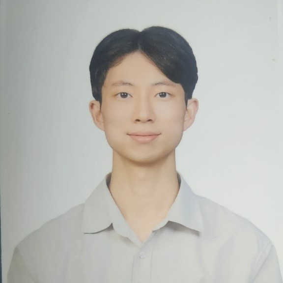

---
# Leave the homepage title empty to use the site title
title:
date: 2024-03-25
type: landing

sections:

  - block: features
    content:
      title: ""
      text: |
        

         
        Hwang Seon-woo  
        I'm a sophomore at Chonbuk National University's Department of Computer and Artificial Intelligence, developing games and web applications, and preparing for a career as a developer.  
        <!-- Email icon added and styled -->
        

          <a href="mailto:swh06084@jbnu.ac.kr" style="text-decoration: none; color: #ff5722;">
            <i class="fas fa-envelope" style="font-size: 2rem;"></i>
          </a>
        
  

  - block: slider
    content:
      slides:

      - title: Virtual Reality Game
        content: A game that immerses players with controls that mimic real-life movements.
        align: center
        background:
          image:
            filename: nikita-kachanovsky-FJFPuE1MAOM-unsplash.jpg
            filters:
              brightness: 0.4
          position: center
          color: '#000'

      - title: Web Service
        content: Creating creative and user-friendly web services.
        align: center
        background:
          image:
            filename: luke-chesser-2Bdyxgz3OM0-unsplash.jpg
            filters:
              brightness: 0.4
          position: center
          color: '#000'

      - title: RPG Game Development
        content: Developing games tailored for career opportunities in the RPG genre.
        align: center
        background:
          image:
            filename: alice-alinari-HUqxgjORAnw-unsplash.jpg
            filters:
              brightness: 0.4
          position: center
          color: '#000'

    design:
      # Slide height is automatic unless you force a specific height (e.g. '400px')
      slide_height: '350px'
      slide_width: '100px'
      is_fullscreen: false
      # Automatically transition through slides?
      loop: true
      # Duration of transition between slides (in ms)
      interval: 3000

  - block: features
    id: features
    content:
      title:   Fields of Study
      text: These are my learning goals and areas of interest as I work towards becoming a developer.  
      items:
        - name: Artificial Intelligence (AI)
          icon: code-branch
          icon_pack: fas
          description: Creating creative and innovative AI services.  
        - name: Algorithms
          icon: code
          icon_pack: fas
          description:  Learning algorithms for coding tests and those applied in AI, along with problem-solving.  
        - name: Planning
          icon: align-right
          icon_pack: fas
          description:  Generating ideas for web/app development based on given requirements, focusing on what will attract users, and systematically organizing them.  
        - name: Networking
          icon: wifi
          icon_pack: fas
          description:  Knowledge of networking to solve various problems in development practices.  
        - name: Game Development
          icon: gamepad
          icon_pack: fas
          description:  Developing fun and trendy games efficiently for the game companies or users I aim to work for.  
        - name: Web Development
          icon: file
          icon_pack: fas
          description:  Building sustainable code using appropriate design patterns and tackling real-world issues like traffic in a practical environment.  

  - block: collection
    content:
      id: section-1
      title:  Wii Swordplay Clone Game
      subtitle:
      text:     
      count: 3
      offset: 0
      order: desc
      filters:
        folders:
          - sword-motion
          - hit-reaction
          - shader
    design:
      view: community/custom_card
      columns: '2'

  - block: collection
    content:
      id: section-1
      title:  YouTube Clone Web
      subtitle:
      text:     
      count: 3
      offset: 0
      order: desc
      filters:
        folders:
          - react&spring
          - aws-lambda
          - video-preview
    design:
      view: community/custom_card
      columns: '2'

  - block: collection
    content:
      title:  Team Projects
      subtitle:
      text:     
      count: 3
      filters:
        author: ''
        category: ''
        exclude_featured: false
        publication_type: ''
        tag: ''
      offset: 0
      order: desc
      page_type: team-projects
    design:
      view: community/custom_card
      columns: '2'
    advanced:
      css_style: "text-align: center;"

  - block: markdown
    content:
      title:
      subtitle:
      text: |
        {}
    design:
      columns: '1'
---
