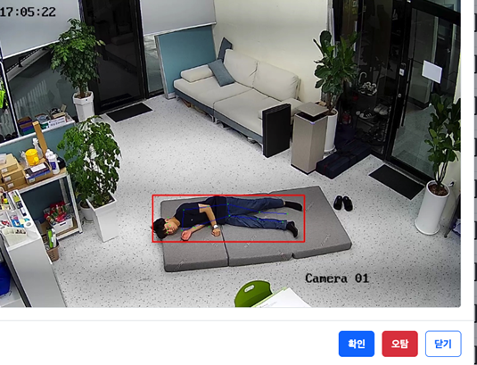
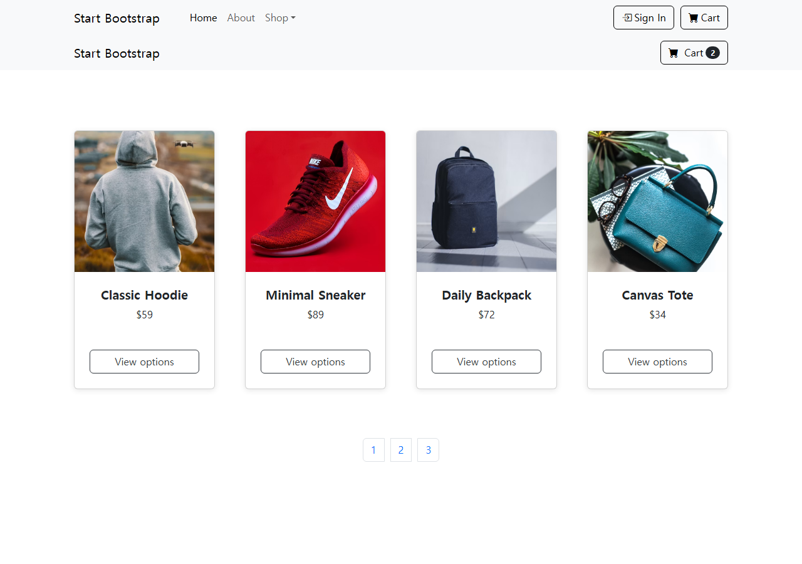

---
title:
date: 2026-08-14
type: landing
sections:
  - block: markdown
    content:
      title:
      text: |
        <section class="portfolio-hero-v2">
          
BACKEND · AI SERVICE · EDGE-AI ENGINEER

          <h1>Building projects that turn curiosity across backend, AI, and games into reality.</h1>
          
Spring Boot and FastAPI APIs, AWS media pipelines, GraphRAG voice services, and real-time RTSP/NPU monitoring: this is Hwang Seon-woo's development portfolio.

          
GPA 4.0/4.5President's Award (Top Rank of the Year)Capstone Grand Prize · Governor's CitationContract · Internship · Research Experience

          
<a href="./projects/">View Projects</a><a href="https://github.com/pipecat-ai/pipecat/pull/4455" target="_blank" rel="noopener noreferrer">View Open Source Contribution</a><a href="https://github.com/eecczz">GitHub</a><a href="/uploads/portfolio_2026_08.pdf">Resume PDF</a>

        </section>
    design:
      columns: '1'
  - block: markdown
    content:
      title: Four Core Projects
      subtitle: Problems, implementation scope, and validation evidence I led.
      text: |
        

          <a class="case-study-card" href="./contest-projects/jeonbuk-chatbot/">BACKEND · AI · SYSTEM CASE STUDY<h3>Jeonbuk Provincial Voice Chatbot</h3>
A public voice-information service that retrieves provincial and municipal data with GraphRAG and delivers it through STT/TTS.
</a>
          <a class="case-study-card" href="./contest-projects/smartcctv-fall/">BACKEND · AI · SYSTEM CASE STUDY<h3>Smart CCTV Fall Detection</h3>
An Edge-AI monitoring project that reduces nursing-home RTSP false positives with pose, detector, and site-context zero-shot validation.
</a>
          <a class="case-study-card" href="./toy-projects/streaming-api/">BACKEND · AI · SYSTEM CASE STUDY<h3>Streaming API</h3>
A streaming service connecting React, Spring Boot, AWS S3, Lambda, and MediaConvert.
</a>
          <a class="case-study-card" href="./toy-projects/shopping-mall/">BACKEND · AI · SYSTEM CASE STUDY<h3>E-Commerce Backend</h3>
A Spring Boot, JPA, and Querydsl service covering product browsing, cart, orders, and payment verification.
</a>
        

    design:
      columns: '1'
  - block: markdown
    content:
      title: Implementation Strengths
      text: |
        

<b>01 / Backend</b>
Spring Boot, FastAPI, REST APIs, JPA, Querydsl, MariaDB, PostgreSQL

<b>02 / AI Service</b>
STT/TTS, GraphRAG, LLM agents, SSE/WebSocket, Computer Vision

<b>03 / Cloud & Edge</b>
AWS S3 · Lambda · MediaConvert, Linux, RTSP, NPU model conversion and deployment

<b>04 / Problem Solving</b>
I document logs, thresholds, retries, API boundaries, and domain limits as implementation evidence.

    design:
      columns: '1'
  - block: markdown
    content:
      title: Project Archive
      text: |
        
The remaining projects are supporting cases selected for each role or interview question, rather than an inflated project count.

        
<a href="./projects/">View All Projects →</a><a href="./contest-projects/">All Team, Award & Field Projects →</a><a href="./toy-projects/">All Personal Projects →</a><a href="./toy-projects/swordplay/">Unity Math & IK Case →</a><a href="./contact/">Contact →</a>

    design:
      columns: '1'
---
