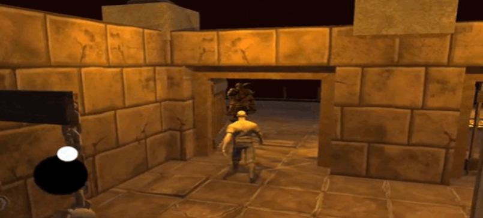
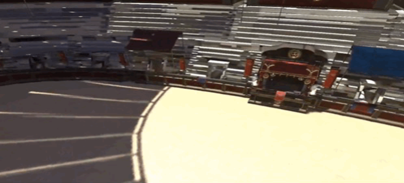
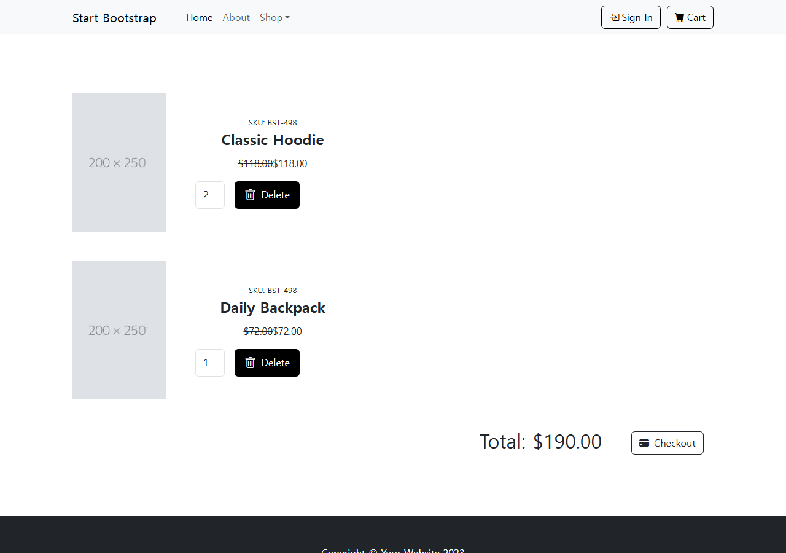
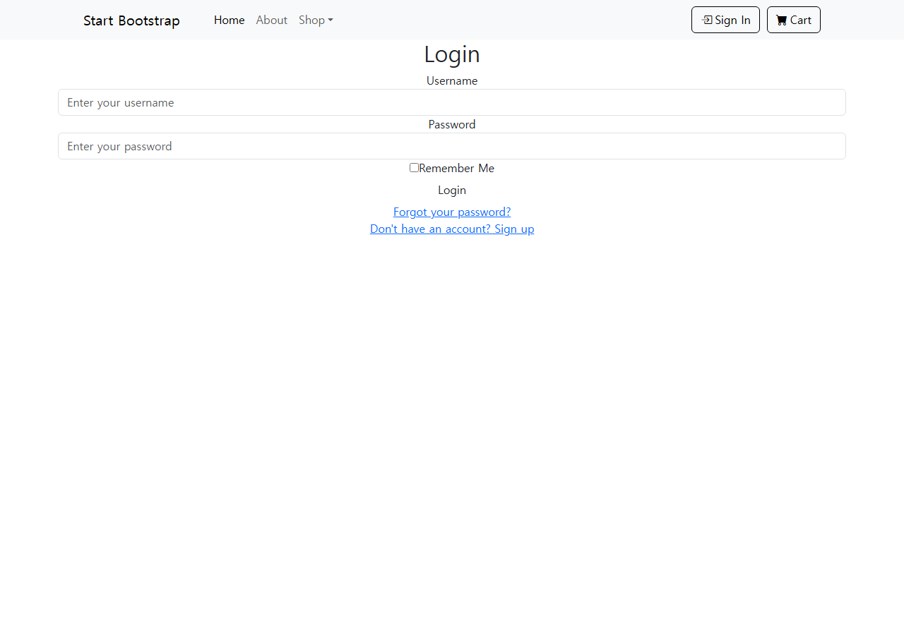
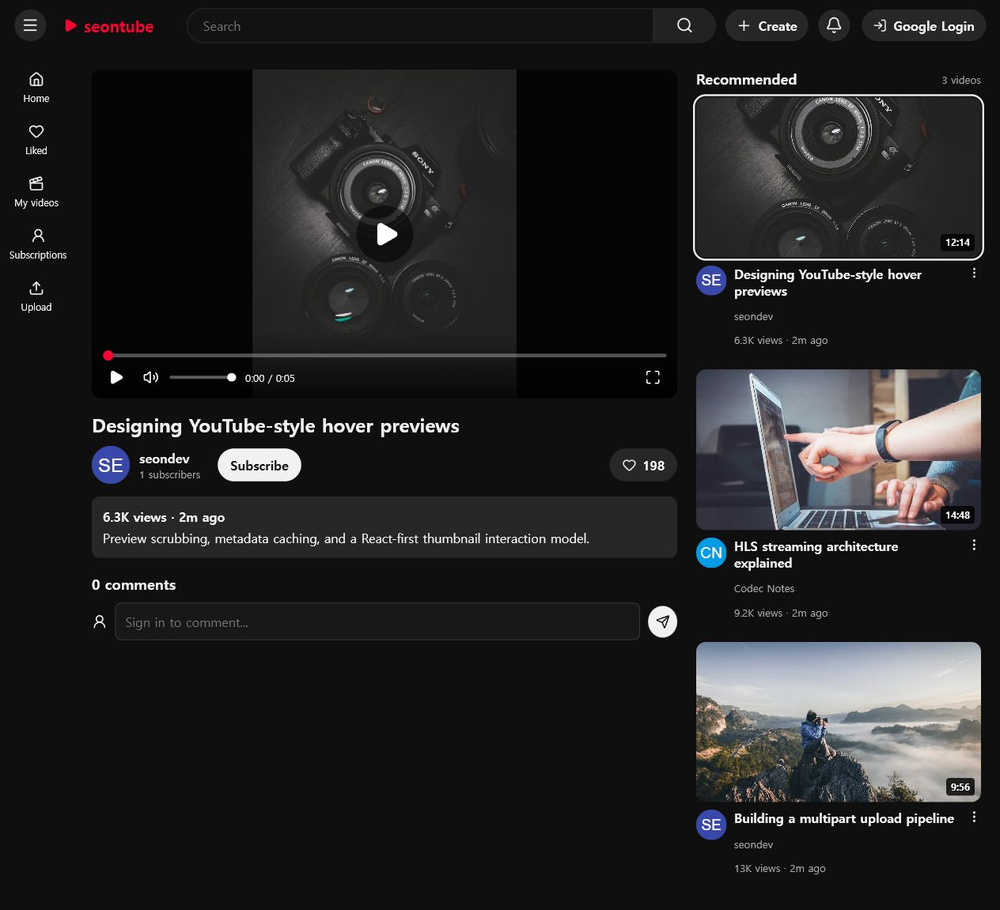
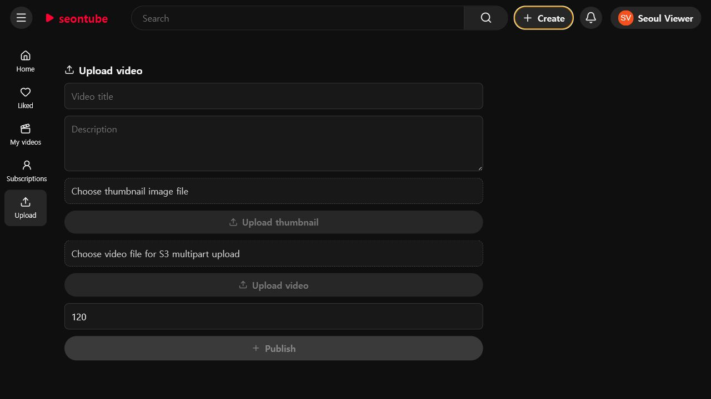
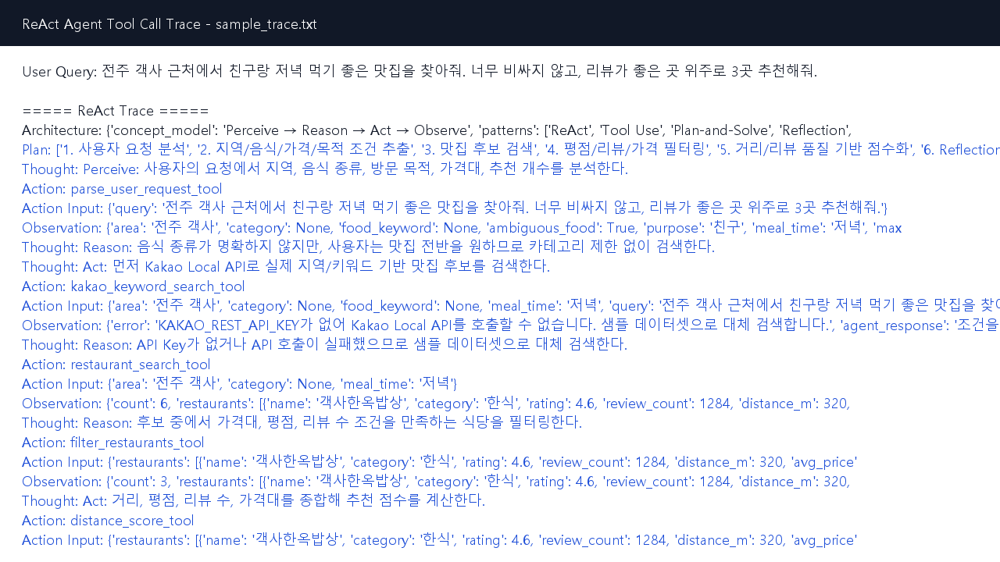
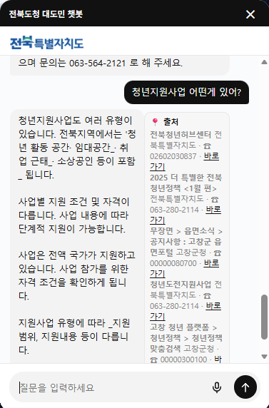

---
title:
date: 2024-03-25
type: landing

sections:

  - block: features
    content:
      title: ""
      text: |
        

          
          
Game / Backend / AI Service Developer

          <h1>Hwang Seon-woo</h1>
          

            I am a senior IT Information Engineering student at Jeonbuk National University, building Unity games,
            Spring Boot/FastAPI backends, and AI agent services. I like imagining the moment users will react to,
            turning ideas into prototypes quickly, and refining them into executable service structures.
          

          

            I have kept a 4.0/4.5 overall academic GPA, received the 2021 President's Award for academic excellence
            with the top overall rank, and earned capstone awards including a Jeonbuk Provincial Governor citation.
          

          

            <a href="mailto:swh06084@jbnu.ac.kr" aria-label="Email"><i class="fas fa-envelope"></i></a>
            <a href="https://github.com/eecczz" aria-label="GitHub"><i class="fab fa-github"></i></a>
          

        

  - block: markdown
    content:
      title: Key Achievements
      subtitle:
      text: |
        

          

            <strong>Overall academic GPA 4.0/4.5</strong>
            Maintained while balancing major coursework and projects
          

          

            <strong>President's Award</strong>
            2021 academic excellence, top overall rank
          

          

            <strong>Grand Prize / Governor Citation</strong>
            Jeonbuk public voice chatbot capstone project
          

          

            <strong>Industry & Research Experience</strong>
            Unity contract work, visual intelligence lab, monitoring software internship
          

          

            <strong>Open Source Contribution</strong>
            Contributed a fix for a video playback initialization error
          

        

    design:
      columns: '1'

  - block: slider
    content:
      slides:

      - title: Interactive Games
        content: |
          

            Building immersive game interactions through motion-like input, hit reactions, and feedback loops
          

        align: center
        background:
          image:
            filename: nikita-kachanovsky-FJFPuE1MAOM-unsplash.jpg
            filters:
              brightness: 0.4
          position: center
          color: '#000'

      - title: AI Services
        content: |
          

            Connecting voice, video, and recommendation problems to AI agents and web services
          

        align: center
        background:
          image:
            filename: Ai.jpg
            filters:
              brightness: 0.4
          position: center
          color: '#000'

      - title: Backend & Cloud
        content: |
          

            Designing APIs and media pipelines with Spring Boot, MariaDB, AWS, and HLS
          

        align: center
        background:
          image:
            filename: luke-chesser-2Bdyxgz3OM0-unsplash.jpg
            filters:
              brightness: 0.4
          position: center
          color: '#000'

    design:
      slide_height: '350px'
      slide_width: '100px'
      is_fullscreen: false
      loop: true
      interval: 3000

  - block: features
    id: features
    content:
      title:   Core Strengths
      text: Technical directions I have repeatedly built through projects.  
      items:
        - name: AI Agents
          icon: code-branch
          icon_pack: fas
          description: Connecting ReAct agents, real-time coaching, and video analysis to usable service flows  
        - name: Backend APIs
          icon: server
          icon_pack: fas
          description: Spring Boot, FastAPI, REST APIs, JWT auth, and MariaDB/PostgreSQL data design  
        - name: Cloud & Media
          icon: cloud
          icon_pack: fas
          description: Upload, conversion, and streaming architecture with AWS S3, Lambda, MediaConvert, and HLS  
        - name: Game Development
          icon: gamepad
          icon_pack: fas
          description: Unity, C#, XR input, procedural animation, and shaders for responsive controls and hit feedback  
        - name: Web Frontend
          icon: desktop
          icon_pack: fas
          description: React, Next.js, and TypeScript interfaces connected to backend APIs  
        - name: Product Thinking
          icon: lightbulb
          icon_pack: fas
          description: Shaping ideas around user and teammate reactions, then adjusting them toward clear goals  

  - block: markdown
    content:
      title: Game Projects
      subtitle:
      text: |
        

          <article class="home-project-card">
            <a class="home-project-title" href="./toy-projects/swordplay/">Wii Swordplay Remake</a>
            
A Unity WebGL project that recreates sword swinging, hit reactions, and Wii-like shader styling with mouse input.

            

              
<strong>Sword Controls</strong>Converted mouse input into sword rotation and position for a direct swinging feel.

              
<strong>Hit Reaction</strong>Strengthened impact feedback with a self-balancing recovery flow.

              
<strong>Wii-like Shader</strong>Used simple colors, low gloss, and outline-like styling to echo the original visual tone.

            

          </article>

          <article class="home-project-card">
            <a class="home-project-title" href="./contest-projects/soulslike-game/">Soulslike Game</a>
            
A four-person Unity action game project set in a colosseum for an introductory creative engineering design course.

            

              
<strong>Boss Sequence</strong>Built tension with wide-range attacks and strong visual effects.

              
<strong>Dodge & Combo</strong>Designed a combat rhythm where the player reads attacks, dodges, and counters.

              
<strong>Colosseum Stage</strong>Created a confrontation space for a final battle between the player and boss.

            

          </article>

          <article class="home-project-card">
            <a class="home-project-title" href="./toy-projects/metaxr-project/">MetaXR Project</a>
            
An XR action prototype connecting hand movement and spatial presence to combat interactions.

            

              
<strong>XR Combat Input</strong>Mapped controller motion to attack and defense interactions.

              
<strong>Close Interaction</strong>Composed close-range action scenes where the player faces monsters directly.

              
<strong>Unity Prototype</strong>Validated XR input, collision, and monster reactions in a fast action prototype.

            

          </article>
        

    design:
      columns: '1'

  - block: markdown
    content:
      title: Web & App Services
      subtitle:
      text: |
        

          <article class="home-project-card">
            <a class="home-project-title" href="./toy-projects/shopping-mall/">Shopping Mall Project</a>
            
A Spring Boot and MariaDB shopping mall demo covering product browsing, cart, purchase, and payment verification flows.

            

              
<strong>Product List</strong>Implemented the basic shopping flow from product list to cart and purchase pages.

              
<strong>Cart Flow</strong>Handled quantity updates, total price calculation, and checkout entry.

              
<strong>Login Screen</strong>Connected cart and payment flows to a session-based authentication screen.

            

          </article>

          <article class="home-project-card">
            <a class="home-project-title" href="./toy-projects/youtube-clone/">YouTube Remake</a>
            
A YouTube-style video service remake exploring hover preview, upload, and playback architecture.

            

              
<strong>Video Preview</strong>Reduced unnecessary loading by previewing only after a hover dwell time.

              
<strong>Media UX</strong>Built a YouTube-like exploration experience with thumbnails, video, and playback controls.

              
<strong>Upload Flow</strong>Separated the React screen and backend/cloud processing for upload and playback.

            

          </article>

          <article class="home-project-card">
            <a class="home-project-title" href="./toy-projects/restaurant-agent/">Restaurant ReAct Agent</a>
            
A FastAPI-based AI agent that interprets location, price, and context, then calls search and filtering tools for explainable restaurant recommendations.

            

              
<strong>Restaurant Query</strong>Extracts area and preference conditions from natural-language requests.

              
<strong>Search Tool</strong>Uses Kakao Local API and a sample dataset to search candidate restaurants.

              
<strong>Filtering & Recommendation</strong>Reflects price, context, and review conditions to produce explainable recommendations.

            

          </article>
        

    design:
      columns: '1'

  - block: markdown
    content:
      title: Career & Awards
      subtitle:
      text: |
        

          <article class="home-project-card">
            <a class="home-project-title" href="./contest-projects/speech-coach/">SpeakUp (AI&SW Competition Bronze Prize)</a>
            
An AI coaching service for presentations, interviews, and negotiation practice, centered on real-time feedback and session reports.

            

              
<strong>Real-time Coaching</strong>Analyzes speaking speed, fillers, silence, and other signals during practice.

              
<strong>Session Dashboard</strong>Collects practice records and metrics to show improvement over time.

              
<strong>AI Report</strong>Summarizes next-step improvements from transcript and attention segments.

            

          </article>
          <article class="home-project-card">
            <a class="home-project-title" href="./contest-projects/jeonbuk-chatbot/">Jeonbuk Voice Chatbot (Governor Citation)</a>
            
A public-service project combining voice conversation and a character UI to help residents find policy and civil-service information.

            

              
<strong>Character Chatbot</strong>Used a character-based UI to make public information feel more approachable.

              
<strong>Voice Conversation</strong>Focused on letting residents ask for information conversationally.

              
<strong>Public Service UX</strong>Organized response flows to explain policy and civil-service information clearly.

            

          </article>
        

    design:
      columns: '1'

  - block: markdown
    content:
      title:
      subtitle:
      text: |
        {}
    design:
      columns: '1'
---
