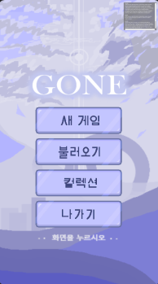

A choice-based story action-adventure game created as a four-person Coala club team project.

- Tech focus: implementation, interaction design, backend/API structure, and project delivery
- Repository or reference: portfolio project

## Key Implementation Points

### Choice-based Story

Provides different endings through choices in a ruined city attacked by AI.

### Vertical Play

Tested a mobile-friendly 1:1 layout with game view above and controls below.

### Club Team Development

Split Fungus-based story flow and action progression across team members.
