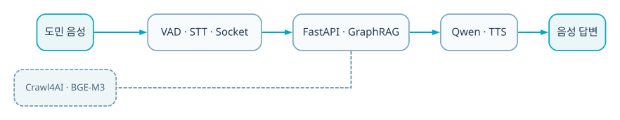

BACKEND · AI · SYSTEM CASE STUDY

A public voice-information service that retrieves Jeonbuk Province and municipal data with GraphRAG and delivers answers through STT and TTS.

<b>Role</b> Capstone · FastAPI, voice pipeline, GraphRAG, crawler operation<b>Validation</b> Capstone Grand Prize · Jeonbuk Governor's Citation

## Key Screens

## Troubleshooting
### 1. A new utterance had to interrupt an answer already being spoken
Instead of finishing STT → answer → TTS in one request, I rebuilt the pipeline around a real-time socket connection. When a new utterance is detected, the active response and playback are stopped before the next turn begins.
### 2. Daily crawling was slow, skipped pages, and overloaded the embedding server
I standardized dynamic-page extraction, content cleanup, and asynchronous crawling with Crawl4AI. Incremental, full, and per-site runs isolate failures and reduce BGE-M3 embedding load.
### 3. Slow RAG answers were not only a pipeline problem
I compared the same queries across different Qwen 3.5 model sizes, confirmed the model-selection impact on end-to-end latency, and changed the response model.
### 4. STT often missed the first syllable
VAD onset delay and confidence thresholds were tuned so the audio buffer reaches STT immediately after speech is detected.
### 5. Municipality URLs and SPA structures caused different collection failures
Base paths are configured per site, while normal HTML and browser-rendered SPA pages use separate collection paths.

## Technology Choices
| Technology | Why it was used |
|---|---|
| **FastAPI** | To compose asynchronous STT, retrieval, LLM, and TTS stages with different latency characteristics. |
| **STT/TTS** | To make public policy and civil-service information accessible through natural voice queries. |
| **GraphRAG** | To retrieve answers with document relationships and evidence preserved. |
| **Incremental crawler** | To refresh normal and SPA sites selectively rather than re-crawling everything. |

## System Flow

1. STT converts the user's voice to text.
2. FastAPI receives the normalized question and conversation context.
3. GraphRAG retrieves relevant provincial and municipal data.
4. The LLM produces an evidence-grounded answer.
5. TTS returns speech synchronized with the character UI.

## Next Implementation Plan
- Show a source document and last-crawled time with every answer.
- Add browser-pool, timeout, retry, latency, and failure-rate monitoring by pipeline stage.
