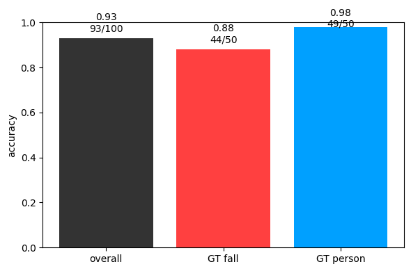
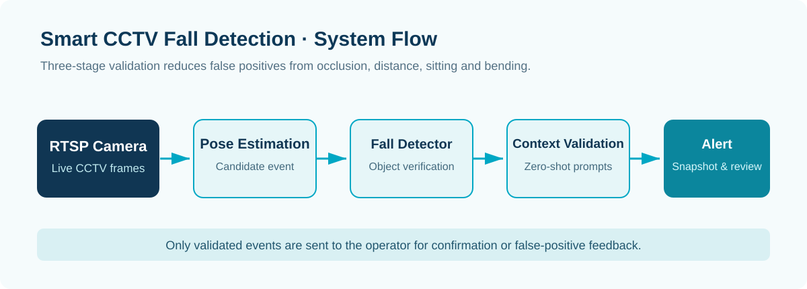

BACKEND · AI · SYSTEM CASE STUDY

An Edge-AI monitoring project that reduces nursing-home RTSP false positives through three-stage pose, fall-object, and site-context zero-shot validation.

<b>Role</b> Edge-AI field internship · data, models, post-processing, field validation<b>Validation</b> Live nursing-home RTSP environment

## Key Screens

## Troubleshooting
### 1. Pose estimation alone was unstable for occlusion, distance, and vertical falls
Joint confidence, body angle, aspect ratio, and dwell-time heuristics changed with camera angle and occlusion. Pose remained the first candidate stage, while a `fall/person` detector became the second verifier.
### 2. The detector still confused sitting, bending, and lower-body occlusion with falls
Hard negatives for sitting, bending, and partial occlusion were added. Overlapping or adjacent boxes were grouped, and a fall survived only when confidence and body coverage were sufficient.
### 3. Model output alone could not interpret the site context
The final verifier compares candidate visual features with site-specific prompts such as a person fully lying on the floor, sitting on a chair, bending, or partially hidden by furniture.

## System Flow

1. Pose keypoints and body tilt produce a fall candidate from RTSP frames.
2. A YOLO `fall/person` model verifies the cropped candidate.
3. Nearby boxes are grouped and confidence and coverage are measured.
4. Visual features and site-specific prompts perform zero-shot validation.
5. Only events above 0.70 confidence and the time condition are confirmed and sent to snapshots, DB, and alerts.
