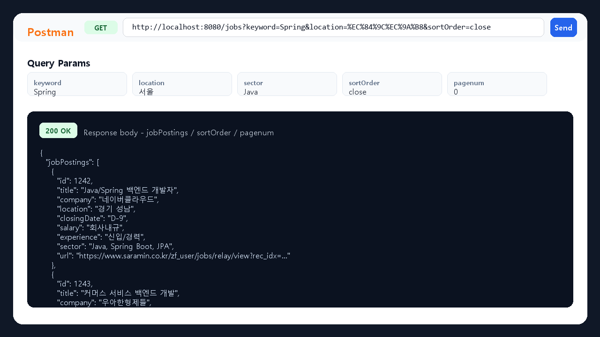

Job API Project is a Spring Boot REST API project that crawls Saramin job postings, stores them in MariaDB, and exposes search/filter APIs for the saved listings. Beyond basic CRUD, it covers real job-posting collection, conditional search, application/bookmark flows, and JWT-based authentication.

The crawler extracts company name, posting title, location, experience, education, employment type, deadline, tech stack, salary, and source URL from Saramin search results. Duplicate postings are filtered by URL before saving, and the `/jobs` endpoint supports keyword, company, position, sector, location, experience, salary, sorting, and pagination parameters.

- Tech stack: Java, Spring Boot, Spring Web, Spring Data JPA, Querydsl, MariaDB, JWT, Gradle, Jsoup
- Implementation focus: Saramin crawling, job search/filtering, applications, bookmarks, authentication and authorization flow
- Repository: [eecczz/jobAPI](https://github.com/eecczz/jobAPI)

## Key Implementation Points

### Job Listing Screen

The listing screen shows crawled job postings with searchable filters for location, experience, salary, tech stack, and deadline. Each row presents company, location, experience, salary, stack, and an apply action.

### API Test Response

The `GET /jobs` endpoint accepts query parameters such as keyword, location, sector, and sort order, then returns `jobPostings`, `sortOrder`, and `pagenum` as JSON. This makes the backend behavior visible even without a fully running frontend.

### Saramin Crawl Dump

The `POST /jobs/crawl` flow collects Saramin search results page by page, extracts posting fields with Jsoup selectors, skips duplicate source URLs, and saves the remaining postings to MariaDB.
