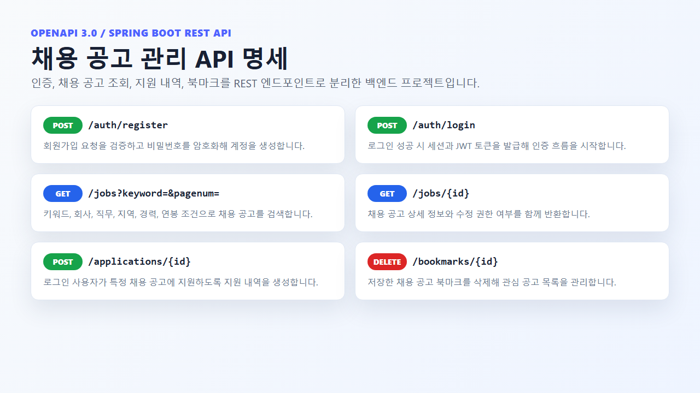

A Spring Boot REST API project for job postings, applications, bookmarks, and JWT-based authentication.

- Tech focus: implementation, interaction design, backend/API structure, and project delivery
- Repository or reference: https://github.com/eecczz/jobAPI

## Key Implementation Points

### Job Posting API

Organized authentication, job search, applications, and bookmarks around an OpenAPI-style endpoint map.

### JWT Authentication

Separated Auth, Jobs, Applications, and Bookmarks controllers with JWT-based auth flow.

### Build Verification

Verified the Spring Boot backend source compiles locally with Gradle compileJava.
