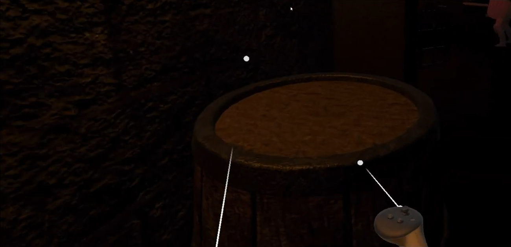
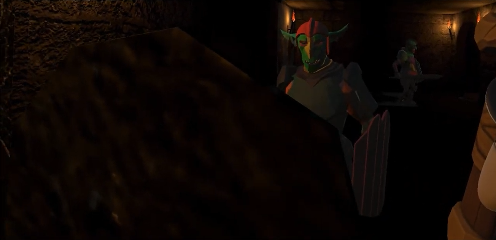

A Unity XR action prototype using Meta/XR device input for tactile combat, monster encounters, and escape flow.

- Tech focus: implementation, interaction design, backend/API structure, and project delivery
- Repository or reference: https://github.com/eecczz/MetaXR-Project

## Key Implementation Points

### XR Combat Input

Mapped controller movement to attack and defense interactions.

### Close Interaction

Composed close-range action scenes where the player faces monsters directly.

### Unity Prototype

Validated XR input, collision, and monster reactions in a fast action prototype.
