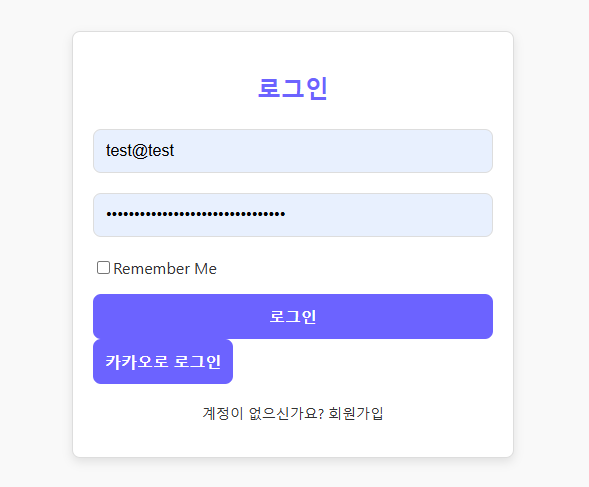
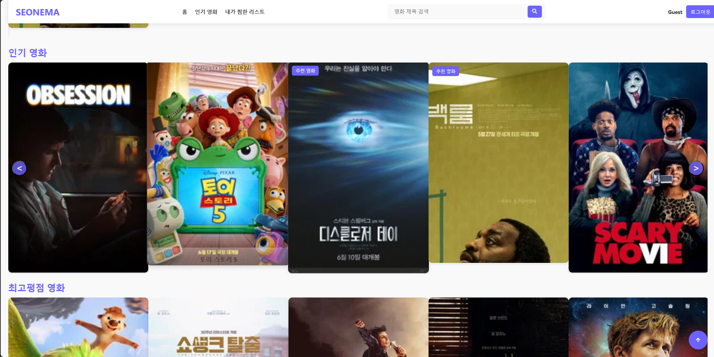
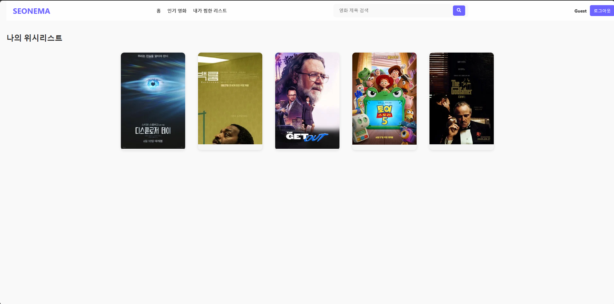

A React web application using the TMDb API for movie search, popular movie browsing, wishlist management, filtering, and sorting.

- Tech focus: implementation, interaction design, backend/API structure, and project delivery
- Repository or reference: https://github.com/eecczz/my-movie-web

## Key Implementation Points

### Movie Discovery UI

Organized popular and top-rated movies around poster-focused browsing.

### Search and Filtering

Built a flow for searching, sorting, and filtering TMDb API results.

### Wishlist

Implemented a client-side state flow for saving and revisiting favorite movies.
