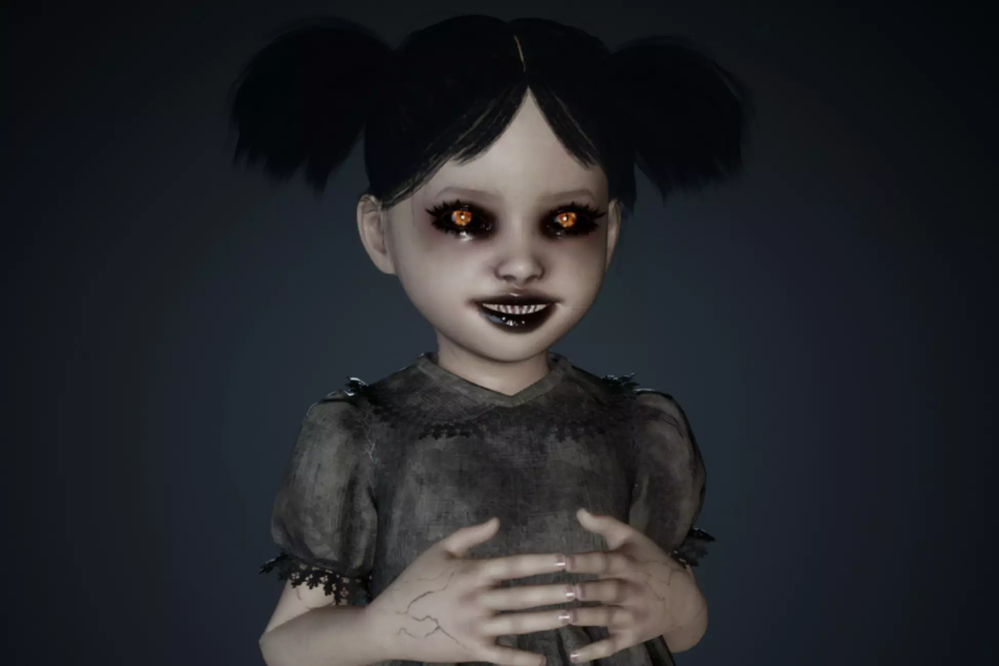

A Unity 3D horror prototype experimenting with first-person exploration, tense atmosphere, pursuit flow, and simple interactions.

- Tech focus: implementation, interaction design, backend/API structure, and project delivery
- Repository or reference: https://github.com/eecczz/my3dhorrorgame

## Key Implementation Points

### Horror Character

Used a close-range character image to build tension.

### First-person Exploration

Tested player view, movement, and perspective transitions.

### Atmosphere Direction

Built a horror mood with dark scenes, timing, and interaction events.
