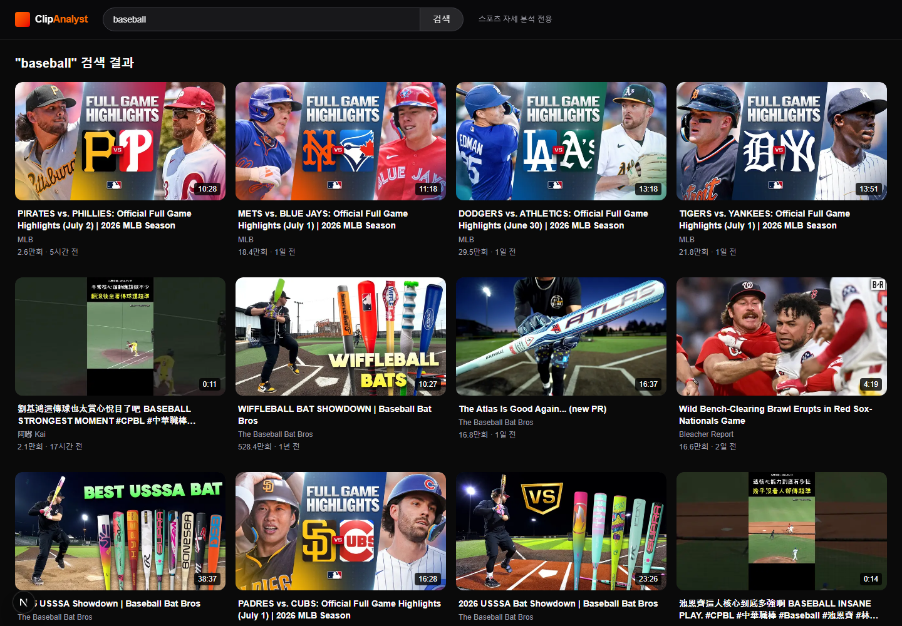

A Next.js + FastAPI MVP that selects YouTube sports clips and streams AI-based motion analysis.

- Tech focus: implementation, interaction design, backend/API structure, and project delivery
- Repository or reference: https://github.com/eecczz/sports-analyzer

## Key Implementation Points

### Clip Selection

Lets users choose the segment to analyze and extracts only that portion server-side.

### AI Analysis Streaming

Streams analysis results from FastAPI with SSE.

### Provider Switching

Designed an analysis pipeline that can switch between Gemini/Kimi model providers.
