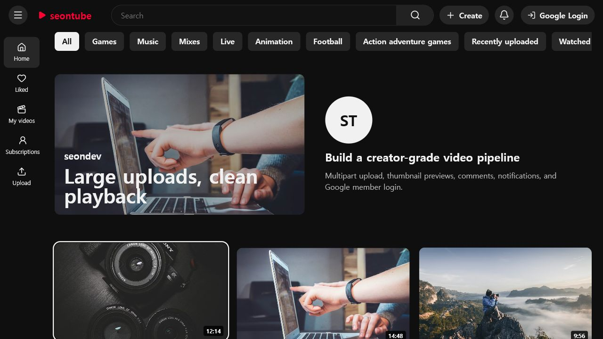
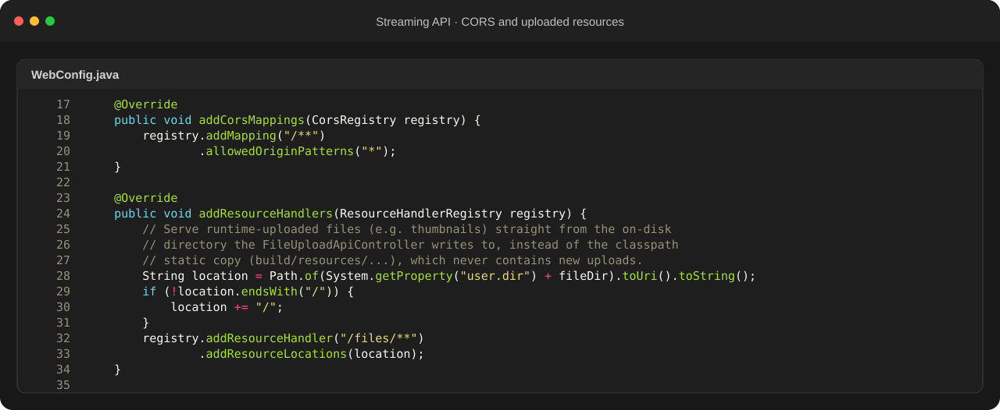
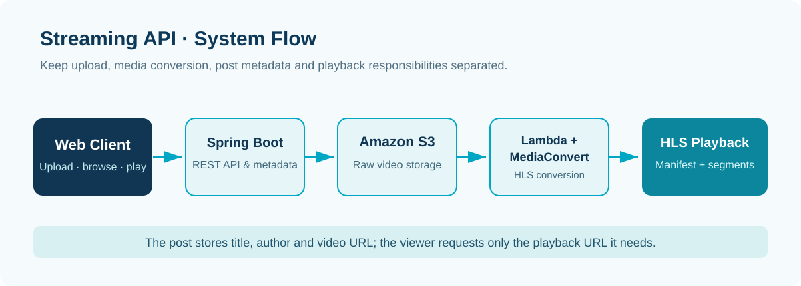

BACKEND · AI · SYSTEM CASE STUDY

A streaming service connecting a React browsing and playback UI with Spring Boot, AWS S3, Lambda, and MediaConvert.

<b>Role</b> Personal project · upload, media pipeline, post API, playback UI<b>Validation</b> Large-file upload and HLS playback tests

## Key Screens

## Troubleshooting
### 1. Uploading and converting large videos through the Spring server held requests for too long
The browser uploads raw video to S3, then an S3 trigger invokes Lambda and MediaConvert for transcoding. The application manages metadata and lifecycle states instead of carrying the raw file through the API server.

### 2. Large browser uploads were blocked even after AWS had been configured
The failure was server-side CORS. `WebConfig` permits the browser origin and maps `/files/**` to the runtime upload directory so post-upload resources are served from the files actually written by the controller.

### 3. A raw video file still needed to appear as a searchable post
The post record stores title, author, description, and `videoUrl` as metadata. The playback screen resolves the media through that URL without storing the video binary in the database.

## Technology Choices
| Technology | Why it was used |
|---|---|
| **React** | For content discovery, upload, and playback interactions. |
| **Spring Boot** | For post metadata, API boundaries, and upload lifecycle handling. |
| **S3 · Lambda · MediaConvert** | To separate large-file transfer and transcoding from the application server. |
| **HLS** | To deliver converted video segments for browser playback. |

## System Flow

1. The client obtains an upload target and sends raw media to S3.
2. S3 triggers Lambda and MediaConvert to create HLS output.
3. Spring Boot persists the post metadata and result URL.
4. The library and player load metadata first, then resolve media at playback.

## Next Implementation Plan
- Add queue-backed conversion status and retry visibility.
- Collect playback, conversion, and storage-cost metrics.
