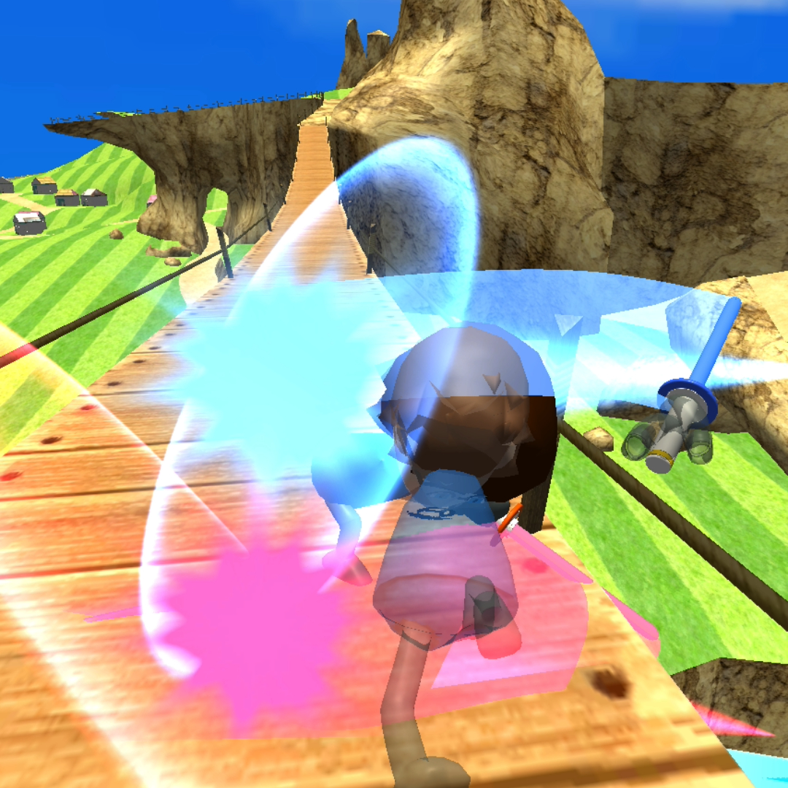
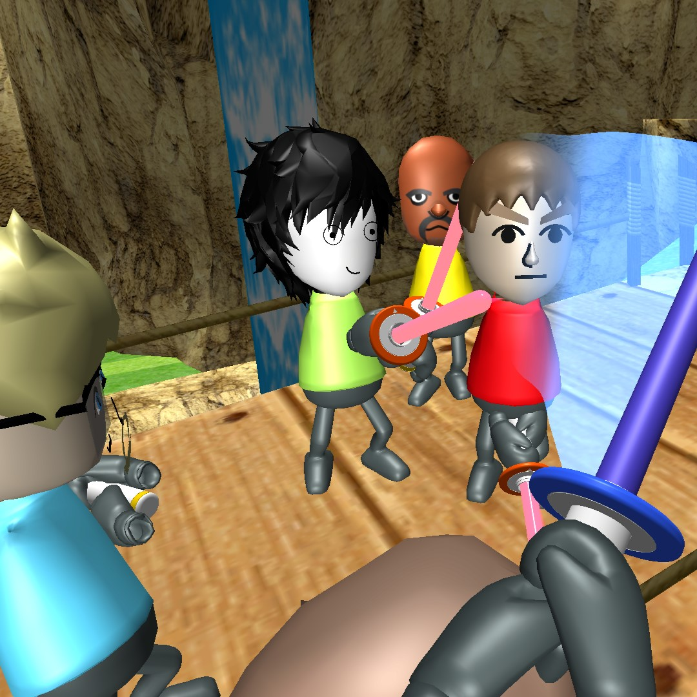

A Unity project recreating Wii Sports Resort swordplay controls and hit feedback for a PC/WebGL environment.

- Tech focus: implementation, interaction design, backend/API structure, and project delivery
- Repository or reference: https://github.com/eecczz/swordplay

## Key Implementation Points

### Sword Controls

Converted mouse input into sword rotation and position for a direct swinging feel.

### Hit Reaction

Strengthened impact feedback with a self-balancing recovery flow.

### Wii-like Shader

Used simple colors, low gloss, and outline-like styling to echo the original visual tone.
