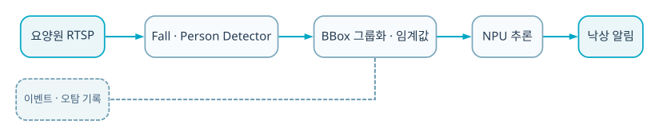

---
title:
date: 2026-08-14
type: landing

sections:
  - block: markdown
    content:
      title:
      text: |
        <section class="portfolio-hero-v2">
          
BACKEND · AI SERVICE · EDGE-AI ENGINEER

          <h1>모델을 실제 서비스와 현장 시스템으로 연결합니다.</h1>
          

            Spring Boot·FastAPI API, AWS 미디어 파이프라인, GraphRAG 음성 서비스,
            RTSP/NPU 기반 실시간 관제까지 구현해 온 황선우의 개발 포트폴리오입니다.
          

          

            학점 4.0/4.5총장상 · 전체 석차 1위캡스톤 최우수상 · 도지사 표창
          

          

            <a href="./contest-projects/">프로젝트 사례 보기</a>
            <a href="https://github.com/eecczz">GitHub</a>
            <a href="/uploads/portfolio_2026_08.pdf">Resume PDF</a>
          

        </section>
    design:
      columns: '1'

  - block: markdown
    content:
      title: 핵심 프로젝트 4선
      subtitle: 제가 직접 맡은 범위의 문제와 해결 과정, 검증 결과를 먼저 보여줍니다.
      text: |
        

          <a class="case-study-card" href="./contest-projects/jeonbuk-chatbot/">
            
            GRAPHRAG · VOICE SERVICE
            <h3>전북도청 대도민 음성 챗봇</h3>
            
<b>문제</b> 서로 다른 도청·시군 사이트와 SPA 수집 실패를 분리했습니다. <b>기여</b> FastAPI 음성 파이프라인, GraphRAG, 증분·사이트별 크롤러를 맡았습니다. <b>검증</b> 캡스톤 최우수상·도지사 표창.

          </a>
          <a class="case-study-card" href="./contest-projects/smartcctv-fall/">
            
            EDGE-AI · COMPUTER VISION
            <h3>Smart CCTV 낙상 감지</h3>
            
<b>문제</b> 앉은 사람·부분 신체 bbox 오탐을 재현했습니다. <b>기여</b> fall/person 2-class, bbox 그룹화, 0.70 기준을 설계했습니다. <b>검증</b> 요양원 RTSP·NPU 현장 실행.

          </a>
          <a class="case-study-card" href="./toy-projects/streaming-api/">
            
            SPRING BOOT · AWS
            <h3>Streaming API</h3>
            
<b>문제</b> 대용량 업로드·변환과 목록 preview가 서버·브라우저 자원을 낭비하지 않게 했습니다. <b>기여</b> React 미디어 UX, Spring API, S3 multipart와 Lambda·MediaConvert HLS 파이프라인을 구현했습니다. <b>검증</b> 탐색·업로드·변환·재생 흐름 연결.

          </a>
          <a class="case-study-card" href="./toy-projects/shopping-mall/">
            
            SPRING BOOT · JPA · QUERYDSL
            <h3>쇼핑몰 백엔드</h3>
            
<b>문제</b> Querydsl Q타입 생성 오류와 장바구니의 회원·화면 결합도를 추적했습니다. <b>기여</b> 상품 조회, 장바구니·주문, PortOne 테스트 결제 흐름을 구현했습니다. <b>검증</b> 전체 구매 흐름과 jcloud Ubuntu 배포.

          </a>
        

    design:
      columns: '1'

  - block: markdown
    content:
      title: 구현 역량
      text: |
        

          
<b>01 / Backend</b>
Spring Boot, FastAPI, REST API, JPA, Querydsl, MariaDB, PostgreSQL

          
<b>02 / AI Service</b>
STT/TTS, GraphRAG, LLM Agent, SSE/WebSocket, Computer Vision

          
<b>03 / Cloud & Edge</b>
AWS S3·Lambda·MediaConvert, Linux, RTSP, NPU 모델 변환·배포

          
<b>04 / Problem Solving</b>
실패 로그, threshold, retry, API 경계, 도메인 차이와 한계를 구현 기록으로 남깁니다.

        

    design:
      columns: '1'

  - block: markdown
    content:
      title: 프로젝트 아카이브
      text: |
        
나머지 프로젝트는 개수로 역량을 부풀리지 않고, 지원 직무나 면접 질문에 맞춰 꺼내 볼 수 있는 보조 사례로 정리했습니다.

        

          <a href="./contest-projects/">팀·수상·현장 사례 전체 보기 →</a>
          <a href="./toy-projects/">개인·기술 검증 사례 전체 보기 →</a>
          <a href="./toy-projects/swordplay/">Unity 수학·IK 대표 사례 →</a>
          <a href="./contact/">Contact →</a>
        

    design:
      columns: '1'
---
