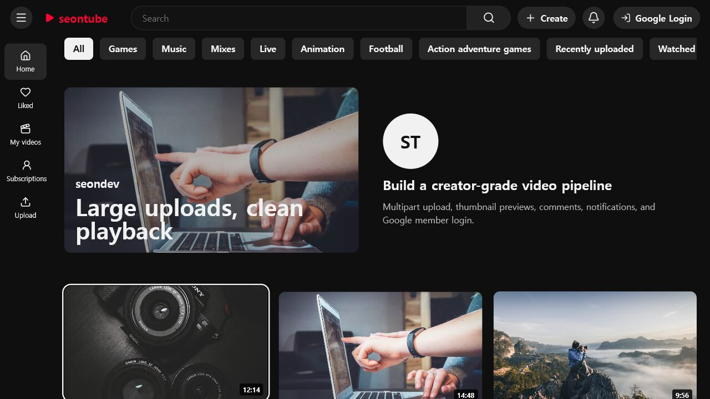

---
title:
date: 2026-08-14
type: landing

sections:
  - block: markdown
    content:
      title:
      text: |
        <section class="portfolio-hero-v2">
          
BACKEND · AI SERVICE · EDGE-AI ENGINEER

          <h1>백엔드, AI, 게임을 넘나들며, 호기심을 실현하는 프로젝트를 만듭니다.</h1>
          

            Spring Boot·FastAPI API, AWS 미디어 파이프라인, GraphRAG 음성 서비스,
            RTSP/NPU 기반 실시간 관제까지 구현해 온 황선우의 개발 포트폴리오입니다.
          

          

            학점 4.0/4.5총장상 (당해 석차 1위)캡스톤 최우수상 · 도지사 표창외주 · 인턴 · 연구 경험
          

          

            <a href="./projects/">프로젝트 보기</a>
            <a href="https://github.com/pipecat-ai/pipecat/pull/4455" target="_blank" rel="noopener noreferrer">오픈소스 기여 보기</a>
            <a href="https://github.com/eecczz">GitHub</a>
            <a href="/uploads/portfolio_2026_08.pdf">Resume PDF</a>
          

        </section>
    design:
      columns: '1'

  - block: markdown
    content:
      title: 핵심 프로젝트 4선
      subtitle: 제가 직접 맡은 범위의 문제와 해결 과정, 검증 결과를 먼저 보여줍니다.
      text: |
        

          <a class="case-study-card" href="./contest-projects/jeonbuk-chatbot/">
            
            BACKEND · AI · SYSTEM CASE STUDY
            <h3>전북도청 대도민 음성 챗봇</h3>
            
전북도청·시군 데이터를 GraphRAG로 검색하고 STT/TTS로 전달하는 공공 음성 정보 서비스입니다.

          </a>
          <a class="case-study-card" href="./contest-projects/smartcctv-fall/">
            
            BACKEND · AI · SYSTEM CASE STUDY
            <h3>Smart CCTV 낙상 감지</h3>
            
자세 추정·낙상 객체 탐지·현장 맥락 zero-shot의 3단 검증으로 요양원 RTSP 오탐을 줄인 Edge-AI 관제 프로젝트입니다.

          </a>
          <a class="case-study-card" href="./toy-projects/streaming-api/">
            
            BACKEND · AI · SYSTEM CASE STUDY
            <h3>Streaming API</h3>
            
React 기반 영상 탐색·재생 화면과 Spring Boot·AWS S3·Lambda·MediaConvert를 연결한 스트리밍 서비스입니다.

          </a>
          <a class="case-study-card" href="./toy-projects/shopping-mall/">
            
            BACKEND · AI · SYSTEM CASE STUDY
            <h3>쇼핑몰 백엔드</h3>
            
Spring Boot·JPA·Querydsl로 상품 탐색부터 장바구니·주문·PortOne 테스트 결제 검증까지 구현한 서비스입니다.

          </a>
        

    design:
      columns: '1'

  - block: markdown
    content:
      title: 구현 역량
      text: |
        

          
<b>01 / Backend</b>
Spring Boot, FastAPI, REST API, JPA, Querydsl, MariaDB, PostgreSQL

          
<b>02 / AI Service</b>
STT/TTS, GraphRAG, LLM Agent, SSE/WebSocket, Computer Vision

          
<b>03 / Cloud & Edge</b>
AWS S3·Lambda·MediaConvert, Linux, RTSP, NPU 모델 변환·배포

          
<b>04 / Problem Solving</b>
실패 로그, threshold, retry, API 경계, 도메인 차이와 한계를 구현 기록으로 남깁니다.

        

    design:
      columns: '1'

  - block: markdown
    content:
      title: 프로젝트 아카이브
      text: |
        
나머지 프로젝트는 개수로 역량을 부풀리지 않고, 지원 직무나 면접 질문에 맞춰 꺼내 볼 수 있는 보조 사례로 정리했습니다.

        

          <a href="./projects/">프로젝트 전체 보기 →</a>
          <a href="./contest-projects/">팀·수상·현장 사례 전체 보기 →</a>
          <a href="./toy-projects/">개인 프로젝트 전체 보기 →</a>
          <a href="./toy-projects/swordplay/">Unity 수학·IK 대표 사례 →</a>
          <a href="./contact/">Contact →</a>
        

    design:
      columns: '1'
---
