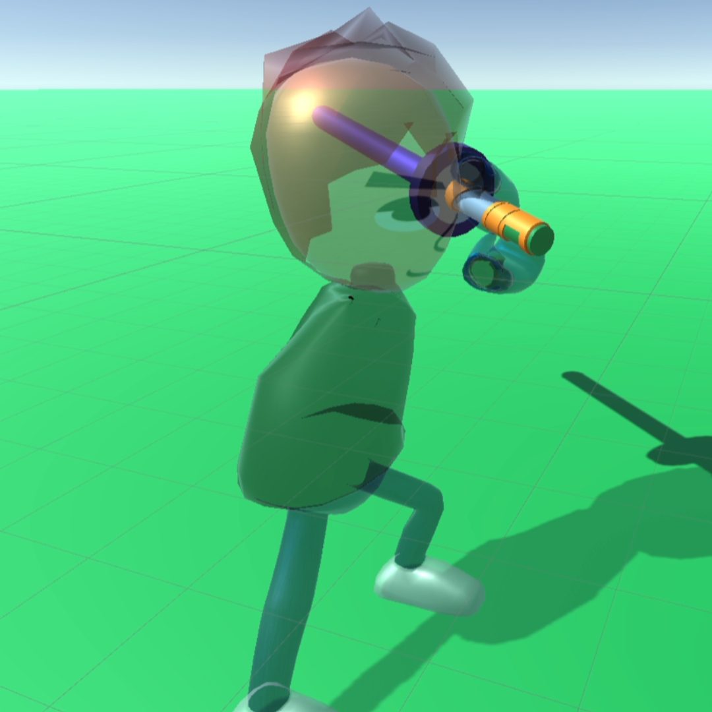
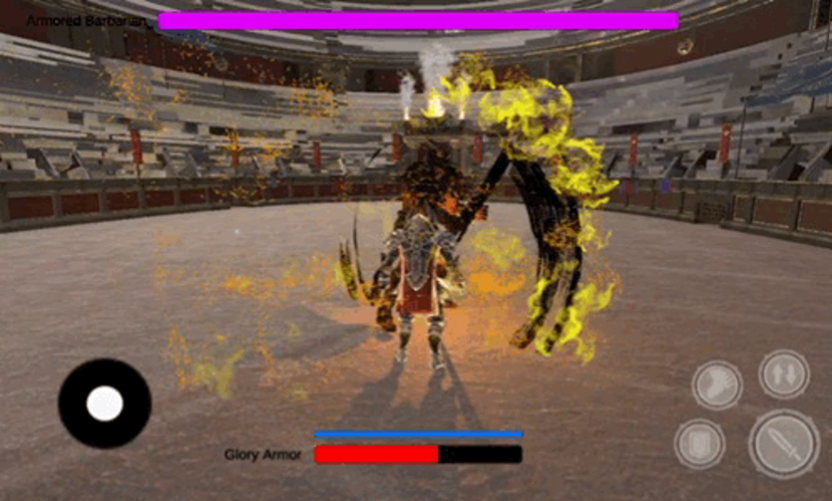
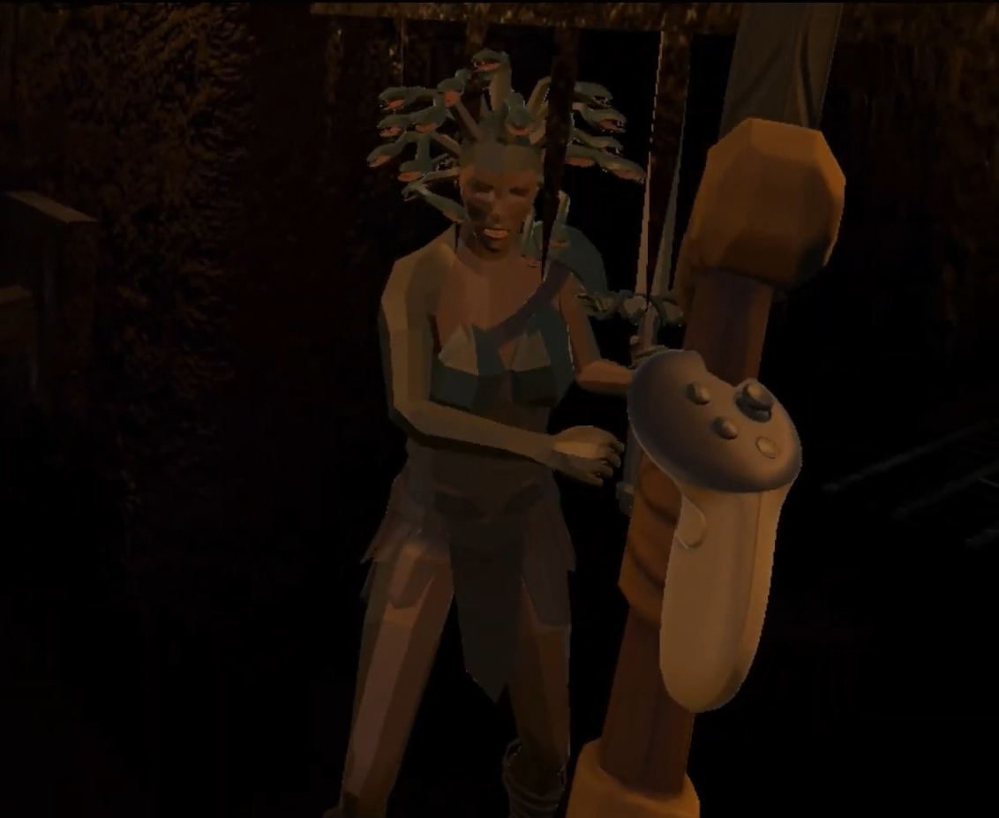
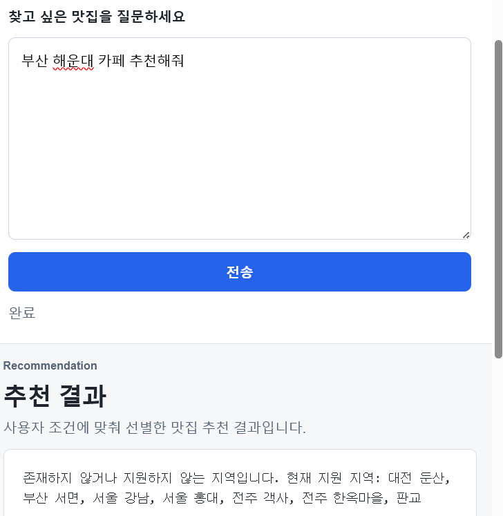
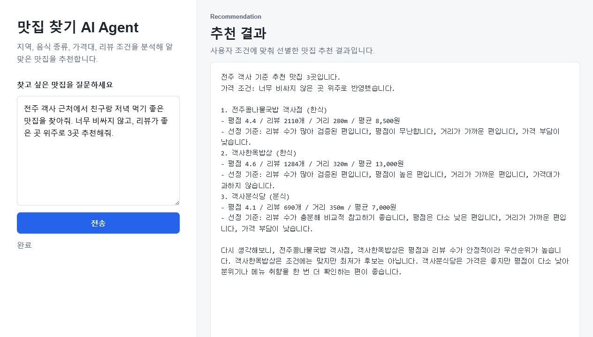
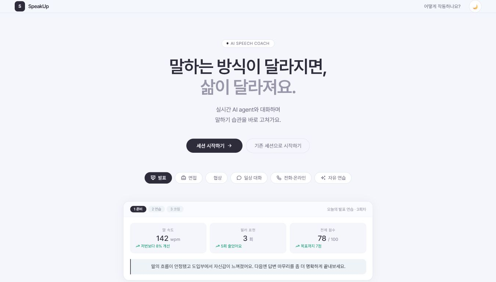
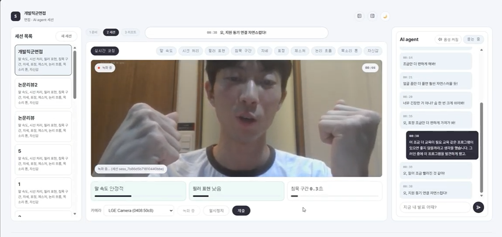
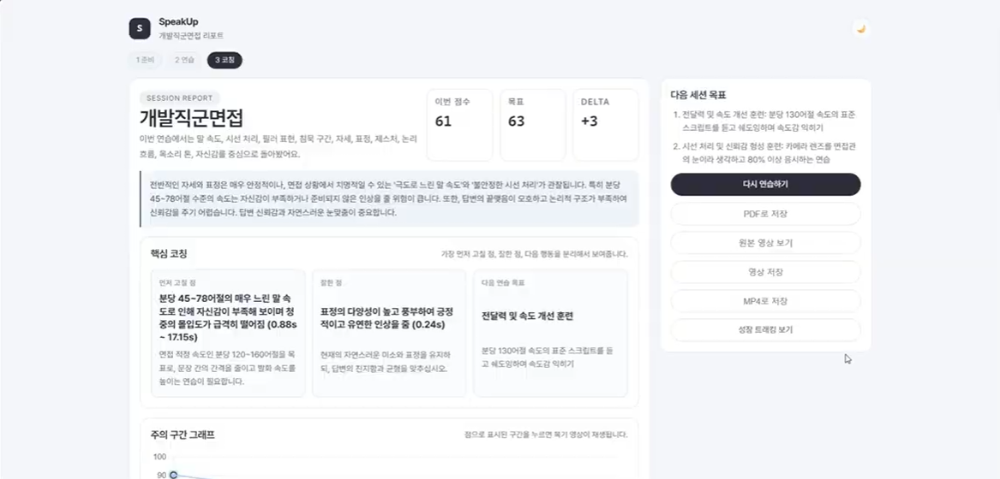
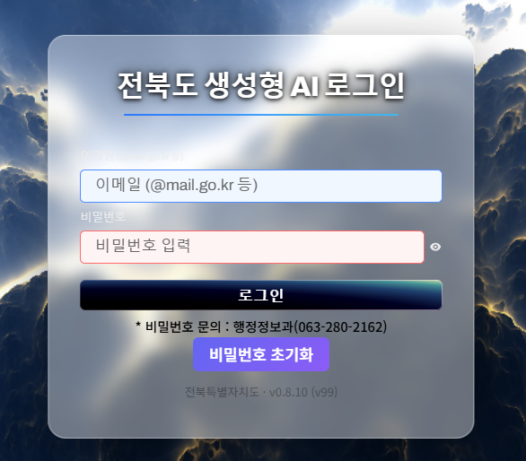

---
# Leave the homepage title empty to use the site title
title:
date: 2024-03-25
type: landing

sections:

  - block: features
    content:
      title: ""
      text: |
        

          
          
Game · Backend · AI Service Developer

          <h1>황선우</h1>
          

            전북대학교 IT정보공학과 4학년으로, Unity 게임 개발과 Spring Boot/FastAPI 기반 백엔드,
            AI 에이전트 서비스를 함께 만들어 온 개발자입니다. 유저가 반응할 장면을 상상하며 몰입하고,
            아이디어를 빠르게 시제품으로 옮긴 뒤 실행 가능한 서비스 구조로 다듬는 일을 좋아합니다.
          

          

            학점 4.0/4.5, 2021년 총장상(성적 우수, 전체 석차 1위), 2026년 캡스톤디자인 최우수상 및
            전북도청 도지사 표창을 기반으로 꾸준함과 실행력을 함께 증명해 왔습니다.
          

          

            <a href="mailto:swh06084@jbnu.ac.kr" aria-label="Email"><i class="fas fa-envelope"></i></a>
            <a href="https://github.com/eecczz" aria-label="GitHub"><i class="fab fa-github"></i></a>
          

        

  - block: markdown
    content:
      title: 주요 성과
      subtitle:
      text: |
        

          

            <strong>교과종합성적 4.0/4.5</strong>
            전공 학업과 프로젝트를 병행하며 유지한 학점
          

          

            <strong>총장상</strong>
            2021년 성적 우수, 전체 석차 1위
          

          

            <strong>최우수상 · 도지사 표창</strong>
            전북도청 대도민 음성 챗봇 캡스톤디자인
          

          

            <strong>산학·연구 경험</strong>
            Unity 외주, 시각지능 연구실, 관제 소프트웨어 현장실습
          

          

            <strong>오픈소스 기여</strong>
            영상 재생 초기화 오류 해결 기여
          

        

    design:
      columns: '1'

  - block: slider
    content:
      slides:

      - title: 인터랙티브 게임
        content: |
          

            실제 움직임과 닮은 입력·피격·상호작용으로 몰입감을 만드는 게임 개발
          

        align: center
        background:
          image:
            filename: nikita-kachanovsky-FJFPuE1MAOM-unsplash.jpg
            filters:
              brightness: 0.4
          position: center
          color: '#000'

      - title: AI 서비스
        content: |
          

            음성, 영상, 추천 문제를 AI 에이전트와 웹서비스로 연결
          

        align: center
        background:
          image:
            filename: Ai.jpg
            filters:
              brightness: 0.4
          position: center
          color: '#000'

      - title: 백엔드·클라우드
        content: |
          

            Spring Boot, MariaDB, AWS 기반의 API와 미디어 처리 파이프라인 설계
          

        align: center
        background:
          image:
            filename: luke-chesser-2Bdyxgz3OM0-unsplash.jpg
            filters:
              brightness: 0.4
          position: center
          color: '#000'

    design:
      slide_height: '350px'
      slide_width: '100px'
      is_fullscreen: false
      loop: true
      interval: 3000

  - block: features
    id: features
    content:
      title:   핵심 역량
      text: 프로젝트를 통해 반복적으로 쌓아 온 기술 방향입니다.  
      items:
        - name: AI 에이전트
          icon: code-branch
          icon_pack: fas
          description: ReAct Agent, 실시간 코칭, 영상 분석 등 AI를 실제 서비스 흐름에 연결  
        - name: 백엔드 API
          icon: server
          icon_pack: fas
          description:  Spring Boot, FastAPI, REST API, JWT 인증, MariaDB/PostgreSQL 기반 데이터 설계  
        - name: 클라우드·미디어
          icon: cloud
          icon_pack: fas
          description:  AWS S3, Lambda, MediaConvert, HLS를 활용한 업로드·변환·스트리밍 구조 설계  
        - name: 게임 개발
          icon: gamepad
          icon_pack: fas
          description:  Unity, C#, XR 입력, 절차적 애니메이션, 셰이더로 조작감과 타격감을 구현  
        - name: 웹 프론트엔드
          icon: desktop
          icon_pack: fas
          description:  React, Next.js, TypeScript로 사용자 흐름과 API 연동 화면 구성  
        - name: 기획·몰입
          icon: lightbulb
          icon_pack: fas
          description:  유저와 팀원의 반응을 상상하며 아이디어를 만들고, 목표에 맞게 수용적으로 조율  

  - block: markdown
    content:
      title: 게임 프로젝트
      subtitle:
      text: |
        

          <article class="home-project-card">
            <a class="home-project-title" href="./toy-projects/swordplay/">Wii Swordplay 모작</a>
            
마우스 입력으로 검을 휘두르는 감각, 피격 반응, Wii풍 셰이더를 하나의 Unity WebGL 프로젝트로 묶었습니다.

            

              
<strong>검 조작</strong>마우스 입력을 검의 회전과 위치로 변환해 직접 휘두르는 감각을 구현했습니다.

              
<strong>피격 반응</strong>충격 후 균형을 회복하는 self-balancing 흐름으로 타격감을 강화했습니다.

              
<strong>Wii풍 셰이더</strong>낮은 광택, 단순한 색, 외곽선 느낌으로 원작의 간결한 비주얼을 재현했습니다.

            

          </article>

          <article class="home-project-card">
            <a class="home-project-title" href="./contest-projects/soulslike-game/">소울라이크 게임</a>
            
창의적공학설계입문 4인 팀프로젝트로 제작한 콜로세움 배경의 Unity 액션 게임입니다.

            

              
<strong>보스전 연출</strong>큰 범위 공격과 강한 이펙트로 소울라이크풍 긴장감을 만들었습니다.

              
<strong>회피와 콤보</strong>공격 모션을 보고 피한 뒤 콤보로 반격하는 전투 흐름을 구현했습니다.

              
<strong>콜로세움 무대</strong>마지막 경기라는 설정에 맞춰 보스와 플레이어가 대치하는 공간감을 구성했습니다.

            

          </article>

          <article class="home-project-card">
            <a class="home-project-title" href="./toy-projects/metaxr-project/">MetaXR Project</a>
            
Meta/XR 기기를 활용해 손의 움직임과 공간감을 전투 상호작용으로 연결한 액션 프로토타입입니다.

            

              
<strong>XR 전투 입력</strong>컨트롤러 움직임을 공격과 방어 상호작용으로 연결했습니다.

              
<strong>근접 상호작용</strong>플레이어와 몬스터가 가까운 거리에서 맞붙는 XR 액션 장면을 구성했습니다.

              
<strong>Unity 프로토타입</strong>XR 입력, 충돌, 몬스터 반응을 빠르게 검증하는 액션 프로토타입입니다.

            

          </article>
        

    design:
      columns: '1'

  - block: markdown
    content:
      title: 웹&앱 서비스
      subtitle:
      text: |
        

          <article class="home-project-card">
            <a class="home-project-title" href="./toy-projects/shopping-mall/">쇼핑몰 프로젝트</a>
            
Spring Boot와 MariaDB 기반으로 상품 조회, 장바구니, 구매, 결제 검증 흐름을 구현한 쇼핑몰 데모입니다.

            

              
<strong>쇼핑몰 화면</strong>상품 목록, 상세, 장바구니, 구매 페이지로 이어지는 기본 쇼핑 흐름을 만들었습니다.

              
<strong>장바구니 흐름</strong>상품 수량, 합계 계산, 체크아웃 진입까지 구매 전 단계를 확인할 수 있게 구성했습니다.

              
<strong>로그인 화면</strong>장바구니와 결제 흐름을 세션 기반 인증 화면으로 연결하는 구조를 실험했습니다.

            

          </article>

          <article class="home-project-card">
            <a class="home-project-title" href="./toy-projects/youtube-clone/">유튜브 모작</a>
            
영상 썸네일 hover preview와 업로드/재생 구조를 실험한 유튜브형 영상 서비스 모작입니다.

            

              
<strong>Video Preview</strong>hover 후 일정 시간 머물렀을 때만 영상을 로드해 불필요한 재생을 줄였습니다.

              
<strong>미디어 UX</strong>썸네일, 영상, 재생바가 자연스럽게 전환되는 유튜브형 탐색 경험을 구현했습니다.

              
<strong>영상 처리 구조</strong>업로드와 재생을 고려해 React 화면과 서버/클라우드 처리 흐름을 분리했습니다.

            

          </article>

          <article class="home-project-card">
            <a class="home-project-title" href="./toy-projects/restaurant-agent/">맛집 추천 ReAct Agent</a>
            
사용자의 지역·가격·상황 조건을 해석하고, 검색 도구와 필터링 도구를 호출해 설명 가능한 맛집 추천을 생성하는 FastAPI 기반 AI Agent입니다.

            

              
<strong>맛집 추천 질문</strong>자연어 요청을 받아 지역과 조건을 추출하고 추천 흐름을 시작합니다.

              
<strong>검색 도구</strong>Kakao Local API와 샘플 데이터셋을 함께 사용해 후보 맛집을 검색합니다.

              
<strong>필터링과 추천</strong>가격, 상황, 리뷰 조건을 반영해 사용자에게 설명 가능한 추천 결과를 제공합니다.

            

          </article>
        

    design:
      columns: '1'

  - block: markdown
    content:
      title: 경력사항 & 수상
      subtitle:
      text: |
        

          <article class="home-project-card">
            <a class="home-project-title" href="./contest-projects/speech-coach/">SpeakUp (교내 AI&SW경진대회 동상)</a>
            
발표·면접·협상 연습을 AI가 분석해 말하기 습관과 전달력을 개선하도록 돕는 코칭 서비스입니다. AI-SW경진대회 동상 수상 프로젝트로, 실시간 피드백과 세션 리포트를 중심 기능으로 설계했습니다.

            

              
<strong>실시간 코칭</strong>말 속도, 필러, 침묵 등 발표 중 드러나는 신호를 분석해 즉시 피드백합니다.

              
<strong>세션 대시보드</strong>연습 기록과 지표를 대시보드로 모아 반복 훈련의 변화를 확인하게 했습니다.

              
<strong>AI 리포트</strong>전사와 주요 주의 구간을 바탕으로 다음 연습에서 고칠 포인트를 정리합니다.

            

          </article>
          <article class="home-project-card">
            <a class="home-project-title" href="./contest-projects/jeonbuk-chatbot/">대도민 음성챗봇 (전북도청 도지사 표창상)</a>
            
도민이 정책·민원 정보를 더 쉽게 찾도록 음성 대화와 캐릭터 UI를 결합한 공공 서비스 프로젝트입니다. 전북도청 도지사 표창장으로 이어진 프로젝트라 홈에서도 성과가 드러나도록 분리했습니다.

            

              
<strong>캐릭터형 챗봇</strong>공공기관 안내를 덜 딱딱하게 만들기 위해 캐릭터 기반 대화 경험을 설계했습니다.

              
<strong>음성 대화</strong>도민이 필요한 정보를 대화하듯 요청하고 확인하는 흐름에 초점을 맞췄습니다.

              
<strong>공공 서비스 UX</strong>정책·민원 정보를 이해하기 쉬운 말투와 단계로 안내하도록 응답 흐름을 정리했습니다.

            

          </article>
        

    design:
      columns: '1'

  - block: markdown
    content:
      title:
      subtitle:
      text: |
        {}
    design:
      columns: '1'
---
