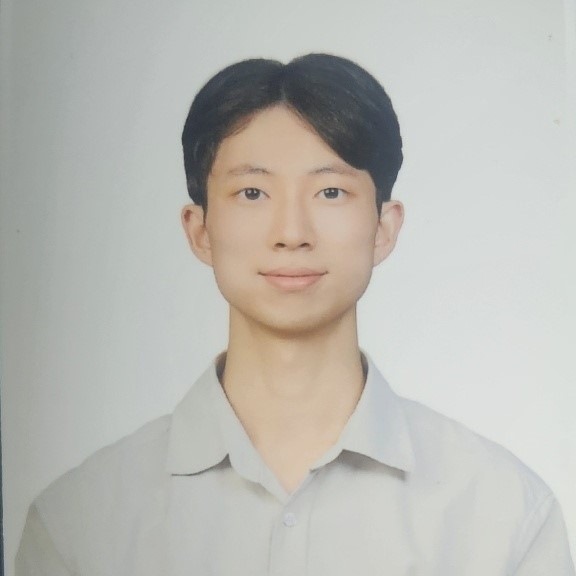

---
# Leave the homepage title empty to use the site title
title:
date: 2024-03-25
type: landing

sections:

  - block: features
    content:
      title: ""
      text: |
        

         
        황선우  
        전북대학교 컴퓨터인공지능학부 2학년으로, 게임/웹을 개발하고 있고, 개발자로 취업을 준비하고 있습니다.  
        <!-- 이메일 및 깃허브 아이콘 추가 및 스타일 수정 -->
        

          <a href="mailto:swh06084@jbnu.ac.kr" style="text-decoration: none; color: #ff5722;">
            <i class="fas fa-envelope" style="font-size: 2rem;"></i>
          </a>
          &nbsp;&nbsp; <!-- 아이콘 사이에 간격 추가 -->
          <a href="https://github.com/eecczz" style="text-decoration: none; color: #ff5722;">
            <i class="fab fa-github" style="font-size: 2rem;"></i>
          </a>
          &nbsp;&nbsp; <!-- 추가된 아이콘 -->
          <a href="https://twitter.com" style="text-decoration: none; color: #ff5722;">
            <i class="fab fa-twitter" style="font-size: 2rem;"></i>
          </a>
          &nbsp;&nbsp;
          <a href="https://facebook.com" style="text-decoration: none; color: #ff5722;">
            <i class="fab fa-facebook" style="font-size: 2rem;"></i>
          </a>
          &nbsp;&nbsp;
          <a href="https://linkedin.com" style="text-decoration: none; color: #ff5722;">
            <i class="fab fa-linkedin" style="font-size: 2rem;"></i>
          </a>
          &nbsp;&nbsp;
          <a href="https://instagram.com" style="text-decoration: none; color: #ff5722;">
            <i class="fab fa-instagram" style="font-size: 2rem;"></i>
          </a>
        
  

  - block: slider
    content:
      slides:

      - title: 가상현실 게임
        content: |
          

            

            조작방식이 실제 움직임과 유사하여 몰입감을 느낄 수 있는 게임
          

        align: center
        background:
          image:
            filename: nikita-kachanovsky-FJFPuE1MAOM-unsplash.jpg
            filters:
              brightness: 0.4
          position: center
          color: '#000'

      - title: 웹서비스
        content: |
          

            

            창의적이고 편리한 웹서비스를 제작
          

        align: center
        background:
          image:
            filename: luke-chesser-2Bdyxgz3OM0-unsplash.jpg
            filters:
              brightness: 0.4
          position: center
          color: '#000'

      - title: RPG 게임 개발
        content: |
          

            

            취업에 맞춤화된 장르의 게임들을 개발
          

        align: center
        background:
          image:
            filename: alice-alinari-HUqxgjORAnw-unsplash.jpg
            filters:
              brightness: 0.4
          position: center
          color: '#000'

    design:
      slide_height: '350px'
      slide_width: '100px'
      is_fullscreen: false
      loop: true
      interval: 3000

  - block: features
    id: features
    content:
      title:   학습중인 분야
      text: 개발자가 되기 위한 학습목표와 관심사입니다.  
      items:
        - name: 인공지능(AI)
          icon: code-branch
          icon_pack: fas
          description: 창의적이고 혁신적인 AI 서비스를 제작  
        - name: 알고리즘
          icon: code
          icon_pack: fas
          description:  코딩 테스트에 나올 수 있는 알고리즘과 AI에 적용되는 알고리즘들을 학습하고 문제풀이  
        - name: 기획
          icon: align-right
          icon_pack: fas
          description:  특정 주제가 주어지고 그에 관련된 웹/앱을 만드는 요구사항이 주어질 때, 유저가 관심을 가질 만한 아이디어를 내고, 체계적으로 정리하기  
        - name: 네트워크
          icon: wifi
          icon_pack: fas
          description:  개발 실무에서 다양한 문제 해결을 위한 네트워크 지식  
        - name: 게임 개발
          icon: gamepad
          icon_pack: fas
          description:  내가 취업하려고 하는 게임회사나 유저들에게 필요한 재밌고 트렌디한 게임을 최적의 방법으로 구현  
        - name: 웹 개발
          icon: file
          icon_pack: fas
          description:  현재 회사들이 필요한, 적절한 디자인 패턴을 사용해 지속가능한 코드와, 실무에서 겪을 수 있는 트래픽 등 다양한 상황들을 해결하는 데 필요한 개념   

  - block: collection
    content:
      id: section-1
      title:  Wii Swordplay 클론
      subtitle:
      text:     
      count: 3
      offset: 0
      order: desc
      filters:
        folders:
          - sword-motion
          - hit-reaction
          - shader
    design:
      view: community/custom_pcard
      columns: '2'

  - block: collection
    content:
      id: section-1
      title:  유튜브 클론
      subtitle:
      text:     
      count: 3
      offset: 0
      order: desc
      filters:
        folders:
          - react&spring
          - aws-lambda
          - video-preview
    design:
      view: community/custom_card
      columns: '2'

  - block: collection
    content:
      title:  팀프로젝트
      subtitle:
      text:     
      count: 3
      filters:
        author: ''
        category: ''
        exclude_featured: false
        publication_type: ''
        tag: ''
      offset: 0
      order: desc
      page_type: team-projects
    design:
      view: community/custom_card
      columns: '2'
    advanced:
      css_style: "text-align: center;"

  - block: markdown
    content:
      title:
      subtitle:
      text: |
        {}
    design:
      columns: '1'
---