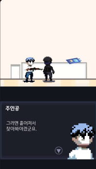
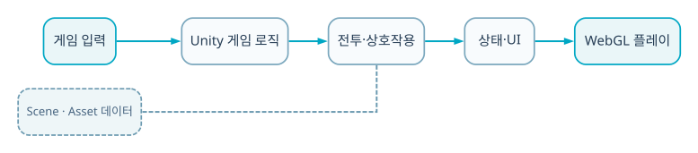

  
BACKEND · AI · SYSTEM CASE STUDY

  
Fungus 기반 선택 분기와 세로형 액션 진행을 결합한 Coala 동아리 4인 팀 프로젝트입니다.

  
<b>역할</b> 4인 팀 · 스토리 흐름/액션 진행/모바일 UI<b>검증</b> 동아리 팀 프로젝트

## 주요 화면

선택형 대화 장면에서 스토리를 진행하고, 분기 이후에는 세로형 전투 화면으로 전환되도록 구성했습니다. 시작 메뉴·대화·전투가 서로 다른 scene이지만 진행 상태는 이어집니다.

## 트러블 슈팅

### 1. 스토리 분기와 전투 scene이 서로의 상태를 잃기 쉬움

선택·진행·ending 조건을 명시적인 state로 연결했습니다.

### 2. 세로 화면에서 게임뷰와 조작 영역이 서로 침범

상·하단을 1:1로 나눠 정보와 입력의 역할을 고정했습니다.

### 3. 팀원이 동시에 flow를 수정할 때 책임 범위가 불명확

Fungus block과 액션 구현을 나눠 통합했습니다.

## 기술 선택과 이유

| 기술 | 선택 이유 |
|---|---|
| **Fungus** | 대화·선택·분기 상태를 빠르게 시각화하고 팀이 함께 수정하기 위해 |
| **Portrait UI** | 상단 게임뷰와 하단 입력을 분리해 모바일 한 손 조작을 실험하기 위해 |
| **Choice state** | 선택이 이후 전투와 ending 조건에 영향을 주게 하기 위해 |
| **Unity scene flow** | 스토리 구간과 전투 구간을 상태로 연결하기 위해 |

## 검증 결과

- 선택 기반 서사·멀티 엔딩과 액션 진행을 하나의 모바일 prototype으로 완성했습니다.
- 백엔드 핵심 프로젝트는 아니므로 팀 협업과 상태 설계 근거로 보조 배치했습니다.

## 시스템 흐름

1. 하단 touch UI가 이동·공격 입력을 만듭니다.
2. Fungus block이 대화와 선택지를 실행합니다.
3. 선택 결과를 진행 state에 기록합니다.
4. state에 따라 전투 scene과 몬스터·무기가 바뀝니다.
5. 완료 조건이 다음 스토리 block을 엽니다.
6. 누적 선택에 따라 ending을 분기합니다.

## API · 시스템 경계

| 영역 | API/계약 | 책임 |
|---|---|---|
| `Narrative` | `Fungus blocks` | 대화·분기 |
| `Input` | `portrait touch UI` | 모바일 조작 |
| `Combat` | `enemy/weapon state` | 액션 진행 |
| `Ending` | `choice conditions` | 멀티 엔딩 |

## 다음 구현 계획

- 분기 graph와 save schema 문서화
- 모바일 input usability test
- 전투와 narrative state를 event bus로 느슨하게 결합
