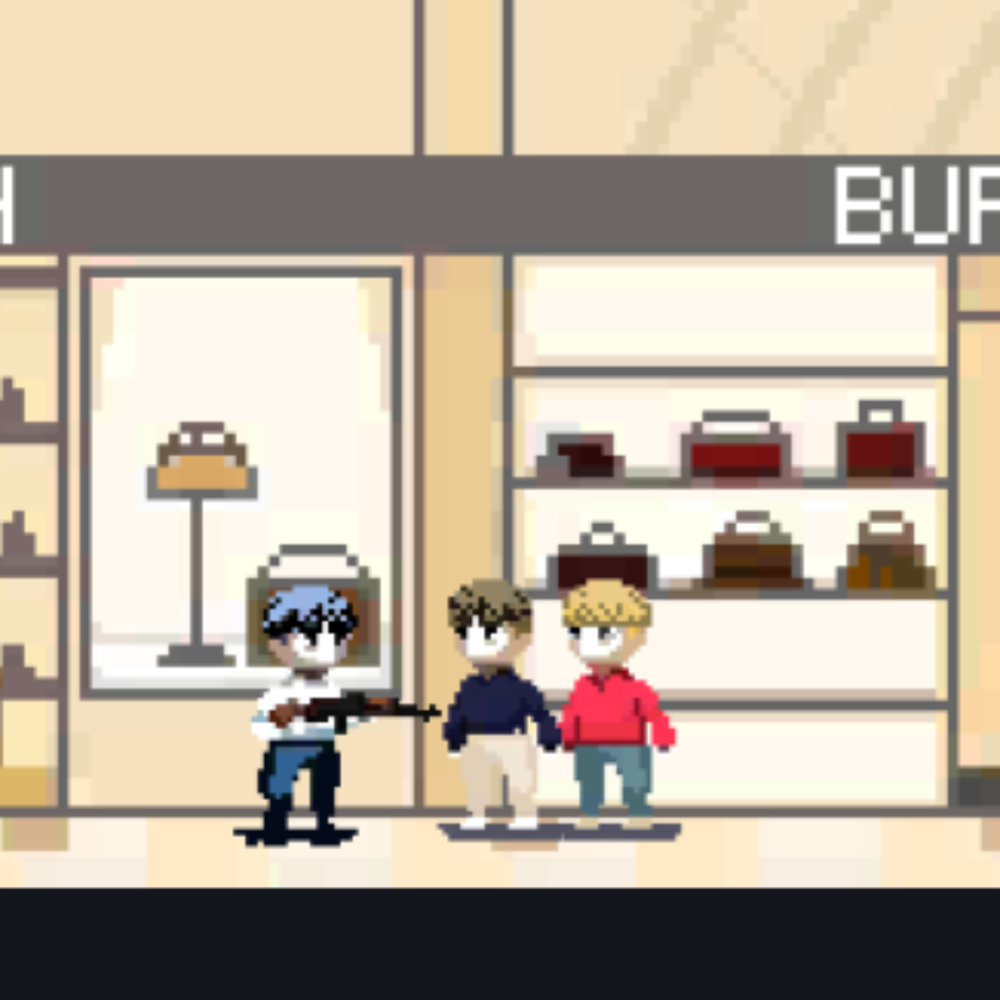

---

title: Gone
date: 2024-04-06
summary: 'Coala 동아리 4인 팀프로젝트로 제작한 선택 기반 세로형 액션 어드벤처 게임입니다.'
highlights:
  - title: 선택 기반 서사
    text: 전직 정보국 요원이 AI의 공격을 막는 이야기 속에서 선택에 따라 다른 엔딩을 제공합니다.
    image: featured.png
  - title: 세로형 플레이
    text: 상단 게임뷰와 하단 조작 영역을 1:1로 배치한 모바일 친화 구성을 실험했습니다.
    image: https://images.unsplash.com/photo-1512941937669-90a1b58e7e9c?auto=format&fit=crop&w=720&q=80
  - title: 동아리 팀 개발
    text: Fungus 기반 스토리 흐름과 액션 진행을 팀원들과 나눠 구현했습니다.
    image: https://images.unsplash.com/photo-1518005020951-eccb494ad742?auto=format&fit=crop&w=720&q=80
links:
  - name: Fungus
    url: https://assetstore.unity.com/packages/tools/game-toolkits/fungus-34184
  - name: Fungus extension pack
    url: https://assetstore.unity.com/packages/templates/systems/multislot-save-system-for-fungus-141890
featured: true
---

Gone은 초인공 지능 "큐리"가 발생시킨 전파로 초토화된 도시를 배경으로 한 팀 프로젝트입니다. 전직 정보국 요원인 주인공이 AI의 공격을 저지하는 과정에서 여러 선택을 마주하고, 선택에 따라 다양한 엔딩을 볼 수 있습니다.

세로 화면으로 플레이하며, 상단의 게임뷰와 하단의 조작 영역이 1:1 비율로 배치된 구성이 특징입니다. 스토리가 진행될수록 강력한 몬스터와 새로운 무기가 등장하며, 액션과 선택형 서사를 함께 실험했습니다.

- 기술 스택: Unity, Fungus
- 구현 포인트: 선택 기반 서사, 멀티 엔딩, 세로형 조작 UI, 액션 진행 구조
- 구분: Coala 동아리 4인 팀프로젝트

## 주요 구현 포인트

### 선택 기반 서사

전직 정보국 요원이 AI의 공격을 막는 이야기 속에서 선택에 따라 다른 엔딩을 제공합니다.

### 세로형 플레이

상단 게임뷰와 하단 조작 영역을 1:1로 배치한 모바일 친화 구성을 실험했습니다.

### 동아리 팀 개발

Fungus 기반 스토리 흐름과 액션 진행을 팀원들과 나눠 구현했습니다.
