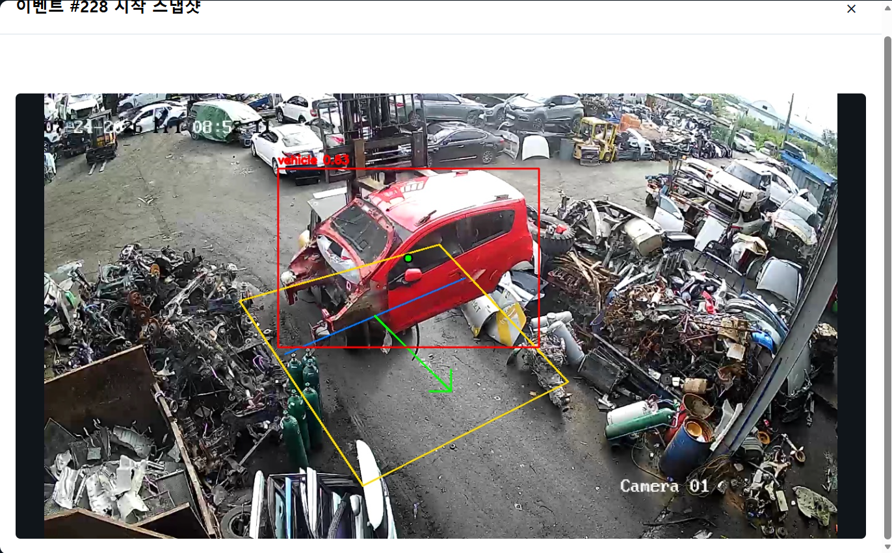
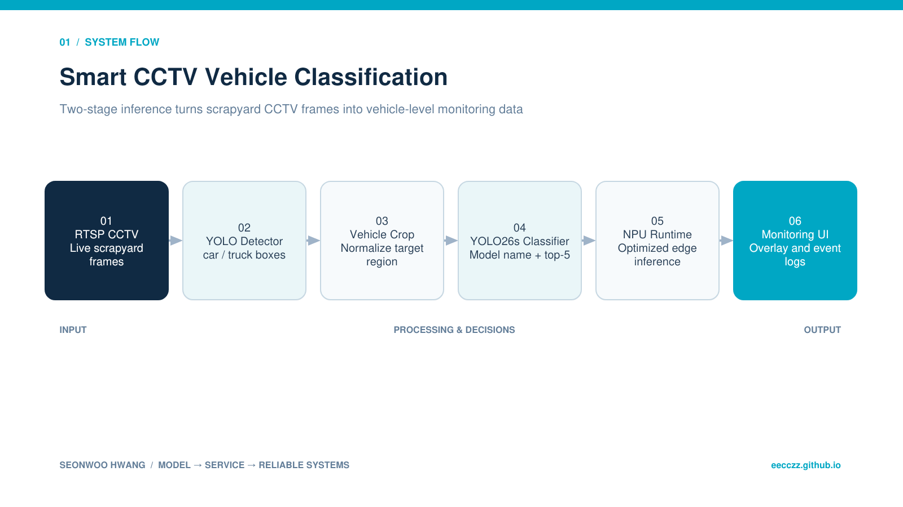

  
BACKEND · AI · SYSTEM CASE STUDY

  
폐차장 RTSP CCTV에서 차량을 탐지하고 NPU 환경에서 차종 단위로 분류하는 Edge-AI 관제 프로젝트입니다.

  
<b>역할</b> Edge-AI 현장실습 · 모델 전처리/학습/변환/현장 적용<b>검증</b> 실제 폐차장 RTSP 환경 검증

## 주요 화면

폐차장 RTSP 화면에서 차량 후보를 탐지하고, 관심 영역과 이동 방향을 관제 화면에 함께 표시했습니다. 파손된 차량처럼 전체 외형이 온전히 보이지 않는 경우에도 crop된 부분 특징으로 차종을 분류하도록 연결했습니다.

## 트러블 슈팅

### 1. 훼손·가림이 많은 폐차장 차량에서도 부분 특징으로 차종을 식별해야 함

폐차장에서는 범퍼·문·적재함이 파손되거나 차량 일부만 카메라에 잡혀 완전한 외형을 보기 어려웠습니다. 차량 bbox를 crop한 약 120만 장의 데이터로 학습해 전체 실루엣뿐 아니라 램프·그릴·창문·차체 비율 같은 부분 특징을 충분히 학습하도록 했고, 실제 현장의 훼손 차량에서도 의미 있는 차종 예측을 확인했습니다.

### 2. 뒤늦게 추가 학습한 지게차를 문이 닫힌 트럭과 혼동함

운영 도중 지게차를 새로운 차종으로 추가해야 한다는 요구사항이 생겼습니다. 기존 분류기에 지게차 데이터만 이어서 학습하자, 폐쇄형 운전석과 각진 전면부를 가진 지게차를 트럭으로 예측하는 오탐이 반복됐습니다.

트럭과 유사한 지게차·문이 닫힌 지게차를 hard negative로 추가하고 지게차 이미지를 트럭 클래스와 비슷한 수까지 oversampling했지만, 기존 클래스 경계가 지게차를 모르는 상태에서 이미 형성되어 혼동이 충분히 줄지 않았습니다.

### 3. 신규 클래스를 포함한 전체 데이터로 처음부터 다시 학습해 클래스 경계를 재구성함

기존 모델에 새 클래스만 덧붙이는 방식 대신, 지게차를 처음부터 포함한 전체 데이터셋으로 모델을 재학습했습니다. 트럭·지게차의 공통 특징과 구분 특징을 동시에 보면서 표현과 클래스 경계를 다시 형성하게 하자 문이 닫힌 지게차를 트럭으로 보던 현장 오탐이 해소됐습니다.

이 경험을 통해 데이터 수를 맞추는 것만으로는 새 클래스가 기존 표현 공간에 안정적으로 들어가지 않을 수 있으며, 요구사항 변경 시 학습 시작점과 전체 클래스 간 관계까지 함께 검토해야 함을 확인했습니다.

## 기술 선택과 이유

| 기술 | 선택 이유 |
|---|---|
| **YOLO26s detector** | CCTV 프레임에서 car/truck 위치를 먼저 제한해 분류 입력의 잡음을 줄이기 위해 |
| **YOLO26s classifier** | 차량 crop을 세부 차종으로 분류하고 top-5 후보까지 비교하기 위해 |
| **OpenCV · Python** | RTSP 프레임 처리, crop 생성, 결과 overlay를 하나의 파이프라인으로 묶기 위해 |
| **NPU runtime** | GPU가 아닌 현장 Edge 장비의 제약 안에서 실시간 추론하기 위해 |
| **From-scratch retraining** | 지게차를 포함한 전체 클래스의 특징과 경계를 처음부터 함께 학습하기 위해 |

## 검증 결과

- 기존 분류 모델의 validation에서 top-1 0.90665, top-5 0.97743을 기록했습니다.
- 약 120만 장의 차량 crop으로 학습해 실제 폐차장 훼손 차량의 부분 특징 기반 분류를 확인했습니다.
- 지게차를 포함한 전체 데이터 재학습으로 폐쇄형 지게차와 트럭의 현장 혼동을 해소했습니다.

## 시스템 흐름

1. RTSP 카메라 프레임을 수집합니다.
2. COCO 사전학습 detector에서 car/truck bbox만 선택합니다.
3. bbox를 차량 crop으로 잘라 classifier 입력으로 정규화합니다.
4. AIHub 데이터로 학습한 분류기가 차종명·confidence·top-5를 반환합니다.
5. NPU용 형식으로 변환한 모델을 현장 관제 소프트웨어에 연결합니다.
6. bbox와 예측값을 화면과 로그에 남겨 오탐을 추적합니다.

## API · 시스템 경계

| 영역 | API/계약 | 책임 |
|---|---|---|
| `입력` | `RTSP/CCTV frame` | 폐차장 카메라 |
| `탐지` | `car, truck bbox` | YOLO26s detector |
| `분류` | `class, confidence, top-5` | YOLO26s classifier |
| `출력` | `overlay · 결과 이미지 · CSV` | 현장 관제 UI |

## 다음 구현 계획

- 다중 차량에서 관심 차량을 안정적으로 선택하는 tracking 추가
- 지게차·트럭 hard case 전용 validation set과 confusion matrix로 정량 재평가
- 새 클래스 추가 시 기존 클래스 rehearsal set과 class-balanced sampler 비교
- NPU latency/FPS와 CPU·메모리 사용량 계측
