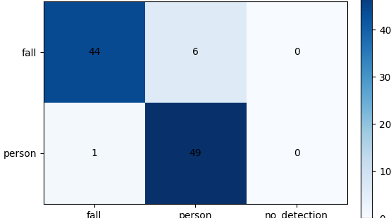

  
BACKEND · AI · SYSTEM CASE STUDY

  
자세 추정·낙상 객체 탐지·현장 맥락 zero-shot의 3단 검증으로 요양원 RTSP 오탐을 줄인 Edge-AI 관제 프로젝트입니다.

  
<b>역할</b> Edge-AI 현장실습 · 데이터/모델/후처리/현장 검증<b>검증</b> 실제 요양원 RTSP 환경 적용

## 주요 화면

현장 적용 전에는 낙상·비낙상 hard validation set으로 오탐과 미탐을 분리해 확인했습니다. 아래 결과는 50개의 낙상 장면과 50개의 일반 사람 장면에 대한 2차 객체 탐지 모델의 판정 분포이며, 이후 pose와 zero-shot 검증을 앞뒤 단계에 결합했습니다.

## 트러블 슈팅

### 1. 자세 추정만으로는 가림·원거리·세로 방향 낙상을 안정적으로 판정하지 못함

처음에는 관절 위치와 신체 기울기를 이용한 자세 추정 기반 낙상 감지를 구현했습니다. 그러나 침대·가구에 신체 일부가 가려지거나 사람이 멀리 있어 keypoint confidence가 낮아지는 장면, 카메라 화면에서 세로 방향으로 쓰러져 신체 폭이 충분히 넓어지지 않는 장면에서는 판정이 불안정했습니다.

관절 confidence, 상체 각도, bbox 종횡비와 유지 시간을 조합한 휴리스틱을 반복 조정했지만 카메라 시점과 가림 정도에 따라 기준이 달라졌습니다. 자세 추정은 1차 후보 생성으로 유지하고, 실제 낙상 이미지를 학습한 `fall/person` 객체 탐지 모델을 2차 검증기로 연결했습니다.

### 2. 2차 객체 탐지 모델에서도 앉기·허리 숙이기·하반신 가림 오탐이 발생함

객체 탐지 모델은 자세 추정의 누락을 보완했지만, 앉거나 허리만 숙인 사람을 쓰러진 사람으로 판단하거나 하반신이 가구에 가려져 짧고 수평에 가까운 형태만 보일 때 `fall`로 오탐했습니다.

앉음·숙임·부분 가림 장면을 hard negative로 보강하고, `person` 비교군을 함께 학습했습니다. 한 사람의 상·하체가 서로 다른 bbox로 검출되는 경우에는 겹치거나 가까운 bbox를 묶어 fall confidence와 신체 coverage가 충분할 때만 낙상으로 유지했습니다.

### 3. 모델 출력만으로는 현장 구조와 행동 맥락을 구분하기 어려움

마지막 단계에서는 적용 현장에 맞춘 텍스트 프롬프트와 후보 이미지의 시각 특징을 함께 비교하는 zero-shot 검증을 추가했습니다. `바닥에 전신이 쓰러진 사람`과 `의자에 앉은 사람`, `허리를 숙인 사람`, `가구에 하반신이 가려진 사람`을 현장 상황에 맞게 기술해 1·2차 모델의 낙상 후보를 다시 판별했습니다.

이를 통해 하나의 기준을 계속 복잡하게 만드는 대신, 자세의 기하학적 변화·학습된 낙상 형태·현장 의미를 서로 다른 단계에서 검증하도록 역할을 분리했습니다.

## 기술 선택과 이유

| 기술 | 선택 이유 |
|---|---|
| **Pose estimation** | 관절 위치·신체 기울기와 시간 변화를 이용해 낙상 후보를 빠르게 생성하기 위해 |
| **YOLO26s detection** | pose가 놓친 후보를 실제 낙상 형태와 `person` 비교군으로 2차 검증하기 위해 |
| **fall/person 2-class** | 쓰러지지 않은 사람을 비교군으로 제공해 단일 클래스의 배경 편향을 줄이기 위해 |
| **BBox post-processing** | 한 사람의 상·하체가 fall/person으로 나뉘는 부분 bbox 오류를 보수적으로 통합하기 위해 |
| **Zero-shot validation** | 시각 특징과 현장 맞춤 텍스트 프롬프트를 결합해 앉음·숙임·부분 가림을 3차 검증하기 위해 |

## 검증 결과

- pose 후보→fall/person 객체 탐지→zero-shot 현장 검증의 3단 판정 흐름을 구성했습니다.
- 최종 fall 표시 기준을 confidence 0.70으로 높여 완전히 쓰러진 상태 중심으로 판정했습니다.
- 실제 요양원 RTSP 카메라에서 부분 가림·원거리·앉음·숙임 장면을 반복 검증했습니다.

## 시스템 흐름

1. RTSP 프레임에서 pose 관절과 신체 기울기로 낙상 후보를 얻습니다.
2. YOLO fall/person 모델이 후보 crop의 낙상 형태를 2차 검증합니다.
3. 같은 사람으로 보이는 중복·인접 bbox를 묶고 confidence·coverage를 계산합니다.
4. 현장 맞춤 텍스트 프롬프트와 시각 특징을 비교해 zero-shot으로 3차 검증합니다.
5. confidence 0.70과 시간 조건을 통과한 이벤트만 낙상으로 확정합니다.
6. 확정 이벤트를 스냅샷·DB·알림 파이프라인에 전달합니다.

## API · 시스템 경계

| 영역 | API/계약 | 책임 |
|---|---|---|
| `1차 판정` | `pose keypoints · angle` | 자세 추정 · 시간 조건 |
| `2차 검증` | `fall/person bbox` | YOLO26s · bbox grouping |
| `3차 검증` | `visual feature · text prompt` | 현장 맥락 zero-shot |
| `이벤트` | `confirmed fall` | snapshot · DB · alert |

## 다음 구현 계획

- 현장 validation set으로 pose·detector·zero-shot 단계별 precision/recall 비교
- 연속 프레임 tracking과 cooldown으로 단발성 오탐 억제
- 요양원별 가구·카메라 시점에 맞춘 hard negative와 프롬프트 보강
