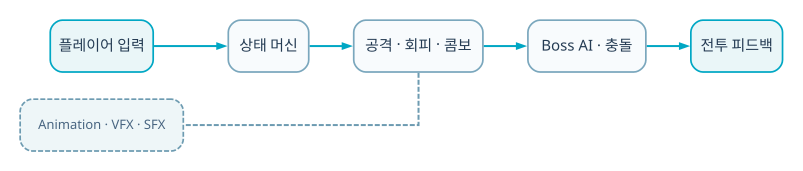

  
BACKEND · AI · SYSTEM CASE STUDY

  
회피·스태미나·콤보·hitbox timing·보스 AI를 상태 기반으로 구성한 4인 Unity 팀 프로젝트입니다.

  
<b>역할</b> 4인 팀 · 전투 조작감/피격/스태미나/연출<b>검증</b> 교과 팀 프로젝트

## 30초 요약

- **무엇을 만들었나** — 회피·스태미나·콤보·hitbox timing·보스 AI를 상태 기반으로 구성한 4인 Unity 팀 프로젝트입니다.
- **내 기여 범위** — 4인 팀 · 전투 조작감/피격/스태미나/연출
- **현재 수준** — 교과 팀 프로젝트
- **코드 근거** — [GitHub 저장소](https://github.com/eecczz/my-soulslike-game)

> 팀 프로젝트는 전체 결과가 아니라 위에 적은 직접 기여 범위와, 면접에서 구현 이유를 설명할 수 있는 내용만 서술했습니다.

## 실제 구현 과정과 트러블슈팅

### 1. 공격 판정과 animation timing이 어긋나 유효 타격이 불분명

**판단과 수정** — hitbox lifecycle을 animation event와 연결했습니다.

### 2. 피격·스태미나 처리가 여러 스크립트에서 중복

**판단과 수정** — 최근 커밋에서 combat hit와 stamina 흐름을 정리했습니다.

### 3. 대형 Unity Library가 저장소에 포함

**판단과 수정** — 외부 asset과 생성 파일 범위를 문서화하고 metadata를 정리했습니다.

## 기술 선택과 이유

| 기술 | 선택 이유 |
|---|---|
| **Combat state** | 공격·회피·피격 중 허용되는 입력을 명확히 제한하기 위해 |
| **Stamina** | 무한 회피·공격을 막고 위험/보상의 리듬을 만들기 위해 |
| **Animation hitbox timing** | 보이는 무기 궤적과 실제 damage 판정을 맞추기 위해 |
| **Cinemachine · VFX** | 보스 공격 범위와 피격 결과를 즉시 읽게 하기 위해 |

## 검증 결과

- 회피 후 반격·콤보·보스 범위 공격의 핵심 전투 loop를 구현했습니다.
- 2022 초기 구현에서 2026 전투 hit/stamina 리팩터링까지 개선 이력이 남아 있습니다.

## 시스템 흐름 — 이해 보조

이 그림은 구현 역량의 증거를 대신하지 않습니다. 실제 코드·README·커밋과 문제 해결 기록을 읽기 쉽게 연결한 보조 자료입니다.

1. 입력을 attack/dodge 명령으로 변환합니다.
2. combat state와 stamina가 실행 가능 여부를 결정합니다.
3. animation event가 hitbox 활성 시간을 엽니다.
4. Enemy AI가 거리와 상태에 따라 공격을 선택합니다.
5. collision이 damage·stagger를 계산합니다.
6. camera·sound·VFX가 결과를 피드백합니다.

## API · 시스템 경계

| 영역 | API/계약 | 책임 |
|---|---|---|
| `Input` | `attack/dodge` | 명령 |
| `State` | `stamina/combo` | 전투 규칙 |
| `Hit` | `animation event + collider` | 판정 |
| `Feedback` | `camera/VFX/sound` | 결과 전달 |

## 한계와 다음 실험

- state machine과 animation graph의 테스트 가능한 경계 분리
- damage frame·input latency 계측
- 보스 패턴별 playtest telemetry

## 구현 근거

- [GitHub 저장소](https://github.com/eecczz/my-soulslike-game)
- README의 기능 목록만 옮기지 않고 controller/service/source tree와 주요 commit 흐름을 함께 확인했습니다.
- 개발 중 남긴 Codex 대화에서는 문제 진단·가설·수정 순서를 확인했습니다.
- 저장소·실행 기록·수상 결과로 확인되지 않는 성과 수치는 만들지 않았습니다.
