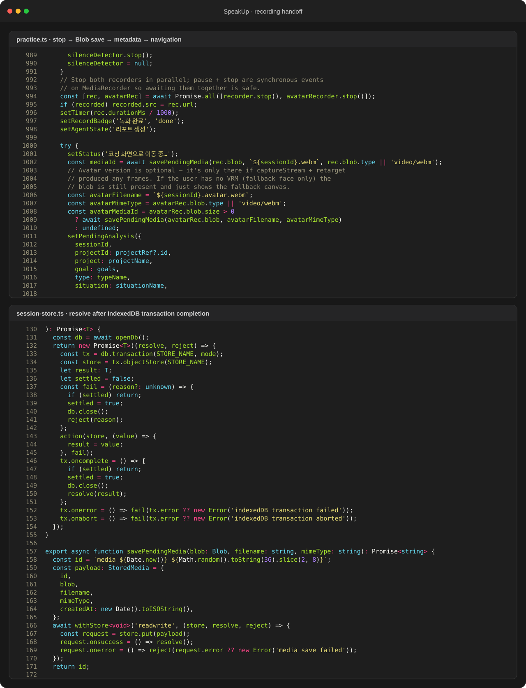
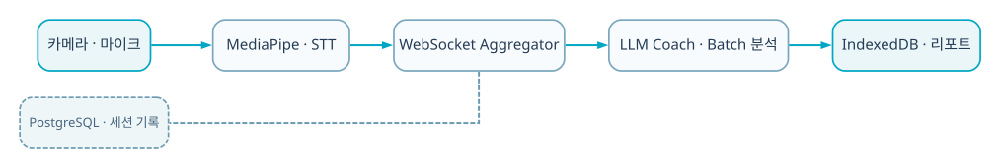

  
BACKEND · AI · SYSTEM CASE STUDY

  
음성·시선·자세·표정 신호를 실시간 집계하고 세션 종료 후 종합 리포트를 만드는 AI 코칭 서비스입니다.

  
<b>역할</b> 3인 팀 팀장 · 주제/서비스 구조/실시간 코칭 및 리포트 구현<b>검증</b> 교내 AI-SW 경진대회 동상

## 트러블 슈팅

### 1. 프레임마다 LLM을 호출하면 지연·비용·반복 피드백이 커짐

MediaPipe는 5 FPS로 처리하고 isFinal 문장 경계에서만 LLM을 호출했습니다.

### 2. 긴 세션에서 payload와 피드백이 누적되어 UI가 불안정

최근 구간 window와 최소 2초 코칭 간격을 두고 practice 화면 스크롤 영역을 분리했습니다.

### 3. 1분 이상 녹화 후 제출하면 리포트 화면으로 넘어가지 않음

MediaRecorder 중지 자체보다, 커진 WebM Blob을 IndexedDB에 저장하는 비동기 작업과 페이지 이동 사이의 경쟁 조건을 의심했습니다. 기존 helper는 object store의 `put()` 성공 시 resolve해 실제 transaction commit 완료 전에 다음 화면으로 이동할 수 있었습니다.

영상 Blob은 용량 제한이 작은 localStorage가 아닌 IndexedDB에 저장하고, `request.onsuccess`가 아니라 transaction의 `oncomplete`에서 Promise를 끝내도록 수정했습니다. 그 뒤에만 pending metadata를 localStorage에 기록하고 loading 화면으로 이동하게 순서를 고정했습니다. 분석 완료 후 media key도 지우지 않아 리포트에서 원본 영상을 다시 불러오도록 했습니다.

### 4. 녹화와 아바타 캔버스를 함께 남겨야 함

브라우저 녹화 경로를 조정하고 MP4 변환 및 리포트 토글까지 연결했습니다.

## 기술 선택과 이유

| 기술 | 선택 이유 |
|---|---|
| **MediaPipe 5 FPS** | 브라우저에서 시선·자세·표정 신호를 실시간 처리하되 연산 부하를 통제하기 위해 |
| **Web Speech API** | 문장 완료 시점을 빠르게 감지해 코칭 트리거와 전사 맥락에 사용하기 위해 |
| **FastAPI microservices** | audio·aggregator·coach의 서로 다른 실시간/배치 책임을 분리하기 위해 |
| **PostgreSQL · Docker Compose** | 세션·대화 기록을 보존하고 여러 서비스를 같은 실행 환경으로 묶기 위해 |

## 검증 결과

- 실시간 언어적·비언어적 피드백과 종료 후 복기 흐름을 하나의 서비스로 완성했습니다.
- 3인 팀을 이끌어 교내 AI-SW 경진대회 동상을 수상했습니다.
- 저장소에는 서비스별 코드, Docker Compose, API endpoint, 수정 커밋이 남아 있습니다.

## 시스템 흐름

1. 브라우저가 카메라·마이크를 받고 MediaPipe 신호를 계산합니다.
2. WebSocket으로 vision/prosody/STT frame을 aggregator에 전달합니다.
3. aggregator가 5초 window를 만들고 live coach 규칙을 호출합니다.
4. 완료 문장 단위로 LLM 피드백을 요청하며 최소 2초 간격으로 반복을 억제합니다.
5. 종료 후 faster-whisper·librosa·ffmpeg가 전사/운율/영상 산출물을 만듭니다.
6. IndexedDB transaction 완료 뒤 분석 화면으로 이동하고, coach 결과와 보존된 media key를 리포트 UI가 함께 사용합니다.

## API · 시스템 경계

| 영역 | API/계약 | 책임 |
|---|---|---|
| `WS` | `/ws/signals, /ws/hud` | 실시간 신호·HUD |
| `Session` | `POST /session/start, /end` | 분석 window lifecycle |
| `Audio` | `POST /transcribe, /convert/mp4, /analyze` | STT·운율·미디어 |
| `Coach` | `POST /live, /comprehensive, /agent-feedback` | 실시간/종합 코칭 |

## 다음 구현 계획

- 실사용자 세션으로 코칭 정확도·유용성 평가
- signal/LLM 장애 시 fallback과 재처리 queue 강화
- 세션 간 지표 비교와 운영 모니터링 추가
