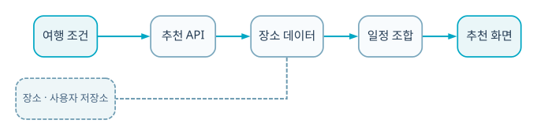

  
BACKEND · AI · SYSTEM CASE STUDY

  
TourAPI 관광지와 GPS 수행·리뷰·완주율을 결합해 검증된 코스를 다시 추천하는 참여형 플랫폼입니다.

  
<b>역할</b> Backend 역할 · TourAPI proxy/데이터 흐름/Trust Score/GPS 검증<b>검증</b> Web→React Native 확장 프로토타입

## 30초 요약

- **무엇을 만들었나** — TourAPI 관광지와 GPS 수행·리뷰·완주율을 결합해 검증된 코스를 다시 추천하는 참여형 플랫폼입니다.
- **내 기여 범위** — Backend 역할 · TourAPI proxy/데이터 흐름/Trust Score/GPS 검증
- **현재 수준** — Web→React Native 확장 프로토타입
- **코드 근거** — [GitHub 저장소](https://github.com/eecczz/tripick)

> 팀 프로젝트는 전체 결과가 아니라 위에 적은 직접 기여 범위와, 면접에서 구현 이유를 설명할 수 있는 내용만 서술했습니다.

## 실제 구현 과정과 트러블슈팅

### 1. TourAPI CORS·키 형식·실패가 웹과 앱에서 다르게 발생

**판단과 수정** — proxy와 직접 호출 계약을 맞추고 mock fallback과 데이터 source 배지를 두었습니다.

### 2. 별점만으로는 실제 수행 가능한 코스인지 판단하기 어려움

**판단과 수정** — 수행자 수·완주율·리뷰를 분리해 Trust Score와 설명 항목을 만들었습니다.

### 3. Web 프로토타입과 React Native 코드가 갈라짐

**판단과 수정** — 공통 category와 trust 계산 규칙을 TypeScript로 이식하고 monorepo로 정리했습니다.

## 기술 선택과 이유

| 기술 | 선택 이유 |
|---|---|
| **TourAPI proxy** | 브라우저 CORS와 인증키 노출을 줄이고 응답을 캐시하기 위해 |
| **React Native · Expo** | GPS check-in을 실제 모바일 사용 흐름에서 검증하기 위해 |
| **Browser Geolocation** | 단순 작성자 추천이 아니라 실제 방문·완주 근거를 남기기 위해 |
| **Trust Score** | 별점만이 아니라 수행자 수·완주율·리뷰를 조합하기 위해 |

## 검증 결과

- TourAPI→코스 생성→GPS 수행→리뷰/Trust→랭킹의 데이터 선순환을 구현했습니다.
- Web에서 React Native로 확장하며 지도 preview·check-in·trace persistence를 커밋 단위로 추가했습니다.

## 시스템 흐름 — 이해 보조

이 그림은 구현 역량의 증거를 대신하지 않습니다. 실제 코드·README·커밋과 문제 해결 기록을 읽기 쉽게 연결한 보조 자료입니다.

1. TourAPI에서 전주 관광지 데이터를 정규화합니다.
2. 사용자가 후보를 조합해 코스를 만듭니다.
3. 모바일 GPS check-in이 방문·완주 흔적을 저장합니다.
4. 리뷰와 수행자 수·완주율을 Trust Score에 반영합니다.
5. 점수와 추천 사유를 카드·상세 화면에 표시합니다.
6. 검증된 코스가 랭킹에서 다시 노출됩니다.

## API · 시스템 경계

| 영역 | API/계약 | 책임 |
|---|---|---|
| `Tour` | `GET /spots` | TourAPI proxy·cache |
| `Course` | `create/detail/trace` | 코스·수행 기록 |
| `GPS` | `check-in` | 방문 검증 |
| `Trust` | `score + reason` | 랭킹 근거 |

## 한계와 다음 실험

- 서버 영속 DB와 사용자 인증 연결
- GPS spoofing·중복 check-in 방지
- Trust Score 가중치 A/B 테스트와 운영 지표

## 구현 근거

- [GitHub 저장소](https://github.com/eecczz/tripick)
- README의 기능 목록만 옮기지 않고 controller/service/source tree와 주요 commit 흐름을 함께 확인했습니다.
- 개발 중 남긴 Codex 대화에서는 문제 진단·가설·수정 순서를 확인했습니다.
- 저장소·실행 기록·수상 결과로 확인되지 않는 성과 수치는 만들지 않았습니다.
