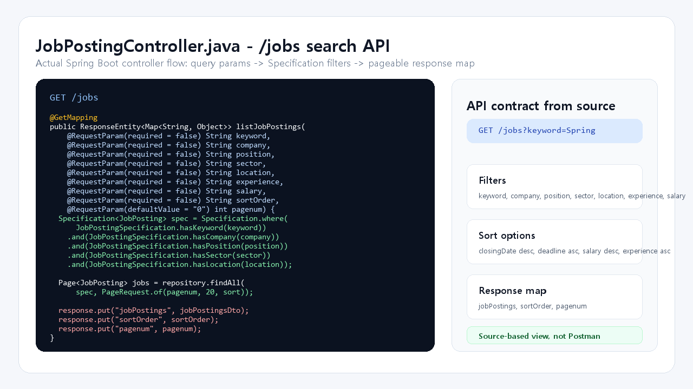
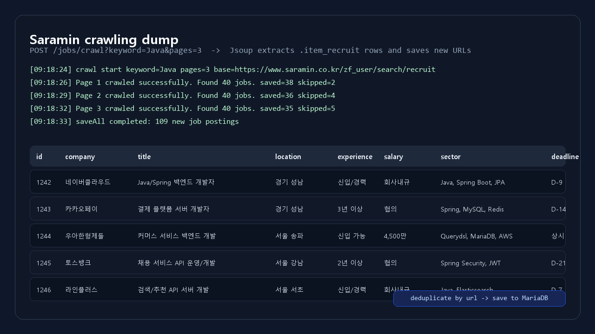
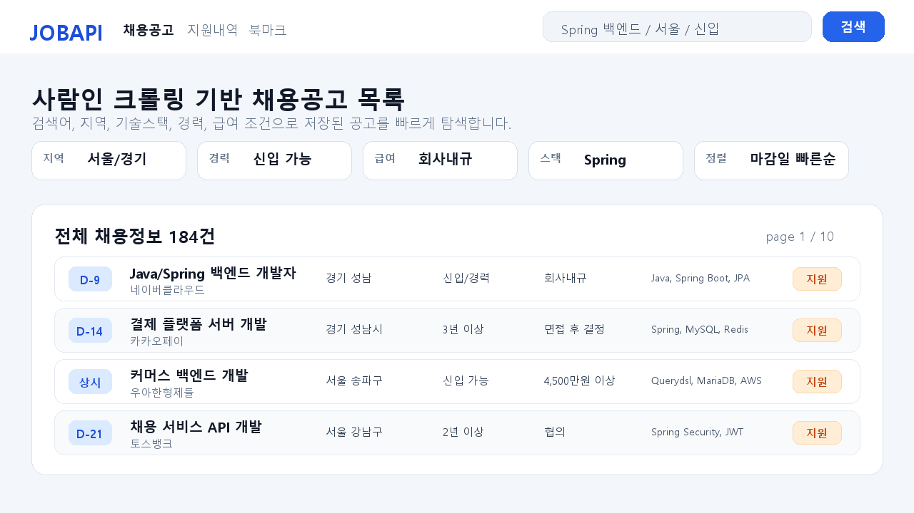
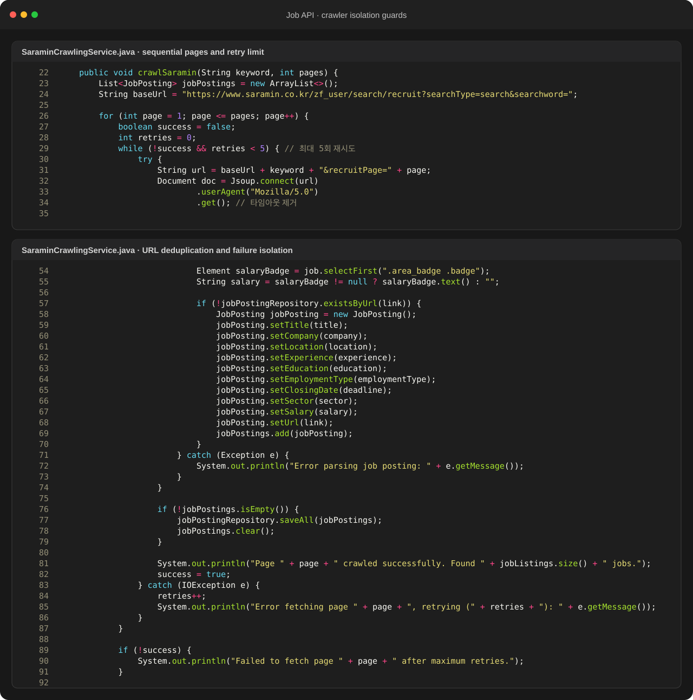
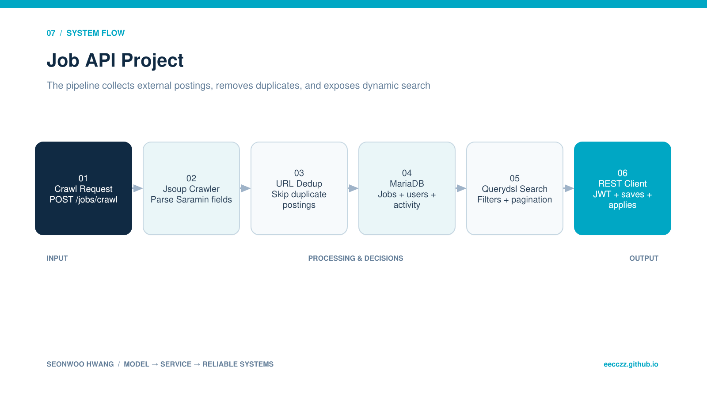

  
BACKEND · AI · SYSTEM CASE STUDY

  
사람인 채용공고를 수집·중복 제거하고 Querydsl 다중 조건 검색과 JWT 기반 지원·북마크를 제공하는 REST API입니다.

  
<b>역할</b> 개인 프로젝트 · 크롤러/검색 API/인증/배포<b>검증</b> jcloud 배포 및 실제 데이터 수집 검증

## 주요 화면

수집한 채용공고를 직무·경력·지역·기술 키워드로 조회하고, REST 응답과 실제 목록 화면이 같은 검색 조건을 사용하도록 구성했습니다. 외부 크롤링이 중단된 뒤에는 SQL dump를 입력 데이터로 전환해 검색 기능을 계속 검증했습니다.

## 트러블 슈팅

### 1. 빠른 병렬 크롤링이 대상 사이트 차단 위험을 키움

초기에는 10개 thread로 페이지를 병렬 요청했지만, 사람인 응답 실패와 IP 차단을 경험했습니다. 외부 HTML 구조와 접근 정책에 핵심 데이터가 종속되면 서비스 기능 검증까지 함께 멈추는 구조였습니다.

병렬 수집을 제거하고 페이지별 순차 처리, 최대 5회 재시도, URL 기반 중복 제거로 요청 강도를 낮췄습니다. 차단된 개발 환경에서는 확보해 둔 DB dump·샘플 공고를 적재해 검색·지원·북마크 API 개발을 계속했습니다. 즉 크롤러는 데이터 공급 수단으로 격리하고, Job API 자체는 저장된 데이터만으로 동작하게 분리했습니다.

### 2. 같은 공고가 반복 수집되어 데이터가 누적

공고 URL을 식별자로 확인한 뒤 새 항목만 saveAll하도록 바꿨습니다.

### 3. 로컬 MySQL과 jcloud 환경 차이

DB schema와 jar 배포 경로를 분리하고 환경변수 기반 접속 정보로 정리했습니다.

## 기술 선택과 이유

| 기술 | 선택 이유 |
|---|---|
| **Jsoup** | 사람인 HTML에서 공고 필드를 직접 파싱하고 페이지 단위 수집을 통제하기 위해 |
| **Querydsl** | 키워드·회사·직무·기술·지역·경력·급여 조건을 조합하기 위해 |
| **JWT access/refresh** | REST client의 인증 상태를 서버 세션과 분리하기 위해 |
| **MariaDB** | 공고·회원·지원·북마크 관계를 영속화하기 위해 |

## 검증 결과

- 공고 수집·동적 검색·인증·지원·북마크의 전체 API 흐름을 구현했습니다.
- 실제 jcloud Ubuntu에 jar와 DB dump를 배포해 서버 환경에서 검증했습니다.

## 시스템 흐름

1. POST /jobs/crawl이 수집 작업을 시작합니다.
2. Jsoup이 회사·제목·지역·경력·마감·기술·URL을 파싱합니다.
3. URL 존재 여부를 확인해 중복 공고를 제외합니다.
4. 순차 요청과 최대 5회 retry로 페이지 실패를 격리하며, 접근 불가 시 DB dump·샘플 데이터로 전환합니다.
5. GET /jobs가 Querydsl 조건과 정렬·페이지 값을 조합합니다.
6. 인증 사용자는 지원·북마크 상태를 생성하거나 취소합니다.

## API · 시스템 경계

| 영역 | API/계약 | 책임 |
|---|---|---|
| `Auth` | `POST /auth/register, /login, /refresh` | JWT lifecycle |
| `Jobs` | `GET /jobs, /jobs/{id}` | 검색·상세 |
| `Crawler` | `POST /jobs/crawl` | 사람인 수집 |
| `Activity` | `POST/DELETE /applications/{id}, /bookmarks/{id}` | 지원·저장 |

## 다음 구현 계획

- robots.txt·이용약관·공식 API 여부를 먼저 확인하고 외부 사이트 수집을 운영 기능과 분리
- 크롤러를 scheduler/queue로 분리하고 실행 상태 endpoint 추가
- 검색 query 실행계획·index·응답시간 계측
- 외부 사이트 정책 변경을 감지하는 parser contract test
