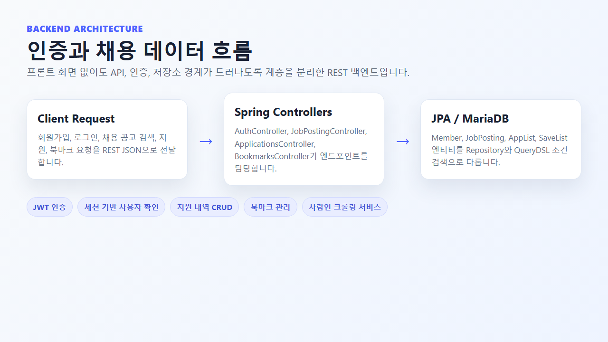
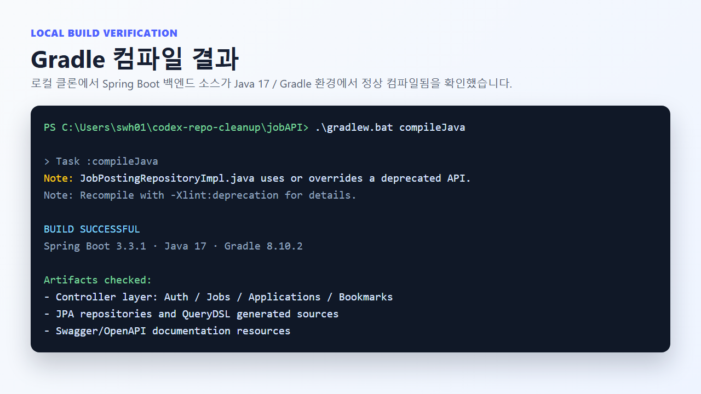

---

title: Job API Project
date: 2026-05-12
summary: '채용 공고 조회, 지원 내역, 북마크, JWT 인증을 제공하는 Spring Boot 기반 REST API 프로젝트입니다.'
highlights:
  - title: 채용 공고 API
    text: OpenAPI 명세를 기준으로 인증, 채용 공고 조회, 지원, 북마크 엔드포인트를 정리했습니다.
    image: api-spec.png
  - title: JWT 인증
    text: Auth, Jobs, Applications, Bookmarks 컨트롤러와 JWT 기반 인증 흐름을 분리했습니다.
    image: backend-flow.png
  - title: 빌드 검증
    text: 로컬 클론에서 Gradle compileJava를 실행해 Spring Boot 백엔드 소스가 정상 컴파일됨을 확인했습니다.
    image: command-result.png
links:
  - name: GitHub
    url: https://github.com/eecczz/jobAPI
featured: true
---

Job API Project는 채용 공고, 지원 내역, 북마크 기능을 제공하는 Spring Boot 기반 REST API 프로젝트입니다. 회원 인증과 채용 공고 조회, 지원 관리 흐름을 백엔드 API 중심으로 구현했습니다.

JWT 기반 인증, 목록/상세 조회, 지원 생성·취소, 북마크 추가·삭제처럼 실제 서비스에서 반복적으로 필요한 CRUD와 권한 흐름을 연습한 프로젝트입니다. MariaDB 기반 데이터 저장과 Gradle 빌드 흐름도 함께 다루었습니다.

- 기술 스택: Java, Spring Boot, Spring Web, MariaDB, JWT, Gradle
- 구현 포인트: 인증, 채용 공고 API, 지원 내역 관리, 북마크
- 저장소: [eecczz/jobAPI](https://github.com/eecczz/jobAPI)

## 주요 구현 포인트

### 채용 공고 API

OpenAPI 명세를 기준으로 인증, 채용 공고 조회, 지원, 북마크 엔드포인트를 정리했습니다.

### JWT 인증

Auth, Jobs, Applications, Bookmarks 컨트롤러와 JWT 기반 인증 흐름을 분리했습니다.

### 빌드 검증

로컬 클론에서 Gradle compileJava를 실행해 Spring Boot 백엔드 소스가 정상 컴파일됨을 확인했습니다.
