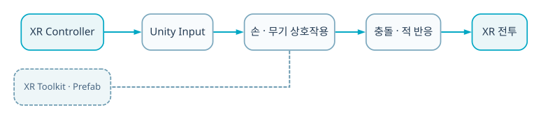

  
BACKEND · AI · SYSTEM CASE STUDY

  
XR 컨트롤러의 위치·회전을 무기 충돌, 몬스터 반응, 탈출 조건으로 연결한 Unity 공간 상호작용 프로젝트입니다.

  
<b>역할</b> 개인 프로젝트 · XR 입력/전투/씬 로직<b>검증</b> Meta XR 기기 프로토타입

## 30초 요약

- **무엇을 만들었나** — XR 컨트롤러의 위치·회전을 무기 충돌, 몬스터 반응, 탈출 조건으로 연결한 Unity 공간 상호작용 프로젝트입니다.
- **내 기여 범위** — 개인 프로젝트 · XR 입력/전투/씬 로직
- **현재 수준** — Meta XR 기기 프로토타입
- **코드 근거** — [GitHub 저장소](https://github.com/eecczz/MetaXR-Project)

> 팀 프로젝트는 전체 결과가 아니라 위에 적은 직접 기여 범위와, 면접에서 구현 이유를 설명할 수 있는 내용만 서술했습니다.

## 실제 구현 과정과 트러블슈팅

### 1. 화면 입력과 달리 XR pose는 매 프레임 위치·회전 노이즈를 포함

**판단과 수정** — 입력·무기·피격 상태를 분리해 상호작용 경계를 명확히 했습니다.

### 2. 외부 Asset Store 패키지와 직접 작성 코드의 범위가 섞임

**판단과 수정** — README에 제외 패키지와 담당 스크립트를 명시하고 저장소 이력을 정리했습니다.

## 기술 선택과 이유

| 기술 | 선택 이유 |
|---|---|
| **Meta XR** | 6DoF controller pose를 직접 게임 상호작용으로 사용하기 위해 |
| **Unity physics** | 검·방패·몬스터 접촉을 공간 충돌로 처리하기 위해 |
| **Stateful enemy controller** | 추적·공격·피격·사망 상태를 분리하기 위해 |
| **Scene interaction** | 레버·탈출 조건을 전투 진행과 연결하기 위해 |

## 검증 결과

- 검술 조작감에 대한 관심을 실제 XR controller 기반 상호작용으로 확장했습니다.
- EnemyController·LeverController·UI/Sound 관리 코드로 전투→탈출 흐름을 구성했습니다.

## 시스템 흐름 — 이해 보조

이 그림은 구현 역량의 증거를 대신하지 않습니다. 실제 코드·README·커밋과 문제 해결 기록을 읽기 쉽게 연결한 보조 자료입니다.

1. XR controller pose를 Unity 좌표로 받습니다.
2. 입력 mapping이 공격·방어 상태를 결정합니다.
3. 무기 collider와 trail이 공간 궤적을 표현합니다.
4. Enemy controller가 탐지·추적·피격 상태를 갱신합니다.
5. 레버와 탈출 조건이 scene progression을 바꿉니다.
6. UI·sound manager가 체력과 결과를 피드백합니다.

## API · 시스템 경계

| 영역 | API/계약 | 책임 |
|---|---|---|
| `Input` | `controller pose/buttons` | 공격·방어 |
| `Combat` | `weapon collider` | 타격 판정 |
| `Enemy` | `detect/chase/hit` | 상태 전환 |
| `Scene` | `lever/exit` | 진행 조건 |

## 한계와 다음 실험

- controller jitter smoothing·물리 timestep 계측
- 충돌 속도 기반 damage와 haptic feedback
- Quest 실기기 FPS·GC profiling

## 구현 근거

- [GitHub 저장소](https://github.com/eecczz/MetaXR-Project)
- README의 기능 목록만 옮기지 않고 controller/service/source tree와 주요 commit 흐름을 함께 확인했습니다.
- 저장소·실행 기록·수상 결과로 확인되지 않는 성과 수치는 만들지 않았습니다.
