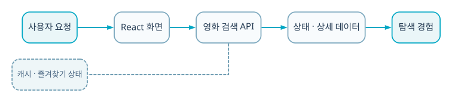

  
BACKEND · AI · SYSTEM CASE STUDY

  
TMDb API 영화 데이터를 검색·필터·정렬하고 위시리스트 상태로 연결한 React 웹 애플리케이션입니다.

  
<b>역할</b> 개인 프로젝트 · 외부 API/React 상태/정적 배포<b>검증</b> GitHub Pages 자동 배포

## 30초 요약

- **무엇을 만들었나** — TMDb API 영화 데이터를 검색·필터·정렬하고 위시리스트 상태로 연결한 React 웹 애플리케이션입니다.
- **내 기여 범위** — 개인 프로젝트 · 외부 API/React 상태/정적 배포
- **현재 수준** — GitHub Pages 자동 배포
- **코드 근거** — [GitHub 저장소](https://github.com/eecczz/my-movie-web)

> 팀 프로젝트는 전체 결과가 아니라 위에 적은 직접 기여 범위와, 면접에서 구현 이유를 설명할 수 있는 내용만 서술했습니다.

## 실제 구현 과정과 트러블슈팅

### 1. 정적 Pages에서 SPA route 새로고침이 깨질 수 있음

**판단과 수정** — 배포 source와 router base를 맞추고 빌드 결과를 Pages 경로에 배치했습니다.

### 2. 가입 비밀번호가 브라우저 저장소에 평문으로 남는 학습용 구현

**판단과 수정** — 문제를 인지하고 저장 방식을 수정했으며, 실제 인증은 서버에서 처리해야 한다고 한계로 명시했습니다.

### 3. 환경변수와 API key 노출 위험

**판단과 수정** — 로컬 .env 대신 예시 파일만 추적했습니다.

## 기술 선택과 이유

| 기술 | 선택 이유 |
|---|---|
| **TMDb API** | 직접 데이터셋을 구축하지 않고 실제 영화 검색·상세 흐름을 만들기 위해 |
| **React Router** | 목록·검색·상세·위시리스트 경로를 분리하기 위해 |
| **Client state** | 관심 영화 추가/삭제를 화면에 즉시 반영하기 위해 |
| **GitHub Actions/Pages** | develop 기반 정적 빌드를 자동 배포하기 위해 |

## 검증 결과

- 검색·필터·위시리스트·라우팅의 전체 프론트엔드 흐름을 구현했습니다.
- GitHub Pages 자동 배포 workflow를 추가해 실제 접근 가능한 빌드를 만들었습니다.

## 시스템 흐름 — 이해 보조

이 그림은 구현 역량의 증거를 대신하지 않습니다. 실제 코드·README·커밋과 문제 해결 기록을 읽기 쉽게 연결한 보조 자료입니다.

1. 사용자가 인기 목록 또는 검색어를 입력합니다.
2. TMDb API 응답을 화면 모델로 정규화합니다.
3. 장르·평점·정렬 조건을 클라이언트에서 적용합니다.
4. 위시리스트 변경을 사용자 상태에 반영합니다.
5. React Router가 상세/목록 전환을 담당합니다.
6. 자동 workflow가 정적 빌드를 Pages source에 배포합니다.

## API · 시스템 경계

| 영역 | API/계약 | 책임 |
|---|---|---|
| `Discover` | `popular/search` | TMDb 호출 |
| `Detail` | `/movie/:id` | 상세 경로 |
| `Wishlist` | `add/remove` | 클라이언트 상태 |
| `Deploy` | `GitHub Pages` | 정적 빌드 |

## 한계와 다음 실험

- 실서비스 인증은 서버/JWT·HttpOnly cookie로 전환
- React Query cache와 loading/error 상태 표준화
- 웹 성능·접근성 Lighthouse 측정

## 구현 근거

- [GitHub 저장소](https://github.com/eecczz/my-movie-web)
- README의 기능 목록만 옮기지 않고 controller/service/source tree와 주요 commit 흐름을 함께 확인했습니다.
- 개발 중 남긴 Codex 대화에서는 문제 진단·가설·수정 순서를 확인했습니다.
- 저장소·실행 기록·수상 결과로 확인되지 않는 성과 수치는 만들지 않았습니다.
