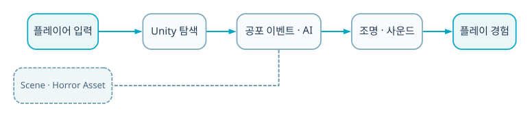

  
BACKEND · AI · SYSTEM CASE STUDY

  
1인칭 이동·raycast 상호작용·인벤토리·목표·오디오 타이밍을 연결한 Unity 공포 게임 프로토타입입니다.

  
<b>역할</b> 개인 프로젝트 · 플레이어/상호작용/인벤토리/연출<b>검증</b> 기능 프로토타입

## 주요 화면

1인칭 시점으로 공간을 탐색하면서 raycast로 오브젝트를 조사하고, 인벤토리와 목표 상태에 따라 공포 연출이 진행됩니다. 캐릭터 조우와 오디오 타이밍을 결합해 제한된 공간에서도 긴장감이 이어지도록 구성했습니다.

## 트러블 슈팅

### 1. Asset 기반 FPS 코드와 직접 구현한 gameplay 코드의 경계가 불명확

생성 Library 파일을 제거하고 직접 작성한 Equip/Input/Interaction/Inventory 스크립트를 저장소 전면에 정리했습니다.

### 2. 공포 연출이 단순 어두운 조명에 의존

목표·아이템·event·audio timing을 분리해 플레이 흐름에서 긴장감을 만들었습니다.

## 기술 선택과 이유

| 기술 | 선택 이유 |
|---|---|
| **FPS controller** | 시야와 이동이 공포 공간 탐색의 핵심이기 때문에 |
| **Raycast interaction** | 플레이어가 바라보는 문·아이템을 일관된 방식으로 선택하기 위해 |
| **Inventory state** | 획득한 도구가 다음 상호작용 조건을 바꾸게 하기 위해 |
| **Event/Audio manager** | 공포감을 모델보다 타이밍과 정보 노출로 제어하기 위해 |

## 검증 결과

- 플레이어→상호작용→인벤토리→목표→연출의 기능 흐름을 프로토타입으로 완성했습니다.
- Unity 생성 파일을 제거하고 재현 가능한 저장소 구조와 README를 정리했습니다.

## 시스템 흐름

1. 입력이 FPS controller의 이동·시점을 갱신합니다.
2. 화면 중심 ray가 상호작용 가능한 객체를 탐색합니다.
3. 아이템을 획득하면 inventory와 장착 상태가 바뀝니다.
4. Objective manager가 다음 목표를 활성화합니다.
5. Game flow event가 적·문·장면을 전환합니다.
6. Audio·HUD가 시점에 맞춰 긴장감을 전달합니다.

## API · 시스템 경계

| 영역 | API/계약 | 책임 |
|---|---|---|
| `Player` | `move/look` | 1인칭 탐색 |
| `Interaction` | `raycast + interface` | 문·아이템 |
| `Inventory` | `collect/equip` | 조건 상태 |
| `Flow` | `objective/event/audio` | 연출 진행 |

## 다음 구현 계획

- 상호작용 interface와 save/load contract 정리
- 공간 audio와 적 AI perception 고도화
- Profiler로 scene loading·GC spike 점검
