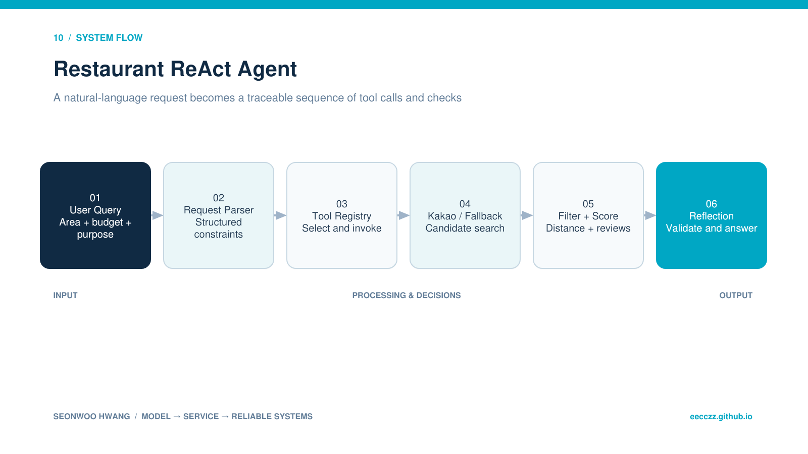

  
BACKEND · AI · SYSTEM CASE STUDY

  
사용자의 지역·가격·목적 조건을 해석하고 검색·필터·검증 도구를 호출하는 FastAPI AI Agent입니다.

  
<b>역할</b> 개인 과제 · Agent loop/Tool Registry/API/fallback<b>검증</b> CLI trace 및 FastAPI endpoint 검증

## 30초 요약

- **무엇을 만들었나** — 사용자의 지역·가격·목적 조건을 해석하고 검색·필터·검증 도구를 호출하는 FastAPI AI Agent입니다.
- **내 기여 범위** — 개인 과제 · Agent loop/Tool Registry/API/fallback
- **현재 수준** — CLI trace 및 FastAPI endpoint 검증
- **코드 근거** — [GitHub 저장소](https://github.com/eecczz/restaurant_recommend_agentAI)

> 팀 프로젝트는 전체 결과가 아니라 위에 적은 직접 기여 범위와, 면접에서 구현 이유를 설명할 수 있는 내용만 서술했습니다.

## 실제 구현 과정과 트러블슈팅

### 1. 외부 API key가 없으면 과제 전체를 실행할 수 없음

**판단과 수정** — 동일 계약의 로컬 dataset fallback을 두었습니다.

### 2. 조건이 엄격해 후보가 0개가 됨

**판단과 수정** — 카테고리·가격 조건을 단계적으로 완화하고 그 사실을 Observation에 남겼습니다.

### 3. Agent가 반복 도구 호출에 빠질 수 있음

**판단과 수정** — max_iterations guard와 도구 오류를 Observation으로 환류했습니다.

## 기술 선택과 이유

| 기술 | 선택 이유 |
|---|---|
| **ReAct loop** | Thought·Action·Observation을 남겨 추천 과정이 블랙박스가 되지 않게 하기 위해 |
| **Tool Registry** | 검색·필터·점수·reflection을 독립 도구로 등록해 실행 흐름을 확장하기 위해 |
| **Kakao Local API** | 샘플 데이터 밖의 실제 지역 검색을 지원하기 위해 |
| **Fallback dataset** | API key/네트워크 실패에도 agent 동작과 테스트를 재현하기 위해 |

## 검증 결과

- Perceive→Reason→Act→Observe와 Plan-and-Solve·Reflection·Memory를 실행 가능한 코드로 검증했습니다.
- 응답뿐 아니라 trace_text를 제공해 도구 사용과 예외 처리를 확인할 수 있습니다.

## 시스템 흐름 — 이해 보조

이 그림은 구현 역량의 증거를 대신하지 않습니다. 실제 코드·README·커밋과 문제 해결 기록을 읽기 쉽게 연결한 보조 자료입니다.

1. POST /recommend가 자연어 요청을 받습니다.
2. parser tool이 지역·음식·가격·목적·개수를 구조화합니다.
3. Kakao keyword search를 우선 호출하고 실패하면 샘플 데이터로 전환합니다.
4. filter와 distance score tool이 후보를 정렬합니다.
5. reflection tool이 조건 충족 여부를 재검토합니다.
6. 최종 답변과 trace를 함께 반환합니다.

## API · 시스템 경계

| 영역 | API/계약 | 책임 |
|---|---|---|
| `Health` | `GET /health` | 서비스 상태 |
| `Agent` | `POST /recommend` | 추천·trace |
| `Search` | `Kakao keyword / local fallback` | 후보 수집 |
| `Guard` | `max_iterations` | 무한 loop 방지 |

## 한계와 다음 실험

- 실제 LLM function calling과 schema validation 도입
- 추천 근거·거리 계산의 정량 평가
- API rate limit·cache·관측 로그 추가

## 구현 근거

- [GitHub 저장소](https://github.com/eecczz/restaurant_recommend_agentAI)
- README의 기능 목록만 옮기지 않고 controller/service/source tree와 주요 commit 흐름을 함께 확인했습니다.
- 저장소·실행 기록·수상 결과로 확인되지 않는 성과 수치는 만들지 않았습니다.
