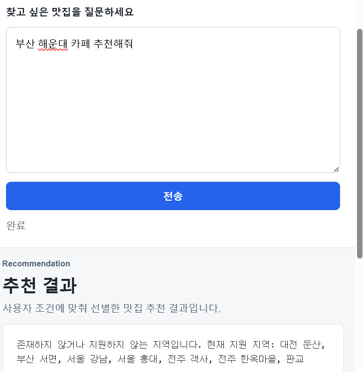

---
title: 맛집 찾기 ReAct Agent
date: 2026-06-10
summary: '사용자의 지역·가격·상황 조건을 분석하고 검색/필터링 도구를 호출해 추천을 생성하는 FastAPI 기반 AI Agent입니다.'
highlights:
  - title: ReAct 루프
    text: 요청을 해석하고 도구를 호출한 뒤 Observation을 바탕으로 추천을 생성합니다.
    image: featured.jpg
  - title: 검색 도구
    text: Kakao Local API와 샘플 데이터셋을 함께 사용해 지역 맛집 검색을 처리합니다.
    image: detail-agent.jpg
  - title: 필터링과 추천
    text: 가격, 상황, 리뷰 조건을 반영해 사용자에게 설명 가능한 추천을 제공합니다.
    image: detail-tools.jpg
links:
  - name: GitHub
    url: https://github.com/eecczz/restaurant_recommend_agentAI
featured: true
---

맛집 찾기 ReAct Agent는 사용자의 요청을 분석하고, 맛집 검색 도구와 필터링 도구를 호출한 뒤 Observation을 바탕으로 최종 추천을 생성하는 AI 에이전트입니다. Kakao Local API를 우선 사용하고, API Key가 없거나 호출에 실패하면 샘플 맛집 데이터셋으로 대체 검색하는 구조를 두었습니다.

`Perceive -> Reason -> Act -> Observe` 흐름, Tool Registry, 반복 실행 루프, `max_iterations` 가드, 도구 실행 에러를 Observation으로 전달하는 방식을 구현해 에이전트 패턴을 코드로 검증했습니다.

- 기술 스택: Python, FastAPI, Kakao Local API
- 구현 포인트: ReAct, Plan-and-Solve, Reflection, Tool Use, Memory 패턴 조합
- 저장소: [eecczz/restaurant_recommend_agentAI](https://github.com/eecczz/restaurant_recommend_agentAI)

## 주요 구현 포인트
### ReAct 루프

요청을 해석하고 도구를 호출한 뒤 Observation을 바탕으로 추천을 생성합니다.

### 검색 도구

Kakao Local API와 샘플 데이터셋을 함께 사용해 지역 맛집 검색을 처리합니다.

### 필터링과 추천

가격, 상황, 리뷰 조건을 반영해 사용자에게 설명 가능한 추천을 제공합니다.

