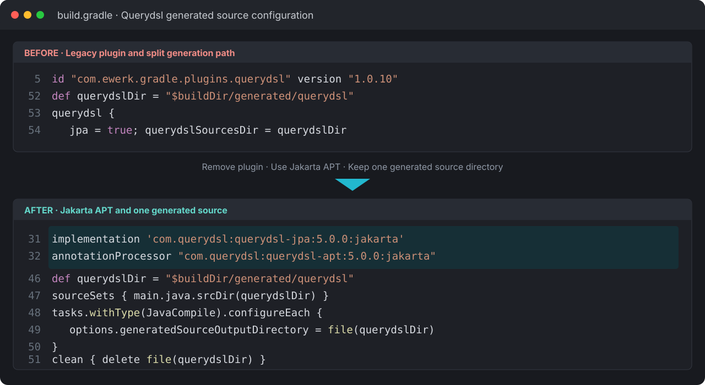

  
BACKEND · AI · SYSTEM CASE STUDY

  
Spring Boot·JPA·Querydsl로 상품 탐색부터 장바구니·주문·PortOne 테스트 결제 검증까지 구현한 서비스입니다.

  
<b>역할</b> 개인 프로젝트 · 상품/장바구니/주문/결제/배포<b>검증</b> jcloud Ubuntu executable jar 배포

## 주요 화면

상품 목록에서 상세 옵션을 확인하고 장바구니에 담은 뒤 합계·수량을 검토해 주문으로 넘어가는 구매 흐름을 구현했습니다. 목록 조회와 장바구니 상태가 주문·결제 도메인으로 이어지도록 구성했습니다.

## 트러블 슈팅

### 1. 빌드할 때마다 Querydsl QEntity 재생성이 불안정함

Spring Boot 3의 Jakarta 전환 이후에도 오래된 Querydsl Gradle 플러그인과 생성 경로 설정이 함께 남아 있어, Q타입이 중복 생성되거나 stale source가 참조됐습니다.

서드파티 플러그인을 제거하고 `querydsl-jpa:5.0.0:jakarta`와 APT annotation processor로 생성 경로를 하나로 통일했습니다. `JavaCompile.generatedSourceOutputDirectory`를 `build/generated/querydsl`로 고정하고 `clean`에서 해당 디렉터리를 지우도록 해 재현 가능한 빌드로 바꿨습니다.

### 2. 장바구니 변경 후 헤더 수량을 즉시 갱신하기 어려움

Thymeleaf로 렌더링하는 공통 헤더가 어느 화면에서나 장바구니 수량을 표시해야 했습니다. 처음에는 각 controller가 로그인 사용자와 장바구니를 다시 조회해 `cartCount`를 모델에 담았고, 상품 추가 뒤에는 `window.location.reload()`로 화면 전체를 새로 그려 수량을 반영했습니다.

이 과정에서 화면 공통 데이터와 장바구니 변경 처리가 한 흐름에 묶여 있다는 점을 확인했습니다. 다음 수정에서는 공통 헤더 데이터 주입을 controller 밖으로 분리하고, 추가·삭제 API가 최신 수량과 합계를 반환해 필요한 DOM만 갱신하도록 개선할 계획입니다.

### 3. 비회원 장바구니를 회원 엔티티에 억지로 연결함

비회원도 상품을 담을 수 있게 하려고 장바구니가 참조할 임시 회원을 두고, 결제 버튼을 누를 때 로그인 화면으로 보내는 흐름을 구성했습니다. 덕분에 회원 장바구니와 같은 테이블 구조를 재사용할 수 있었지만, 초기 데이터에 의존하고 Thymeleaf에서 회원·비회원 장바구니 분기가 늘어났습니다.

다음 수정에서는 비회원 장바구니를 HTTP session의 guest key로 분리하고, 로그인 시 실제 회원 장바구니로 병합하는 방식으로 변경할 계획입니다.

## 기술 선택과 이유

| 기술 | 선택 이유 |
|---|---|
| **Spring MVC · Thymeleaf** | 서버 렌더링으로 구매 흐름과 세션 인증을 빠르게 끝까지 검증하기 위해 |
| **JPA · Querydsl** | 도메인 관계를 모델링하고 검색·페이징 조건을 동적으로 조합하기 위해 |
| **PortOne sandbox** | 실결제 없이 승인 식별자와 주문 상태 처리 흐름을 검증하기 위해 |
| **MariaDB** | 회원·상품·장바구니·주문 데이터를 트랜잭션으로 관리하기 위해 |

## 검증 결과

- 회원가입→상품 탐색→장바구니→테스트 결제→주문 상태의 end-to-end 흐름을 구현했습니다.
- jcloud Ubuntu에 executable jar로 배포했습니다.

## 시스템 흐름

1. 사용자가 상품을 검색하고 상세를 조회합니다.
2. 세션 로그인 사용자가 장바구니 수량을 변경합니다.
3. 서비스 계층이 합계와 주문 항목을 계산합니다.
4. PortOne 테스트 결제 후 imp_uid를 서버에 전달합니다.
5. 서버가 결제 검증 결과에 따라 주문 상태를 변경합니다.
6. Executable jar를 jcloud Ubuntu에서 실행합니다.

## API · 시스템 경계

| 영역 | API/계약 | 책임 |
|---|---|---|
| `Catalog` | `GET /demo/list, /item-detail/{id}` | 검색·상세 |
| `Cart` | `GET /cart, POST /updatecart, /deletecart` | 장바구니 |
| `Order` | `GET/POST /purchase, /order/payment` | 주문 생성 |
| `Payment` | `POST /payment/validation/{imp_uid}` | 결제 검증 |

## 다음 구현 계획

- 공통 헤더 장바구니 조회와 전체 페이지 reload 제거
- guest cart와 member cart 병합 처리
- 결제 검증과 주문 상태 변경의 idempotency 보장
- 동시 수량 변경·재고 차감에 optimistic locking 적용
- CI/CD·health check·로그 수집 추가
