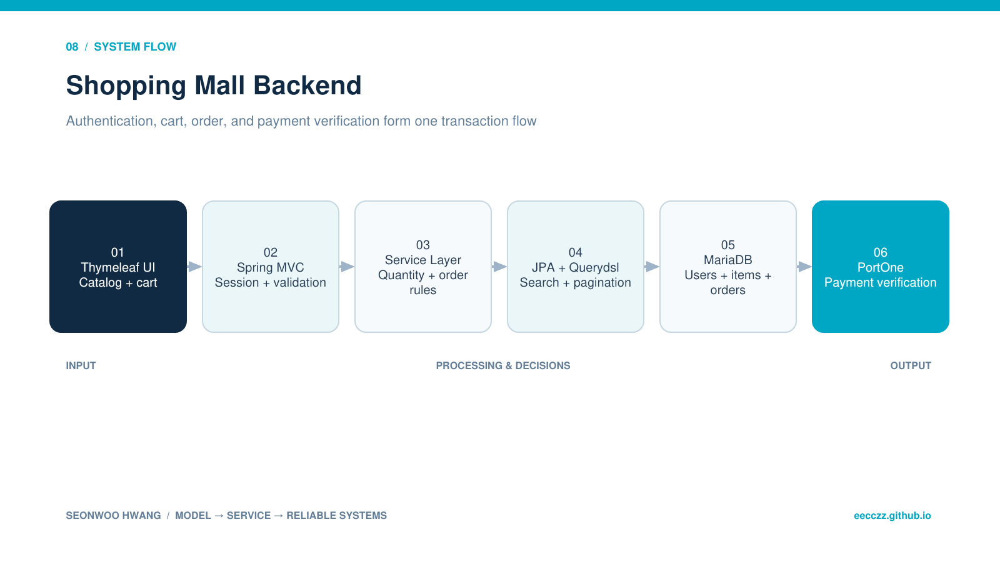

  
BACKEND · AI · SYSTEM CASE STUDY

  
Spring Boot·JPA·Querydsl로 상품 탐색부터 장바구니·주문·PortOne 테스트 결제 검증까지 구현한 서비스입니다.

  
<b>역할</b> 개인 프로젝트 · 상품/장바구니/주문/결제/배포<b>검증</b> jcloud Ubuntu executable jar 배포

## 30초 요약

- **무엇을 만들었나** — Spring Boot·JPA·Querydsl로 상품 탐색부터 장바구니·주문·PortOne 테스트 결제 검증까지 구현한 서비스입니다.
- **내 기여 범위** — 개인 프로젝트 · 상품/장바구니/주문/결제/배포
- **현재 수준** — jcloud Ubuntu executable jar 배포
- **코드 근거** — [GitHub 저장소](https://github.com/eecczz/shoppingmall-springboot)

> 팀 프로젝트는 전체 결과가 아니라 위에 적은 직접 기여 범위와, 면접에서 구현 이유를 설명할 수 있는 내용만 서술했습니다.

## 실제 구현 과정과 트러블슈팅

### 1. 동적 검색 조건이 늘며 repository 메서드만으로 조합이 어려움

**판단과 수정** — Querydsl custom repository로 검색·페이징 조건을 분리했습니다.

### 2. 결제 성공 화면만 믿으면 주문 상태와 실제 승인 결과가 어긋날 수 있음

**판단과 수정** — imp_uid를 서버에서 검증한 뒤 주문 상태를 갱신했습니다.

### 3. 배포 시 MySQL socket/JDBCConnectionException으로 애플리케이션이 기동 실패

**판단과 수정** — DB host·port·방화벽·환경변수를 분리 점검하고 실제 DB 연결을 배포 체크리스트로 남겼습니다.

## 기술 선택과 이유

| 기술 | 선택 이유 |
|---|---|
| **Spring MVC · Thymeleaf** | 서버 렌더링으로 구매 흐름과 세션 인증을 빠르게 끝까지 검증하기 위해 |
| **JPA · Querydsl** | 도메인 관계를 모델링하고 검색·페이징 조건을 동적으로 조합하기 위해 |
| **PortOne sandbox** | 실결제 없이 승인 식별자와 주문 상태 처리 흐름을 검증하기 위해 |
| **MariaDB** | 회원·상품·장바구니·주문 데이터를 트랜잭션으로 관리하기 위해 |

## 검증 결과

- 회원가입→상품 탐색→장바구니→테스트 결제→주문 상태의 end-to-end 흐름을 구현했습니다.
- jcloud Ubuntu에 executable jar로 배포했습니다.

## 시스템 흐름 — 이해 보조

이 그림은 구현 역량의 증거를 대신하지 않습니다. 실제 코드·README·커밋과 문제 해결 기록을 읽기 쉽게 연결한 보조 자료입니다.

1. 사용자가 상품을 검색하고 상세를 조회합니다.
2. 세션 로그인 사용자가 장바구니 수량을 변경합니다.
3. 서비스 계층이 합계와 주문 항목을 계산합니다.
4. PortOne 테스트 결제 후 imp_uid를 서버에 전달합니다.
5. 서버가 결제 검증 결과에 따라 주문 상태를 변경합니다.
6. Executable jar를 jcloud Ubuntu에서 실행합니다.

## API · 시스템 경계

| 영역 | API/계약 | 책임 |
|---|---|---|
| `Catalog` | `GET /demo/list, /item-detail/{id}` | 검색·상세 |
| `Cart` | `GET /cart, POST /updatecart, /deletecart` | 장바구니 |
| `Order` | `GET/POST /purchase, /order/payment` | 주문 생성 |
| `Payment` | `POST /payment/validation/{imp_uid}` | 결제 검증 |

## 한계와 다음 실험

- 결제 검증과 주문 상태 변경의 idempotency 보장
- 동시 수량 변경·재고 차감에 optimistic locking 적용
- CI/CD·health check·로그 수집 추가

## 구현 근거

- [GitHub 저장소](https://github.com/eecczz/shoppingmall-springboot)
- README의 기능 목록만 옮기지 않고 controller/service/source tree와 주요 commit 흐름을 함께 확인했습니다.
- 개발 중 남긴 Codex 대화에서는 문제 진단·가설·수정 순서를 확인했습니다.
- 저장소·실행 기록·수상 결과로 확인되지 않는 성과 수치는 만들지 않았습니다.
