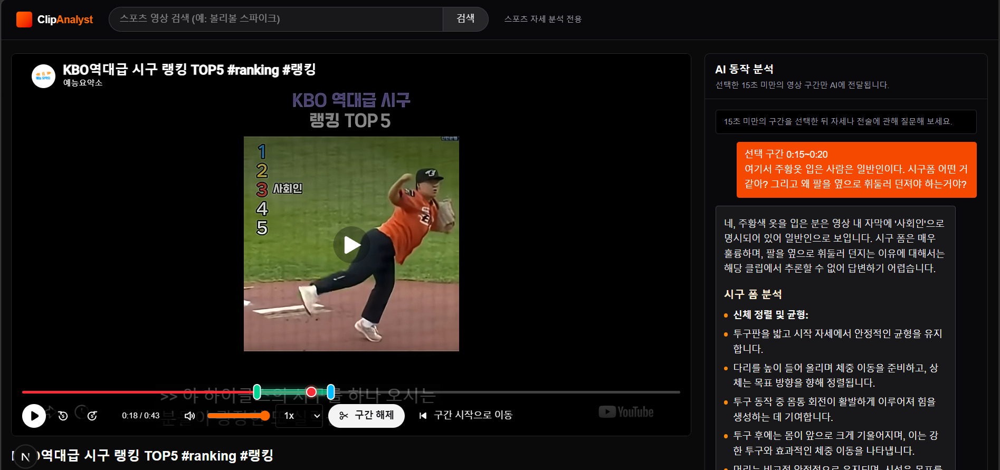

---
title: ClipAnalyst - 스포츠 영상 분석
date: 2026-05-12
summary: 'YouTube 스포츠 영상 구간을 선택해 AI 모델로 자세와 동작을 분석하는 Next.js + FastAPI 기반 로컬 MVP입니다.'
highlights:
  - title: 클립 구간 선택
    text: YouTube 영상에서 분석할 구간을 고르고 서버에서 해당 부분만 추출합니다.
    image: featured.jpg
  - title: AI 분석 스트리밍
    text: FastAPI 서비스가 분석 결과를 SSE로 스트리밍하는 구조를 실험했습니다.
    image: detail-analysis.jpg
  - title: Provider 전환
    text: Gemini/Kimi 등 모델 Provider를 교체할 수 있는 분석 파이프라인을 설계했습니다.
    image: detail-timeline.jpg
links:
  - name: GitHub
    url: https://github.com/eecczz/sports-analyzer
featured: true
---

ClipAnalyst는 YouTube 스포츠 영상에서 특정 구간을 선택하고, 해당 클립을 AI 모델에 전달해 동작 분석을 받는 프로젝트입니다. 웹 앱과 AI 서비스가 분리된 구조로 동작하며, 영상 검색부터 구간 추출, 분석 결과 스트리밍까지 하나의 사용자 흐름으로 묶었습니다.

yt-dlp와 ffmpeg로 클립 구간을 추출하고, SSE로 분석 결과를 스트리밍하며, Gemini/Kimi 등 AI Provider를 교체할 수 있는 구조를 실험했습니다. 스포츠 영상처럼 시간축과 세부 동작이 중요한 데이터를 서비스로 다루는 경험을 쌓은 프로젝트입니다.

- 기술 스택: Next.js, TypeScript, FastAPI, Python, SQLite, yt-dlp, ffmpeg
- 구현 포인트: 타임라인 기반 구간 선택, 서버 사이드 클립 추출, AI 분석 스트리밍
- 저장소: [eecczz/sports-analyzer](https://github.com/eecczz/sports-analyzer)

## 주요 구현 포인트
### 클립 구간 선택

YouTube 영상에서 분석할 구간을 고르고 서버에서 해당 부분만 추출합니다.

### AI 분석 스트리밍

FastAPI 서비스가 분석 결과를 SSE로 스트리밍하는 구조를 실험했습니다.

### Provider 전환

Gemini/Kimi 등 모델 Provider를 교체할 수 있는 분석 파이프라인을 설계했습니다.

