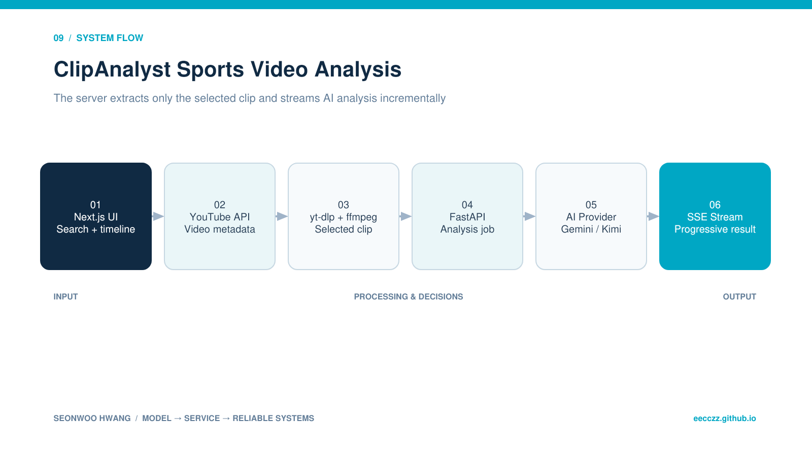

  
BACKEND · AI · SYSTEM CASE STUDY

  
YouTube 영상의 선택 구간만 추출하고 FastAPI가 AI 분석 결과를 SSE로 전달하는 Next.js 기반 MVP입니다.

  
<b>역할</b> 개인 프로젝트 · 웹/AI 서비스 분리·영상 구간 처리·스트리밍 응답<b>검증</b> 로컬 MVP 및 분석 스트리밍 진단

## 30초 요약

- **무엇을 만들었나** — YouTube 영상의 선택 구간만 추출하고 FastAPI가 AI 분석 결과를 SSE로 전달하는 Next.js 기반 MVP입니다.
- **내 기여 범위** — 개인 프로젝트 · 웹/AI 서비스 분리·영상 구간 처리·스트리밍 응답
- **현재 수준** — 로컬 MVP 및 분석 스트리밍 진단
- **코드 근거** — [GitHub 저장소](https://github.com/eecczz/sports-analyzer)

> 팀 프로젝트는 전체 결과가 아니라 위에 적은 직접 기여 범위와, 면접에서 구현 이유를 설명할 수 있는 내용만 서술했습니다.

## 실제 구현 과정과 트러블슈팅

### 1. 전체 영상을 모델에 보내면 처리 시간·비용·맥락 잡음이 커짐

**판단과 수정** — 타임라인에서 선택한 구간만 ffmpeg로 잘라 전달했습니다.

### 2. 분석 응답이 길어 UI가 멈춘 것처럼 보임

**판단과 수정** — SSE로 상태와 답변을 점진 전달하고 진단 로그를 보강했습니다.

### 3. 모델 API가 바뀌면 서비스 코드가 함께 흔들림

**판단과 수정** — provider adapter로 Gemini/Kimi 교체 지점을 분리했습니다.

## 기술 선택과 이유

| 기술 | 선택 이유 |
|---|---|
| **Next.js** | 검색·watch·타임라인과 server route를 한 웹앱에서 구성하기 위해 |
| **yt-dlp · ffmpeg** | 전체 영상 대신 사용자가 선택한 시간 구간만 서버에서 추출하기 위해 |
| **FastAPI** | 미디어 처리와 AI provider 호출을 웹 UI에서 분리하기 위해 |
| **SSE** | 긴 분석이 끝날 때까지 기다리지 않고 진행 결과를 점진적으로 보여주기 위해 |

## 검증 결과

- 검색→구간 선택→clip 추출→AI 분석→SSE 응답의 사용자 흐름을 구현했습니다.
- health/analyze stub test와 Dockerfile/Compose로 서비스 경계를 확인했습니다.

## 시스템 흐름 — 이해 보조

이 그림은 구현 역량의 증거를 대신하지 않습니다. 실제 코드·README·커밋과 문제 해결 기록을 읽기 쉽게 연결한 보조 자료입니다.

1. 웹에서 YouTube 영상을 검색하고 구간을 선택합니다.
2. Next.js API가 영상 메타데이터와 분석 요청을 정리합니다.
3. FastAPI가 yt-dlp·ffmpeg로 필요한 clip만 추출합니다.
4. provider adapter가 Gemini/Kimi 중 설정된 모델을 호출합니다.
5. 분석 결과를 SSE로 브라우저에 스트리밍합니다.
6. SQLite history와 debug endpoint로 최근 결과를 진단합니다.

## API · 시스템 경계

| 영역 | API/계약 | 책임 |
|---|---|---|
| `Web` | `GET /api/search, /feed, /watch/{id}/meta` | 검색·메타데이터 |
| `Analysis` | `POST /api/analyze` | 웹→AI service proxy |
| `AI` | `POST /analyze` | clip 추출·모델 분석 |
| `Debug` | `GET /debug/analyze-history` | 최근 실행 진단 |

## 한계와 다음 실험

- job queue와 취소·재시도 상태 추가
- 임시 clip lifecycle 및 저장 비용 관리
- 분석 latency·provider 오류율·SSE disconnect 모니터링

## 구현 근거

- [GitHub 저장소](https://github.com/eecczz/sports-analyzer)
- README의 기능 목록만 옮기지 않고 controller/service/source tree와 주요 commit 흐름을 함께 확인했습니다.
- 개발 중 남긴 Codex 대화에서는 문제 진단·가설·수정 순서를 확인했습니다.
- 저장소·실행 기록·수상 결과로 확인되지 않는 성과 수치는 만들지 않았습니다.
