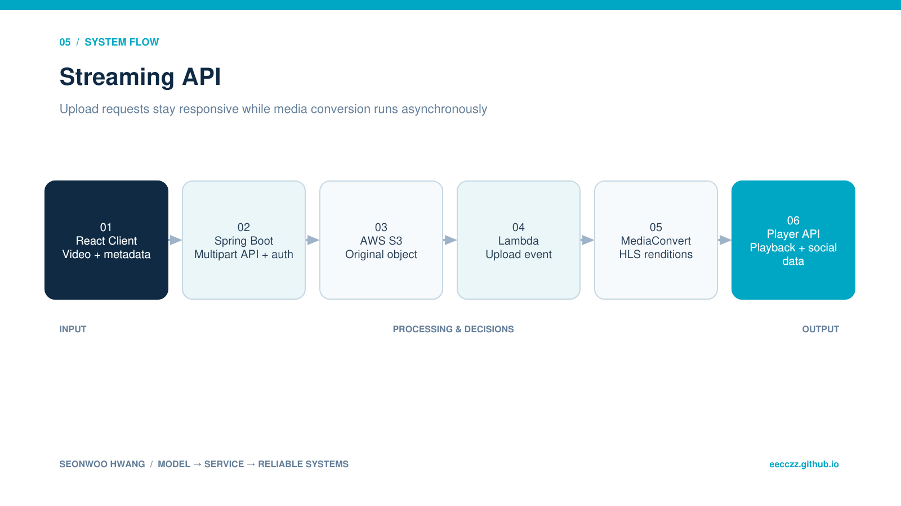

  
BACKEND · AI · SYSTEM CASE STUDY

  
Spring Boot와 AWS S3·Lambda·MediaConvert를 연결해 대용량 영상을 비동기로 HLS 변환하는 미디어 백엔드입니다.

  
<b>역할</b> 개인 프로젝트 · API/도메인/클라우드 미디어 파이프라인<b>검증</b> 로컬·클라우드 기능 검증

## 30초 요약

- **무엇을 만들었나** — Spring Boot와 AWS S3·Lambda·MediaConvert를 연결해 대용량 영상을 비동기로 HLS 변환하는 미디어 백엔드입니다.
- **내 기여 범위** — 개인 프로젝트 · API/도메인/클라우드 미디어 파이프라인
- **현재 수준** — 로컬·클라우드 기능 검증
- **코드 근거** — [GitHub 저장소](https://github.com/eecczz/streamingAPI)

> 팀 프로젝트는 전체 결과가 아니라 위에 적은 직접 기여 범위와, 면접에서 구현 이유를 설명할 수 있는 내용만 서술했습니다.

## 실제 구현 과정과 트러블슈팅

### 1. 대용량 영상을 Spring 서버가 직접 받아 변환하면 요청이 오래 점유됨

**판단과 수정** — S3 direct multipart와 이벤트 기반 변환으로 책임을 분리했습니다.

### 2. 영상 원본과 HLS 결과·메타데이터의 상태가 서로 어긋날 수 있음

**판단과 수정** — 업로드 lifecycle endpoint와 변환 후 재생 URL 단계를 분리해 상태 경계를 명확히 했습니다.

### 3. AWS/DB 비밀 값이 저장소에 노출될 위험

**판단과 수정** — 키를 환경변수로 이동하고 예시 값만 추적하도록 정리했습니다.

## 기술 선택과 이유

| 기술 | 선택 이유 |
|---|---|
| **S3 Multipart Upload** | 대용량 파일을 애플리케이션 서버 메모리에 오래 유지하지 않기 위해 |
| **Lambda event** | 업로드 완료를 변환 시작 신호로 사용해 요청 처리와 무거운 작업을 분리하기 위해 |
| **MediaConvert · HLS** | 브라우저 재생과 화질별 rendition을 표준 방식으로 제공하기 위해 |
| **Spring Boot · MariaDB** | 영상 메타데이터, 인증, 댓글·좋아요·구독 도메인을 관리하기 위해 |

## 검증 결과

- S3 업로드→Lambda 이벤트→MediaConvert→HLS 재생 구조를 코드와 서비스 화면으로 연결했습니다.
- 영상 API 외에 댓글·좋아요·구독·사용자별 목록 endpoint까지 확장했습니다.

## 시스템 흐름 — 이해 보조

이 그림은 구현 역량의 증거를 대신하지 않습니다. 실제 코드·README·커밋과 문제 해결 기록을 읽기 쉽게 연결한 보조 자료입니다.

1. 클라이언트가 multipart upload를 시작하고 signed URL을 받습니다.
2. 분할 업로드 완료 후 원본 객체가 S3에 저장됩니다.
3. S3 이벤트가 Lambda를 호출해 MediaConvert job을 생성합니다.
4. MediaConvert가 HLS manifest와 화질별 segment를 생성합니다.
5. Spring Boot가 영상 메타데이터와 재생 URL을 제공합니다.
6. React player가 HLS를 재생하고 댓글·좋아요·구독 API를 호출합니다.

## API · 시스템 경계

| 영역 | API/계약 | 책임 |
|---|---|---|
| `Upload` | `POST /initiate-upload, /upload-signed-url` | multipart 준비 |
| `Upload` | `POST /complete-upload, /abort-upload` | 완료/취소 |
| `Video` | `GET/POST /api/videos` | 영상 목록·생성 |
| `Social` | `/comments, /like, /subscribe` | 시청 상호작용 |

## 한계와 다음 실험

- job status webhook과 재시도/실패 상태 모델 추가
- CloudFront signed URL·캐시 정책 적용
- 업로드/변환 latency와 비용 계측

## 구현 근거

- [GitHub 저장소](https://github.com/eecczz/streamingAPI)
- README의 기능 목록만 옮기지 않고 controller/service/source tree와 주요 commit 흐름을 함께 확인했습니다.
- 개발 중 남긴 Codex 대화에서는 문제 진단·가설·수정 순서를 확인했습니다.
- 저장소·실행 기록·수상 결과로 확인되지 않는 성과 수치는 만들지 않았습니다.
