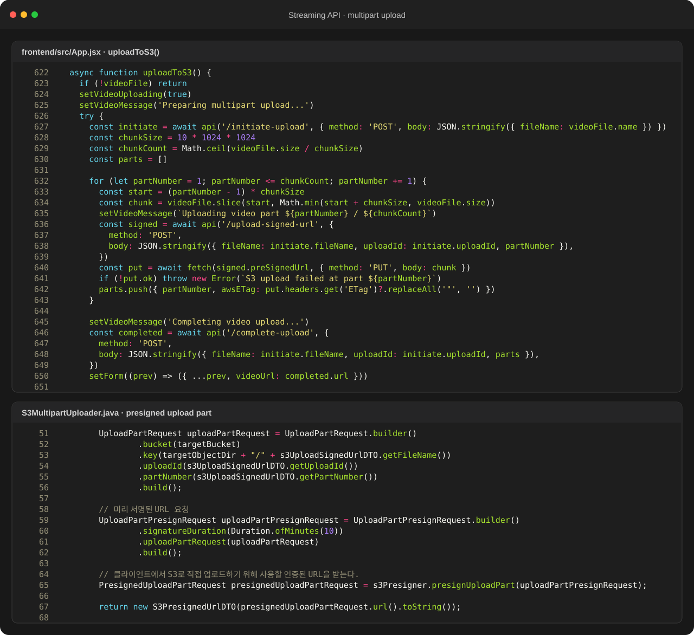

  
BACKEND · AI · SYSTEM CASE STUDY

  
React 기반 영상 탐색·재생 화면과 Spring Boot·AWS S3·Lambda·MediaConvert를 연결한 스트리밍 서비스입니다.

  
<b>역할</b> 개인 프로젝트 · 미디어 UX/API/도메인/클라우드 파이프라인<b>검증</b> 업로드·변환·조회·재생 흐름 구현

## 주요 화면

영상 목록·지연 preview·상세 player·업로드 화면을 하나의 서비스로 구성했습니다. 사용자는 목록에서 콘텐츠를 탐색하고, hover preview로 장면을 확인한 뒤 상세 재생 화면으로 이동하거나 multipart 업로드를 시작할 수 있습니다.

## 트러블 슈팅

### 1. 대용량 영상을 Spring 서버가 직접 받아 변환하면 요청이 오래 점유됨

Spring 서버가 영상 바이트 전체를 받아 S3로 다시 전달하면 업로드 시간 동안 요청·메모리·네트워크를 함께 점유하고, 변환까지 같은 요청에 묶을 경우 실패 복구도 어려워집니다. 이를 제어 API와 데이터 전송 경로로 분리했습니다.

React 클라이언트는 먼저 `/initiate-upload`에서 `uploadId`를 받고, 파일을 10MB 단위로 나눕니다. 각 part마다 `/upload-signed-url`로 서명 URL을 받은 뒤 영상 바이트는 브라우저가 S3에 직접 `PUT`합니다. 마지막으로 `partNumber`와 `ETag` 목록만 `/complete-upload`에 전달해 multipart upload를 확정합니다. Spring은 권한과 업로드 생명주기만 제어하고 대용량 파일 본문은 통과시키지 않게 했습니다. 변환은 S3 업로드 완료 이후의 Lambda·MediaConvert 단계로 분리해 사용자의 HTTP 요청과 비동기 처리 경계를 나눴습니다.

### 2. AWS 설정을 마친 뒤에도 브라우저의 대용량 업로드 요청이 차단됨

업로드는 `initiate-upload → presigned URL 발급 → S3 PUT → complete-upload` 순서였습니다. IAM·버킷·MediaConvert 설정을 먼저 의심했지만, 실제로는 React와 Spring 서버의 origin이 달라 업로드 orchestration API 요청이 CORS 정책에 막히고 있었습니다. AWS 구간과 애플리케이션 서버 구간을 나눠 요청별 응답과 브라우저 콘솔을 확인해 원인을 좁혔습니다.

`WebConfig.addCorsMappings()`에서 개발 단계의 React→Spring 요청을 허용했습니다. 런타임에 생성되는 썸네일은 빌드 시점의 classpath에 없으므로, 같은 설정 파일에 `/files/**` resource handler를 추가해 실제 업로드 디렉터리에서 제공했습니다. 브라우저가 presigned URL로 S3에 직접 `PUT`하는 요청은 Spring CORS가 아니라 S3 버킷 CORS와 `ETag` 노출 설정이 담당하도록 경계를 구분했습니다. 현재 저장소의 `allowedOriginPatterns("*")`는 개발 편의를 위한 범위이므로 운영 배포에서는 허용 origin과 method를 명시적으로 제한해야 합니다.

### 3. 영상 원본을 게시물 DB에 넣지 않고 조회 가능한 게시물로 구성해야 함

원본과 HLS 결과는 S3에 저장하고, 게시물 테이블에는 제목·작성자·썸네일 등 메타데이터와 `videoUrl`만 문자열로 저장했습니다. 조회 API가 게시물 정보와 재생 URL을 반환하면 클라이언트가 해당 URL을 player에 연결하도록 해, 관계형 DB는 게시물 도메인을 관리하고 객체 스토리지는 대용량 바이너리를 담당하게 분리했습니다.

### 4. 영상 원본과 HLS 결과·메타데이터의 상태가 서로 어긋날 수 있음

업로드 lifecycle endpoint와 변환 후 재생 URL 단계를 분리해 상태 경계를 명확히 했습니다.

### 5. AWS/DB 비밀 값이 저장소에 노출될 위험

키를 환경변수로 이동하고 예시 값만 추적하도록 정리했습니다.

### 6. 영상 목록의 모든 preview를 즉시 로드하면 네트워크와 디코딩 자원이 낭비됨

목록에서는 썸네일과 메타데이터만 먼저 렌더링하고, pointer가 일정 시간 유지된 카드만 video element와 preview source를 로드하도록 지연했습니다. 사용자가 스쳐 지나간 카드의 영상을 불필요하게 내려받지 않으면서 탐색 화면에서 재생 장면을 확인할 수 있게 했습니다.

### 7. 재생 상태와 overlay 아이콘이 한 렌더링 흐름에 섞여 아이콘이 점처럼 표시됨

player의 재생 상태와 overlay 아이콘 렌더링 조건을 분리하고, 재생·일시정지 전환마다 아이콘과 진행 상태가 함께 갱신되도록 수정했습니다.

## 기술 선택과 이유

| 기술 | 선택 이유 |
|---|---|
| **S3 Multipart Upload** | 대용량 파일을 애플리케이션 서버 메모리에 오래 유지하지 않기 위해 |
| **Lambda event** | 업로드 완료를 변환 시작 신호로 사용해 요청 처리와 무거운 작업을 분리하기 위해 |
| **MediaConvert · HLS** | 브라우저 재생과 화질별 rendition을 표준 방식으로 제공하기 위해 |
| **Spring Boot · MariaDB** | 영상 메타데이터, 인증, 댓글·좋아요·구독 도메인을 관리하기 위해 |
| **React · Hover delay** | 영상 목록과 player 상태를 분리하고 사용 의도가 확인된 preview만 로드하기 위해 |

## 검증 결과

- S3 업로드→Lambda 이벤트→MediaConvert→HLS 재생 구조를 코드와 서비스 화면으로 연결했습니다.
- 영상 API 외에 댓글·좋아요·구독·사용자별 목록 endpoint까지 확장했습니다.
- 썸네일 탐색→지연 preview→상세 player로 이어지는 사용자 흐름을 같은 프로젝트 안에서 구현했습니다.

## 시스템 흐름

1. React 클라이언트가 multipart upload를 시작하고 signed URL을 받습니다.
2. 브라우저가 분할 업로드를 완료하면 원본 객체가 S3에 저장됩니다.
3. S3 이벤트가 Lambda를 호출해 MediaConvert job을 생성합니다.
4. MediaConvert가 HLS manifest와 화질별 segment를 생성합니다.
5. Spring Boot가 게시물 메타데이터와 `videoUrl`을 저장하고 조회 API로 제공합니다.
6. 목록은 썸네일을 먼저 표시하고 hover가 유지된 카드만 preview를 지연 로드합니다.
7. 상세 player가 HLS를 재생하고 댓글·좋아요·구독 API를 호출합니다.

## API · 시스템 경계

| 영역 | API/계약 | 책임 |
|---|---|---|
| `Upload` | `POST /initiate-upload, /upload-signed-url` | multipart 준비 |
| `Upload` | `POST /complete-upload, /abort-upload` | 완료/취소 |
| `Video` | `GET/POST /api/videos` | 영상 목록·생성 |
| `Social` | `/comments, /like, /subscribe` | 시청 상호작용 |
| `Preview` | `hover timer + video element` | preview 지연 로드·정리 |

## 다음 구현 계획

- job status webhook과 재시도/실패 상태 모델 추가
- CloudFront signed URL·캐시 정책 적용
- 업로드/변환 latency와 비용 계측
- IntersectionObserver로 화면 밖 preview의 네트워크·재생 자원 정리
- 운영 도메인 기준으로 CORS origin·method·header 최소 허용
