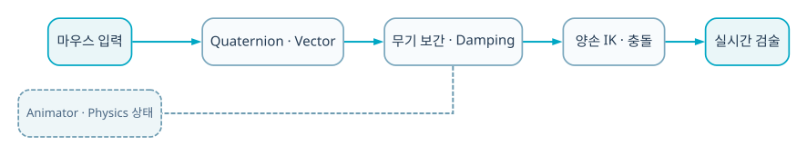

  
BACKEND · AI · SYSTEM CASE STUDY

  
마우스 입력을 쿼터니언·벡터 목표 자세로 변환하고 독립 무기·양손 IK·댐핑·피격 회복을 결합한 Unity WebGL 프로젝트입니다.

  
<b>역할</b> 개인 프로젝트 · 입력/수학적 회전/IK/물리 반응/WebGL<b>검증</b> WebGL 배포

## 트러블 슈팅

### 1. 검을 팔 animation의 child로 두면 입력과 무기 궤적을 독립 제어하기 어려움

무기 transform을 주체로 두고 팔이 IK로 따라오도록 의존 방향을 뒤집었습니다.

### 2. 목표 자세로 즉시 대입하면 검이 순간이동해 질량감이 사라짐

프레임별 선형/구면 보간과 물리적 회전·위치 이동에 damping을 적용했습니다.

### 3. WebGL 시작 시 메모리 crash와 material/lighting 문제가 발생

메모리 설정과 material·sky·camera를 커밋 단위로 수정하고 다시 배포했습니다.

## 기술 선택과 이유

| 기술 | 선택 이유 |
|---|---|
| **Quaternion · Vector math** | Euler 각 누적보다 안정적으로 검의 방향·위치 목표를 합성하기 위해 |
| **Independent weapon transform** | 팔 애니메이션에 검을 종속하지 않고 입력에 즉각 반응시키기 위해 |
| **Two-hand IK** | 독립적으로 움직이는 검의 두 handle에 양손을 계속 정렬하기 위해 |
| **Interpolation · physics damping** | 프레임마다 순간이동하지 않고 질량감과 부드러운 추종을 만들기 위해 |

## 검증 결과

- 쿼터니언·벡터 복합연산, 독립 무기 제어, 양손 IK, damping, hit reaction을 하나의 실시간 제어 루프로 구현했습니다.
- WebGL 빌드를 공개하고 시각 스타일·카메라·메모리 오류를 지속 수정했습니다.

## 시스템 흐름

1. 마우스의 화면 이동량을 입력 벡터로 읽습니다.
2. 입력으로 검의 위치와 quaternion 회전 목표를 계산합니다.
3. Lerp/Slerp 또는 물리 회전으로 목표를 damping하며 추종합니다.
4. 검 transform은 캐릭터 팔과 독립적으로 움직입니다.
5. 양손 IK target을 검의 handle transform에 맞춥니다.
6. 충돌 시 hit reaction과 self-balancing으로 타격 후 자세를 회복합니다.

## API · 시스템 경계

| 영역 | API/계약 | 책임 |
|---|---|---|
| `Input` | `mouse delta` | 검 위치·회전 명령 |
| `Motion` | `Quaternion + Vector + damping` | 프레임별 추종 |
| `Rig` | `two-hand IK` | 손-손잡이 정렬 |
| `Combat` | `collision + recovery` | 타격·균형 회복 |

## 다음 구현 계획

- 검 target과 실제 rigidbody 오차·latency 계측
- 입력 속도 기반 angular velocity/충격량 모델 개선
- Unity Robotics 시뮬레이션에서 end-effector tracking으로 전이 실험
