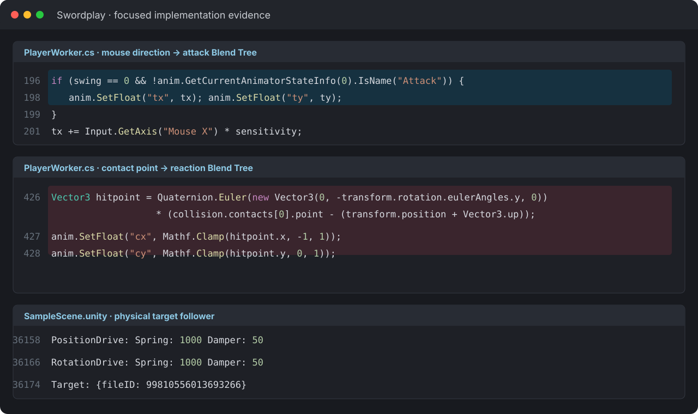

  
UNITY · ANIMATION · PHYSICS CASE STUDY

  
마우스 방향 기반 2D Blend Tree, 복합 Animation Rigging, 물리 추종 collider와 방향별 피격 반응을 결합한 Unity WebGL 검술 프로젝트입니다.

  
<b>역할</b> 개인 프로젝트 · 입력/2D 애니메이션 블렌딩/IK/물리 피격/WebGL<b>검증</b> WebGL 배포

## 주요 화면

마우스 방향에 따라 공격 모션이 섞이고, 양손과 상체 IK가 무기 자세를 따라가며, 충돌 위치에 맞춰 상대의 피격 방향과 넉백이 달라지는 검술 전투를 구현했습니다.

## 트러블 슈팅

### 1. 손뿐 아니라 허리·머리까지 서로 다른 목표를 만족하는 복합 IK가 필요함

손이 무기 손잡이를 추적하면 팔꿈치와 어깨뿐 아니라 허리도 검의 방향으로 회전하고 기울어져야 했습니다. 반면 머리는 허리 회전에 끌려가지 않고 지면과 수평한 기울기를 유지하면서 상대의 얼굴을 바라봐야 했습니다.

양팔은 `Two Bone IK`, 허리와 머리의 방향 제어는 `Multi-Aim`, 무기 소켓과 머리의 기준 변환은 `Multi-Parent`를 조합했습니다. 머리에는 캐릭터 루트 회전을 기준으로 자세를 다시 보정해 허리가 기울어도 수평을 유지하도록 했습니다. 평상시·가드·공격·피격 상태에 따라 Rig와 각 constraint의 weight를 코드에서 전환하거나 보간해 애니메이션과 IK가 서로 덮어쓰지 않게 조정했습니다.

### 2. 2D Blend Tree의 검 궤적을 collider에 그대로 사용하면 물리 충돌 방향이 불안정함

마우스 위치를 `tx·ty` 좌표로 변환하고, 상단에는 종방향 공격, 좌우에는 횡방향 공격, 사이에는 대각 공격 모션을 배치한 2D Blend Tree로 검의 방향을 연속적으로 만들었습니다. 그러나 애니메이션이 매 프레임 결정한 검 transform은 물리 엔진 관점에서는 순간이동이므로, collider를 그대로 붙이면 충돌 속도와 넉백 방향이 실제 휘두른 궤적과 어긋났습니다.

애니메이션 검을 target으로만 사용하고, 보이지 않는 Rigidbody·collider가 Position/Rotation Drive의 spring과 damping으로 target을 추적하도록 분리했습니다. 저장된 Scene의 추종 drive는 Spring 1000, Damper 50으로 설정되어 있으며, `Configurable Joint`가 연결된 물리 검이 충돌을 일으키게 해 실제 이동 속도와 방향을 가진 타격으로 바꿨습니다.

### 3. 충돌 위치와 방향에 맞는 피격 모션·넉백을 동시에 만들어야 함

충돌점을 캐릭터 로컬 좌표로 변환해 `cx·cy`로 정규화하고, 왼쪽·오른쪽·상단 피격 모션을 배치한 별도의 2D Blend Tree에 전달했습니다. 왼쪽에 맞으면 오른쪽으로 중심을 잃고, 상단에 맞으면 뒤로 넘어지는 모션이 비율에 따라 섞이도록 했습니다.

동시에 캐릭터 root의 Rigidbody와 `Configurable Joint`가 타격 방향으로 밀리게 하고 joint 제한·damping으로 속도를 줄였습니다. 방향별 애니메이션과 물리 넉백을 함께 적용해 특정 부위에 맞은 자세로 기울면서 밀린 뒤 자연스럽게 멈추도록 구현했습니다.

### 4. WebGL 시작 시 메모리 crash와 material/lighting 문제가 발생

메모리 설정과 material·sky·camera를 커밋 단위로 수정하고 다시 배포했습니다.

## 기술 선택과 이유

| 기술 | 선택 이유 |
|---|---|
| **2D Blend Tree (`tx·ty`)** | 마우스 방향에 따라 종·횡·대각 공격 모션을 연속적으로 혼합하기 위해 |
| **Two Bone IK · Multi-Aim · Multi-Parent** | 양손·팔꿈치·허리·머리가 서로 다른 자세 목표를 동시에 만족하도록 구성하기 위해 |
| **Physics target follower** | 애니메이션 검을 보이지 않는 Rigidbody·collider가 spring·damping으로 추적하게 하기 위해 |
| **Hit-point 2D Blend Tree (`cx·cy`)** | 충돌 위치에 따라 좌우·상단 피격 자세를 연속적으로 혼합하기 위해 |
| **Configurable Joint** | 검 충돌과 캐릭터 root의 넉백·감속·자세 회복을 물리적으로 연결하기 위해 |

## 검증 결과

- `tx·ty` 공격 Blend Tree, 복합 IK, 물리 추종 collider, `cx·cy` 피격 Blend Tree를 하나의 전투 루프로 연결했습니다.
- 캐릭터 상태에 따라 Rig·constraint weight와 물리 joint 제한을 실시간으로 전환했습니다.
- WebGL 빌드를 공개하고 시각 스타일·카메라·메모리 오류를 지속 수정했습니다.

## 시스템 흐름

1. 마우스 방향을 Animator의 `tx·ty` 좌표로 변환합니다.
2. 2D Blend Tree가 종·횡·대각 공격 모션을 혼합해 애니메이션 검의 궤적을 만듭니다.
3. 보이지 않는 물리 collider가 spring·damping으로 애니메이션 검을 추적합니다.
4. 양팔·허리·머리 constraint의 target과 weight를 캐릭터 상태에 맞게 조정합니다.
5. 충돌점을 로컬 `cx·cy`로 변환해 피격 2D Blend Tree에 전달합니다.
6. root Configurable Joint가 타격 방향의 넉백과 감속을 처리합니다.

## API · 시스템 경계

| 영역 | API/계약 | 책임 |
|---|---|---|
| `Input` | `mouse → tx·ty` | 공격 방향 선택 |
| `Animation` | `2D attack Blend Tree` | 종·횡·대각 모션 혼합 |
| `Rig` | `Two Bone IK · Multi-Aim · Multi-Parent` | 손·허리·머리 자세 제어 |
| `Physics` | `target follower · Configurable Joint` | 물리 검 충돌·넉백·damping |
| `Reaction` | `contact point → cx·cy` | 방향별 피격 Blend Tree |

## 다음 구현 계획

- 애니메이션 target과 물리 collider 사이의 거리·회전 오차·latency 계측
- 충돌 상대속도·무기 질량 기반 impulse와 hit-stop 튜닝
- Rig constraint별 weight curve를 상태별 ScriptableObject로 분리
- Unity Robotics 시뮬레이션에서 end-effector tracking으로 전이 실험
