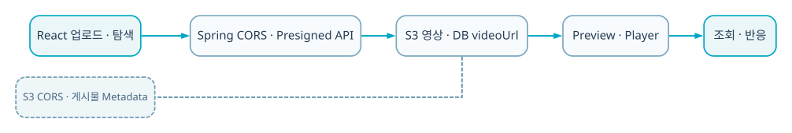

  
BACKEND · AI · SYSTEM CASE STUDY

  
React 탐색 화면과 Spring 영상 API를 연결하고 hover 의도 확인 뒤 preview를 지연 로드한 미디어 UX 프로젝트입니다.

  
<b>역할</b> 개인 프로젝트 · React 미디어 UX 및 API 연동<b>검증</b> Streaming API와 같은 제품 계보의 프론트엔드 사례

## 30초 요약

- **무엇을 만들었나** — React 탐색 화면과 Spring 영상 API를 연결하고 hover 의도 확인 뒤 preview를 지연 로드한 미디어 UX 프로젝트입니다.
- **내 기여 범위** — 개인 프로젝트 · React 미디어 UX 및 API 연동
- **현재 수준** — Streaming API와 같은 제품 계보의 프론트엔드 사례
- **코드 근거** — [GitHub 저장소](https://github.com/eecczz/streamingAPI)

> 팀 프로젝트는 전체 결과가 아니라 위에 적은 직접 기여 범위와, 면접에서 구현 이유를 설명할 수 있는 내용만 서술했습니다.

## 실제 구현 과정과 트러블슈팅

### 1. 모든 카드에서 preview를 즉시 로드하면 네트워크·디코딩 낭비

**판단과 수정** — hover 유지 시간을 조건으로 두고 thumbnail→video 전환을 지연했습니다.

### 2. overlay play icon이 점처럼 렌더링되는 UI 오류

**판단과 수정** — player 상태별 icon 렌더링을 분리해 수정한 커밋을 남겼습니다.

### 3. 프론트와 백엔드 소개가 중복됨

**판단과 수정** — 이 페이지는 탐색·player UX, Streaming API 페이지는 업로드·변환 백엔드로 역할을 분리했습니다.

## 기술 선택과 이유

| 기술 | 선택 이유 |
|---|---|
| **React** | 목록·상세·player·사용자 상태를 컴포넌트 단위로 분리하기 위해 |
| **Hover delay** | 사용자가 스쳐 지나간 썸네일까지 영상을 로드하지 않기 위해 |
| **Spring Video API** | 영상·댓글·좋아요·구독 데이터를 한 도메인 API로 제공하기 위해 |
| **Custom player** | 재생 상태·overlay·진행 바를 직접 제어하며 미디어 UX를 이해하기 위해 |

## 검증 결과

- 영상 탐색에서 preview와 전체 재생으로 이어지는 사용자 흐름을 구현했습니다.
- 동일 저장소의 미디어 백엔드와 연결해 화면만 있는 모작을 넘어 API 흐름을 확인했습니다.

## 시스템 흐름 — 이해 보조

이 그림은 구현 역량의 증거를 대신하지 않습니다. 실제 코드·README·커밋과 문제 해결 기록을 읽기 쉽게 연결한 보조 자료입니다.

1. 목록은 우선 썸네일과 메타데이터만 렌더링합니다.
2. pointer가 일정 시간 유지되면 사용 의도가 있다고 판단합니다.
3. 그때 video element와 preview source를 로드합니다.
4. pointer가 벗어나면 timer와 재생 상태를 정리합니다.
5. watch page에서 전체 player와 댓글·좋아요 API를 연결합니다.

## API · 시스템 경계

| 영역 | API/계약 | 책임 |
|---|---|---|
| `Browse` | `GET /api/videos` | 목록·메타데이터 |
| `Watch` | `GET /api/videos/{id}` | 상세·재생 |
| `Engagement` | `comments/like/subscribe` | 사용자 반응 |
| `Preview` | `hover timer + video element` | 지연 로드 |

## 한계와 다음 실험

- IntersectionObserver로 화면 밖 preview 정리
- adaptive bitrate 실제 브라우저 품질 전환 검증
- preview 요청량·재생 시작 시간 계측

## 구현 근거

- [GitHub 저장소](https://github.com/eecczz/streamingAPI)
- README의 기능 목록만 옮기지 않고 controller/service/source tree와 주요 commit 흐름을 함께 확인했습니다.
- 개발 중 남긴 Codex 대화에서는 문제 진단·가설·수정 순서를 확인했습니다.
- 저장소·실행 기록·수상 결과로 확인되지 않는 성과 수치는 만들지 않았습니다.
